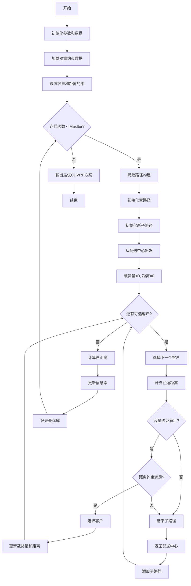
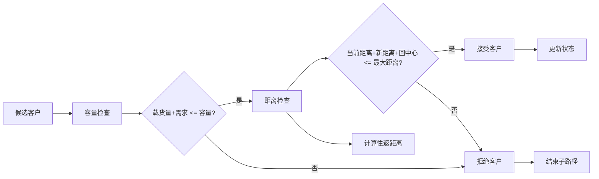
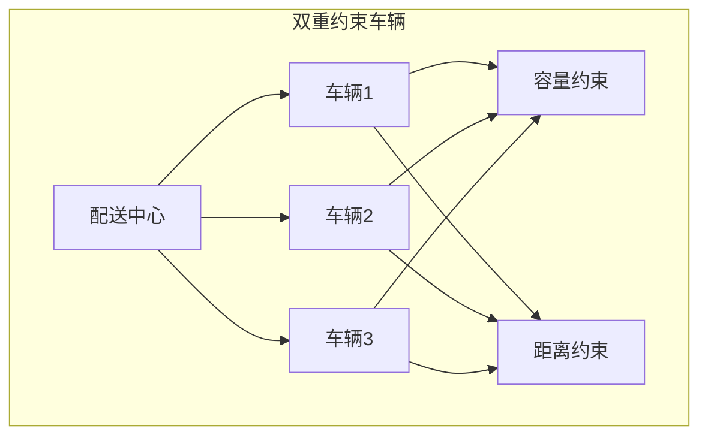

# ACO_CDVRP - 蚁群算法求解容量距离约束车辆路径问题

## 问题描述

**容量距离约束车辆路径问题 (Capacitated Distance-constrained Vehicle Routing Problem, CDVRP)**

CDVRP是CVRP和DVRP的结合，同时考虑车辆容量约束和行驶距离约束的双重限制。每辆车必须满足：
1. 总载货量不超过车辆容量
2. 总行驶距离不超过最大允许距离

### 数学模型

目标函数：
$min \sum_{k=1}^{K} \sum_{i=0}^{n} \sum_{j=0}^{n} d_{ij} x_{ijk}$

约束条件：
$\sum_{k=1}^{K} \sum_{i=0}^{n} x_{ijk} = 1, \quad \forall j = 1,2,...,n$

$\sum_{j=1}^{n} q_j \sum_{i=0}^{n} x_{ijk} \leq Q, \quad \forall k = 1,2,...,K$  (容量约束)

$\sum_{i=0}^{n} \sum_{j=0}^{n} d_{ij} x_{ijk} \leq D_{max}, \quad \forall k = 1,2,...,K$  (距离约束)

$\sum_{i=0}^{n} x_{ihk} - \sum_{j=0}^{n} x_{hjk} = 0, \quad \forall h = 1,2,...,n; \forall k = 1,2,...,K$

$\sum_{i=1}^{n} x_{i0k} = 1, \quad \sum_{j=1}^{n} x_{0jk} = 1, \quad \forall k = 1,2,...,K$

其中：
- $d_{ij}$：节点i到节点j的距离
- $q_j$：客户j的需求量
- $Q$：车辆容量
- $D_{max}$：车辆最大行驶距离
- $x_{ijk}$：二进制变量，车辆k从i到j时为1，否则为0

## 算法流程

### 基于蚁群算法的CDVRP求解

1. **双重约束检查**
   - **容量约束**：$delivery + Demand(target) \leq Capacity$
   - **距离约束**：$DisTraveled + Distance(current, target) + Distance(target, depot) \leq Travelcon$
   - 必须同时满足两个约束才能继续服务下一个客户

2. **复杂约束处理**
   - 实时跟踪每辆车的载货量和行驶距离
   - 任一约束被违反时，立即结束当前子路径
   - 返回配送中心并派新车继续服务剩余客户

3. **路径构建策略**
   - 采用与CVRP和DVRP类似的子路径构建方法
   - 但在选择下一个客户时需要同时检查双重约束

## 算法逻辑框架

### CDVRP双重约束流程图


### 双重约束检查机制


### CDVRP路径结构


### 伪代码框架
```
初始化参数和数据
while 未达到最大迭代次数:
    for 每只蚂蚁:
        初始化空路径
        while 还有未服务客户:
            初始化新子路径（新车）
            从配送中心出发
            初始化载货量 = 0, 行驶距离 = 0
            while 还有可选客户:
                计算到下一个客户的往返距离
                检查容量约束和距离约束
                如果 两个约束都满足:
                    选择该客户
                    更新载货量和行驶距离
                否则:
                    结束当前子路径
                    返回配送中心
            添加子路径到完整路径
    计算每个蚂蚁的总距离
    更新信息素
    记录最优解
```

## 关键实现特点

### 双重约束处理
- **同步检查**：在选择每个客户前同时检查容量和距离约束
- **优先级处理**：两个约束具有同等重要性，任一违反都导致路径中断
- **动态更新**：实时更新载货量和行驶距离状态

### 约束判断逻辑
```matlab
if delivery + Demand(target) > Capacity || ...
   DisTraveled + Distance(current, target) + Distance(target, 1) > Travelcon
    % 违反约束，结束子路径
end
```

### 状态管理
- **载货量跟踪**：每服务一个客户，累加其需求量
- **距离跟踪**：累计计算当前车辆的行驶距离
- **重置机制**：当车辆返回配送中心时，重置载货量和距离计数器

## 文件结构

- `Main.m`：ACO_CDVRP主程序
- `DrawPath.m`：路径可视化
- `TextOutput.m`：结果输出
- `dsxy2figxy.m`：坐标转换工具

## 参数配置

- 蚂蚁数量：8
- 信息素重要程度因子：1
- 启发函数重要程度因子：5
- 信息素挥发因子：0.1
- 车辆容量：从Capacity.mat读取
- 最大行驶距离：从Travelcon.mat读取
- 客户需求：从Demand.mat读取

## 使用示例

1. 准备数据文件：
   - `City.mat`：客户和配送中心坐标
   - `Distance.mat`：距离矩阵
   - `Demand.mat`：各客户需求量
   - `Capacity.mat`：车辆容量
   - `Travelcon.mat`：车辆最大行驶距离

2. 运行`Main.m`执行求解

3. 输出结果：
   - 最优车辆路径方案
   - 每辆车的载货量和行驶距离
   - 总运输距离
   - 路径可视化图

## 算法复杂度分析

CDVRP由于需要同时处理双重约束，算法复杂度高于CVRP和DVRP：
- 每次决策需要检查两个约束条件
- 状态变量增加（载货量+行驶距离）
- 可行解空间进一步缩小

## 实际应用

CDVRP适用于：
- 城市配送系统（同时考虑载重和里程限制）
- 冷链物流（载重和续航双重限制）
- 危险品运输（重量和路线长度限制）