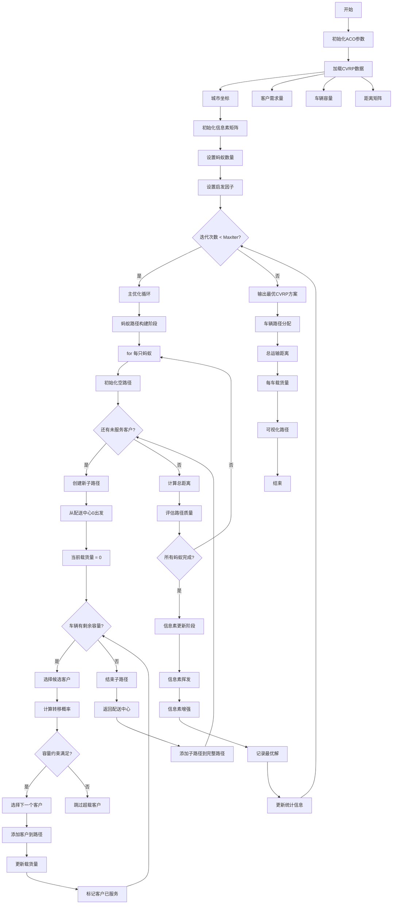
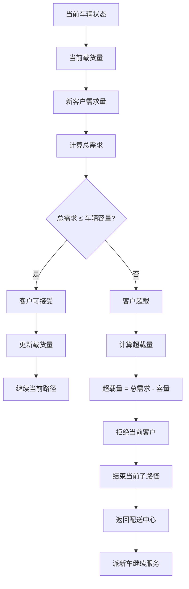
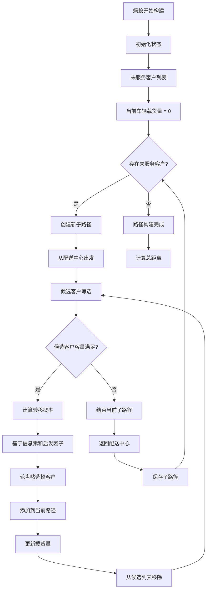
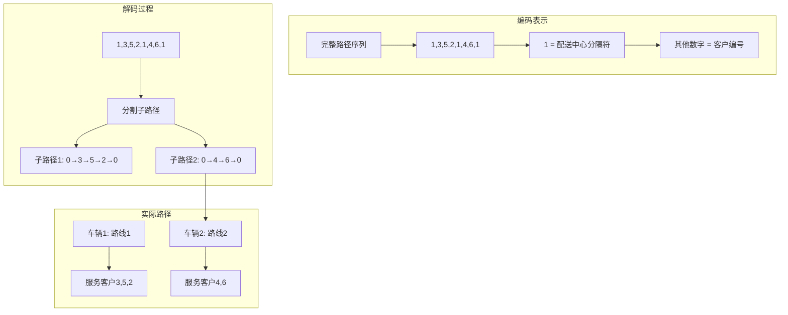
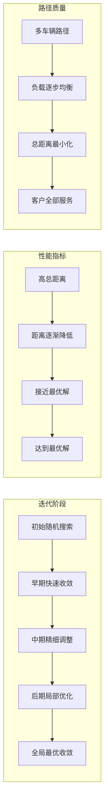

# ACO_CVRP - 蚁群算法求解容量约束车辆路径问题

## 问题描述

**容量约束车辆路径问题 (Capacitated Vehicle Routing Problem, CVRP)**

CVRP是VRP的基本形式，考虑车辆容量限制。目标是设计一组车辆路径，从配送中心出发，服务所有客户需求后返回配送中心，使得总运输成本最小，同时满足每个客户的需求且不超过车辆容量限制。

### 数学模型

目标函数：
$min \sum_{k=1}^{K} \sum_{i=0}^{n} \sum_{j=0}^{n} d_{ij} x_{ijk}$

约束条件：
$\sum_{k=1}^{K} \sum_{i=0}^{n} x_{ijk} = 1, \quad \forall j = 1,2,...,n$

$\sum_{j=1}^{n} q_j \sum_{i=0}^{n} x_{ijk} \leq Q, \quad \forall k = 1,2,...,K$

$\sum_{i=0}^{n} x_{ihk} - \sum_{j=0}^{n} x_{hjk} = 0, \quad \forall h = 1,2,...,n; \forall k = 1,2,...,K$

$\sum_{i=1}^{n} x_{i0k} = 1, \quad \sum_{j=1}^{n} x_{0jk} = 1, \quad \forall k = 1,2,...,K$

其中：
- $d_{ij}$：节点i到节点j的距离
- $q_j$：客户j的需求量
- $Q$：车辆容量
- $x_{ijk}$：二进制变量，车辆k从i到j时为1，否则为0
- $K$：可用车辆数
- $n$：客户数量

## 算法流程

### 基于蚁群算法的CVRP求解

1. **问题初始化**
   - 加载城市坐标、距离矩阵、客户需求量和车辆容量
   - 设置蚁群算法参数：蚂蚁数量、信息素因子、启发因子等

2. **路径构建策略**
   - 每只蚂蚁构建多条子路径（多辆车）
   - 每辆车从配送中心出发
   - 基于容量约束选择下一个客户：
     - 如果当前车辆剩余容量足够，则继续服务
     - 如果超出容量限制，则返回配送中心，派新车继续服务

3. **容量约束处理**
   - 实时跟踪每辆车的累计载货量
   - 当$delivery + Demand(target) > Capacity$时，结束当前子路径
   - 对违反容量约束的解给予惩罚（设为无穷大距离）

4. **信息素更新机制**
   - 与基本ACO相同的信息素挥发和增强机制
   - 但基于完整VRP路径（包含多个子路径）进行评价

## 算法逻辑框架

### ACO-CVRP完整优化流程图


### 容量约束检查机制


### 蚂蚁路径构建详解


### 信息素更新机制
```mermaid
graph TD
    subgraph "信息素挥发"
        A[当前信息素] --> B[按挥发因子衰减]
        B --> C[信息素 = (1-ρ) * 原信息素]
    end
    
    subgraph "信息素增强"
        D[蚂蚁路径评估] --> E[计算路径质量]
        E --> F[路径越短增强越多]
        F --> G[信息素 += Δτ]
        G --> H[Δτ = Q / 路径长度]
    end
    
    subgraph "全局更新"
        I[最优路径] --> J[额外信息素增强]
        J --> K[强化最优解]
        K --> L[引导后续搜索]
    end
```

### 路径编码与解码


### 容量约束下的客户选择
```mermaid
graph LR
    subgraph "候选筛选"
        A[所有未服务客户] --> B[容量筛选]
        B --> C[剩余容量足够]
        C --> D[候选客户列表]
    end
    
    subgraph "概率计算"
        D --> E[信息素强度]
        E --> F[启发因子(1/距离)]
        F --> G[转移概率公式]
        G --> H[P = τ^α * η^β / Σ(τ^α * η^β)]
    end
    
    subgraph "选择机制"
        H --> I[轮盘赌选择]
        I --> J[选择概率最高的客户]
    end
```

### 算法收敛过程


### 伪代码框架
```
初始化ACO-CVRP参数:
    蚂蚁数量 AntCount = 8
    最大迭代次数 MaxIter = 100
    信息素重要程度因子 alpha = 1
    启发函数重要程度因子 beta = 5
    信息素挥发因子 rho = 0.1
    信息素初始值 tau0 = 1.0
    车辆容量 Q
    客户数量 N

加载CVRP数据:
    城市坐标 City.mat
    客户需求 Demands.mat
    车辆容量 Capacity.mat
    距离矩阵 Distance.mat

主优化过程:
% 初始化信息素矩阵
信息素矩阵 = 初始化信息素(N+1, N+1, tau0)
最优解 = 空
最优距离 = 无穷大

for iter = 1 to MaxIter:
    % 蚂蚁路径构建阶段
    for ant = 1 to AntCount:
        % 初始化蚂蚁状态
        未服务客户 = [1,2,...,N]
        完整路径 = []
        
        while 未服务客户不为空:
            % 创建新子路径
            子路径 = [0]  % 从配送中心出发
            当前载货量 = 0
            
            while true:
                % 选择候选客户
                候选客户 = []
                for 客户 in 未服务客户:
                    if 当前载货量 + 需求[客户] <= 车辆容量:
                        候选客户.add(客户)
                
                if 候选客户为空:
                    break  % 结束当前子路径
                
                % 计算转移概率
                总概率 = 0
                for 客户 in 候选客户:
                    信息素 = 信息素矩阵[当前节点][客户]
                    启发值 = 1.0 / 距离矩阵[当前节点][客户]
                    概率[客户] = 信息素^alpha * 启发值^beta
                    总概率 += 概率[客户]
                
                % 轮盘赌选择客户
                随机数 = rand() * 总概率
                累计概率 = 0
                for 客户 in 候选客户:
                    累计概率 += 概率[客户]
                    if 随机数 <= 累计概率:
                        选择客户 = 客户
                        break
                
                % 更新路径
                子路径.add(选择客户)
                当前载货量 += 需求[选择客户]
                未服务客户.remove(选择客户)
                当前节点 = 选择客户
            
            % 结束子路径
            子路径.add(0)  % 返回配送中心
            完整路径.add(子路径)
        
        % 计算总距离
        总距离 = 0
        for 子路径 in 完整路径:
            for i = 1 to length(子路径)-1:
                总距离 += 距离矩阵[子路径[i-1]][子路径[i]]
        
        % 更新最优解
        if 总距离 < 最优距离:
            最优解 = 完整路径
            最优距离 = 总距离
    
    % 信息素更新阶段
    % 信息素挥发
    for i = 0 to N:
        for j = 0 to N:
            信息素矩阵[i][j] *= (1 - rho)
    
    % 信息素增强
    for 子路径 in 最优解:
        for i = 1 to length(子路径)-1:
            信息素矩阵[子路径[i-1]][子路径[i]] += 1.0 / 最优距离
    
    % 记录统计信息
    recordStatistics(iter, 最优距离, 最优解)

输出最优CVRP方案:
    最优车辆路径 = 最优解
    总运输距离 = 最优距离
    车辆使用数量 = length(最优解)
    每车载货量 = calculateLoadPerVehicle(最优解)
    
可视化CVRP路径
```

## 关键实现特点

### 路径编码
- 使用包含配送中心重复出现的长向量表示完整路径
- 数字1表示配送中心，其他数字表示客户
- 示例：[1,3,5,1,2,4,1]表示两辆车：路线1：0→3→5→0，路线2：0→2→4→0

### 约束处理
- **硬约束**：容量约束必须满足，否则解无效
- **惩罚机制**：对不可行解赋予极大距离值，使其在后续迭代中被淘汰

### 距离计算
- 分别计算每辆车的行驶距离
- 累加所有子路径距离得到总距离
- 当配送中心出现时重置距离和载货量计数器

## 文件结构

- `Main.m`：ACO_CVRP主程序
- `DrawPath.m`：路径可视化
- `TextOutput.m`：结果输出
- `dsxy2figxy.m`：坐标转换工具

## 参数配置

- 蚂蚁数量：8
- 信息素重要程度因子：1
- 启发函数重要程度因子：5
- 信息素挥发因子：0.1
- 车辆容量：从Capacity.mat读取
- 客户需求：从Demand.mat读取

## 使用示例

1. 准备数据文件：
   - `City.mat`：客户和配送中心坐标
   - `Distance.mat`：距离矩阵
   - `Demand.mat`：各客户需求量
   - `Capacity.mat`：车辆容量

2. 运行`Main.m`执行求解

3. 输出结果：
   - 最优车辆路径方案
   - 总运输距离
   - 每辆车的载货量使用情况
   - 路径可视化图