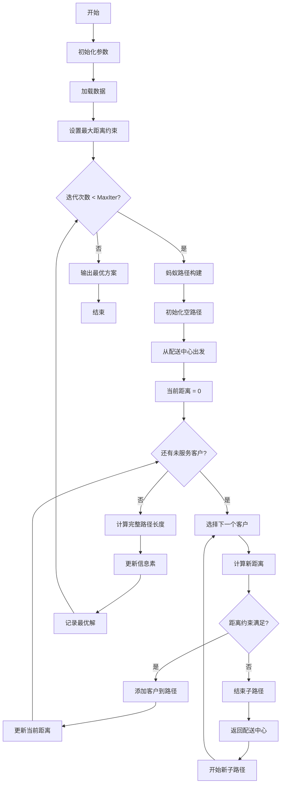
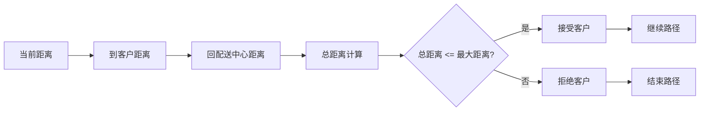
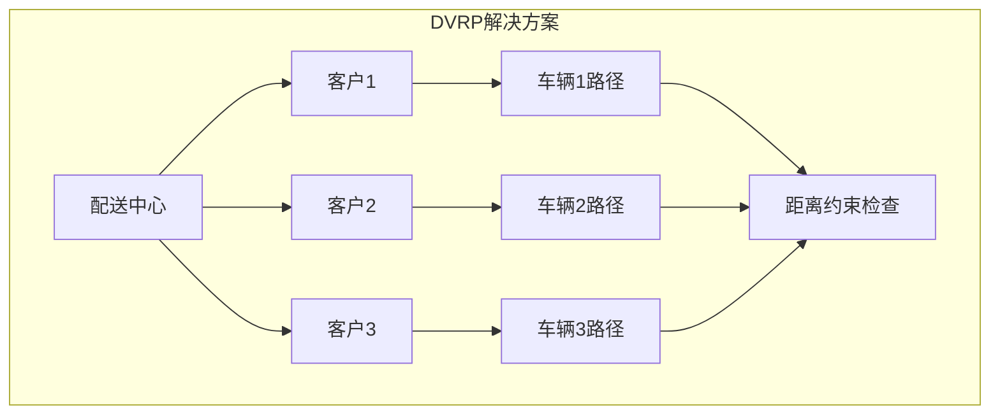

# ACO_DVRP - 蚁群算法求解距离约束车辆路径问题

## 问题描述

**距离约束车辆路径问题 (Distance-constrained Vehicle Routing Problem, DVRP)**

DVRP是在基本VRP基础上增加了车辆行驶距离约束的扩展问题。每辆车从配送中心出发，完成配送任务后返回配送中心，其总行驶距离不能超过预设的最大行驶距离限制。

### 数学模型

目标函数：
$min \sum_{k=1}^{K} \sum_{i=0}^{n} \sum_{j=0}^{n} d_{ij} x_{ijk}$

约束条件：
$\sum_{k=1}^{K} \sum_{i=0}^{n} x_{ijk} = 1, \quad \forall j = 1,2,...,n$

$\sum_{i=0}^{n} \sum_{j=0}^{n} d_{ij} x_{ijk} \leq D_{max}, \quad \forall k = 1,2,...,K$

$\sum_{i=0}^{n} x_{ihk} - \sum_{j=0}^{n} x_{hjk} = 0, \quad \forall h = 1,2,...,n; \forall k = 1,2,...,K$

$\sum_{i=1}^{n} x_{i0k} = 1, \quad \sum_{j=1}^{n} x_{0jk} = 1, \quad \forall k = 1,2,...,K$

其中：
- $d_{ij}$：节点i到节点j的距离
- $D_{max}$：车辆最大行驶距离
- $x_{ijk}$：二进制变量，车辆k从i到j时为1，否则为0
- $K$：可用车辆数
- $n$：客户数量

## 算法流程

### 基于蚁群算法的DVRP求解

1. **距离约束检查**
   - 实时计算车辆从当前位置到目标客户的往返距离
   - 关键约束：$DisTraveled + Distance(current, target) + Distance(target, depot) \leq Travelcon$
   - 如果超过距离限制，则必须返回配送中心并派新车

2. **路径构建策略**
   - 与CVRP类似，但约束条件从容量约束变为距离约束
   - 每辆车必须确保完成配送后能够返回配送中心
   - 考虑从配送中心到客户的往返距离

3. **距离计算机制**
   - 累计计算每辆车已行驶的距离
   - 当车辆返回配送中心时重置距离计数器
   - 对违反距离约束的解进行惩罚处理

## 算法逻辑框架

### DVRP距离约束流程图


### 距离约束检查机制


### 车辆路径示意图


### 伪代码框架
```
初始化参数和数据
while 未达到最大迭代次数:
    for 每只蚂蚁:
        初始化空路径
        while 还有未服务客户:
            初始化新子路径（新车）
            从配送中心出发
            初始化行驶距离 = 0
            while 还有可选客户:
                计算到下一个客户的往返距离
                如果 当前距离 + 到客户距离 + 回配送中心距离 ≤ 最大距离:
                    选择该客户
                    更新累计行驶距离
                否则:
                    结束当前子路径
                    返回配送中心
            添加子路径到完整路径
    计算每个蚂蚁的总距离
    更新信息素
    记录最优解
```

## 关键实现特点

### 距离约束处理
- **往返距离计算**：不仅要考虑从当前位置到目标客户的距离，还要考虑从客户返回配送中心的距离
- **动态距离跟踪**：实时更新每辆车的累计行驶距离
- **约束判断**：在每次选择下一个客户前，先判断是否会违反距离约束

### 路径编码
- 使用与CVRP相同的编码方式
- 配送中心（编码为1）的出现表示车辆返回或新车出发
- 示例：[1,2,5,1,3,4,1]表示：
  - 车辆1：0→2→5→0，行驶距离必须≤Dmax
  - 车辆2：0→3→4→0，行驶距离必须≤Dmax

### 惩罚机制
- 对违反距离约束的解赋予极大距离值
- 确保不可行解在后续迭代中被淘汰

## 文件结构

- `Main.m`：ACO_DVRP主程序
- `DrawPath.m`：路径可视化
- `TextOutput.m`：结果输出
- `dsxy2figxy.m`：坐标转换工具

## 参数配置

- 蚂蚁数量：8
- 信息素重要程度因子：1
- 启发函数重要程度因子：5
- 信息素挥发因子：0.1
- 最大行驶距离：从Travelcon.mat读取

## 使用示例

1. 准备数据文件：
   - `City.mat`：客户和配送中心坐标
   - `Distance.mat`：距离矩阵
   - `Travelcon.mat`：车辆最大行驶距离

2. 运行`Main.m`执行求解

3. 输出结果：
   - 最优车辆路径方案
   - 每辆车的行驶距离
   - 总运输距离
   - 路径可视化图

## 注意事项

- DVRP不考虑客户需求量，只考虑距离约束
- 每辆车可以服务多个客户，只要总行驶距离不超过限制
- 算法确保每辆车都能完成配送并返回配送中心