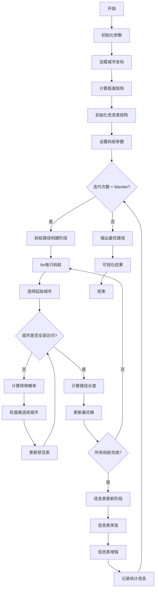
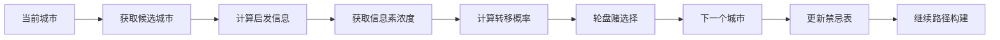

# ACO_TSP - 蚁群算法求解旅行商问题

## 问题描述

**旅行商问题 (Traveling Salesman Problem, TSP)**

TSP是经典的组合优化问题，目标是找到一条经过所有给定城市且每个城市只经过一次的最短路径，最后回到起始城市。

### 数学模型

目标函数：
$min \sum_{i=1}^{n} \sum_{j=1}^{n} d_{ij} x_{ij}$

约束条件：
$\sum_{j=1}^{n} x_{ij} = 1, \quad \forall i = 1,2,...,n$

$\sum_{i=1}^{n} x_{ij} = 1, \quad \forall j = 1,2,...,n$

$\sum_{i \in S} \sum_{j \in S} x_{ij} \leq |S| - 1, \quad \forall S \subset V, S \neq \emptyset$

其中：
- $d_{ij}$：城市i到城市j的距离
- $x_{ij}$：二进制变量，路径中包含边(i,j)时为1，否则为0
- $n$：城市数量
- $V$：所有城市的集合

## 算法流程

### 蚁群算法 (Ant Colony Optimization, ACO)

1. **初始化阶段**
   - 设置蚂蚁数量、信息素重要程度因子、启发函数重要程度因子
   - 初始化信息素矩阵为全1矩阵
   - 加载城市坐标和距离矩阵

2. **路径构建**
   - 每只蚂蚁随机选择起始城市
   - 基于概率选择下一个城市：
     $P_{ij}^k(t) = \frac{[\tau_{ij}(t)]^{\alpha} [\eta_{ij}]^{\beta}}{\sum_{l \in N_i^k} [\tau_{il}(t)]^{\alpha} [\eta_{il}]^{\beta}}$
   - 其中$\tau_{ij}$为信息素浓度，$\eta_{ij} = 1/d_{ij}$为启发信息

3. **信息素更新**
   - 信息素挥发：$\tau_{ij}(t+1) = (1-\rho) \tau_{ij}(t)$
   - 信息素增强：$\tau_{ij}(t+1) = \tau_{ij}(t+1) + \sum_{k=1}^{m} \Delta \tau_{ij}^k$
   - $\Delta \tau_{ij}^k = \frac{Q}{L_k}$，其中$L_k$为第k只蚂蚁的路径长度

4. **迭代优化**
   - 重复路径构建和信息素更新，直到达到最大迭代次数

## 算法逻辑框架

### ACO-TSP完整流程图


### 蚂蚁路径选择机制


### 信息素更新过程
```mermaid
graph TD
    A[当前信息素矩阵] --> B[信息素挥发]
    B --> C[τ_ij = (1-ρ) × τ_ij]
    D[蚂蚁路径结果] --> E[计算路径长度]
    E --> F[计算信息素增量]
    F --> G[Δτ_ij = Q/L_k]
    C --> H[信息素增强]
    G --> H
    H --> I[τ_ij = τ_ij + ΣΔτ_ij^k]
    I --> J[新信息素矩阵]
```

### 概率计算与选择策略
```mermaid
graph LR
    A[转移概率公式] --> B[P_ij = (τ_ij^α × η_ij^β) / Σ(τ_il^α × η_il^β)]
    B --> C[信息素因子 τ_ij^α]
    B --> D[启发因子 η_ij^β]
    C --> E[经验信息]
    D --> F[距离倒数 1/d_ij]
    E --> G[平衡探索与开发]
    F --> G
```

### 伪代码框架
```
初始化参数:
    蚂蚁数量 m = 8
    信息素重要程度因子 α = 1
    启发函数重要程度因子 β = 5
    信息素挥发因子 ρ = 0.1
    常系数 Q = 1
    最大迭代次数 MaxIter = 100

加载数据:
    城市坐标 City.mat
    距离矩阵 Distance.mat

初始化:
    信息素矩阵 τ = ones(n,n)
    最优路径 bestPath = []
    最短距离 bestLength = inf

主循环:
while iter < MaxIter:
    % 蚂蚁路径构建
    for k = 1 to m:
        蚂蚁k选择随机起始城市
        禁忌表 = [起始城市]
        
        while 未访问所有城市:
            计算转移概率 P_ij
            轮盘赌选择下一个城市j
            将城市j加入禁忌表
            当前城市 = j
        
        计算完整路径长度 L_k
        if L_k < bestLength:
            bestLength = L_k
            bestPath = 蚂蚁k的路径
    
    % 信息素更新
    for 每条边(i,j):
        τ_ij = (1-ρ) × τ_ij  % 信息素挥发
        for k = 1 to m:
            if 边(i,j)在蚂蚁k的路径中:
                τ_ij = τ_ij + Q/L_k  % 信息素增强
    
    iter = iter + 1

输出最优路径 bestPath
输出最短距离 bestLength
```

## 文件结构

- `Main.m`：主程序文件，包含ACO算法完整实现
- `DrawPath.m`：路径可视化函数
- `TextOutput.m`：结果文本输出函数
- `dsxy2figxy.m`：坐标转换工具函数

## 参数设置

- 蚂蚁数量：8
- 信息素重要程度因子：1
- 启发函数重要程度因子：5
- 信息素挥发因子：0.1
- 常系数：1
- 最大迭代次数：100

## 使用说明

1. 确保`test_data`文件夹包含必要的数据文件：
   - `City.mat`：城市坐标数据
   - `Distance.mat`：城市间距离矩阵

2. 运行`Main.m`文件开始求解

3. 结果将显示：
   - 最优路径
   - 最短距离
   - 迭代过程图
   - 实际路线地图