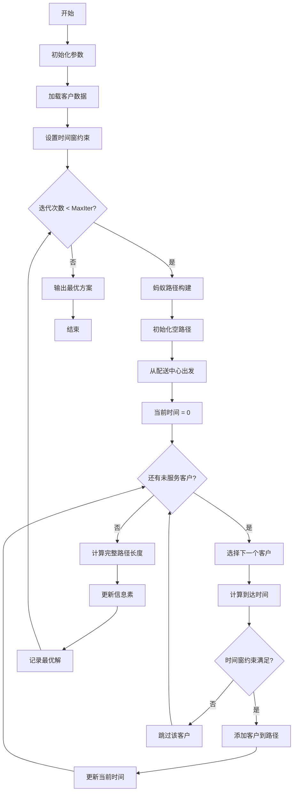
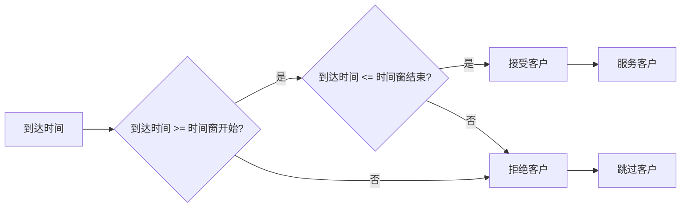

# ACO_VRPTW - 蚁群算法求解带时间窗车辆路径问题

## 问题描述

**带时间窗车辆路径问题 (Vehicle Routing Problem with Time Windows, VRPTW)**

VRPTW在基本VRP基础上增加了时间窗约束，每个客户都有特定的服务时间窗口$[e_i, l_i]$，车辆必须在时间窗口内到达客户处开始服务，早到需要等待，晚到则不允许。

### 数学模型

目标函数：
$min \sum_{k=1}^{K} \sum_{i=0}^{n} \sum_{j=0}^{n} d_{ij} x_{ijk}$

约束条件：
$\sum_{k=1}^{K} \sum_{i=0}^{n} x_{ijk} = 1, \quad \forall j = 1,2,...,n$

$\sum_{j=1}^{n} q_j \sum_{i=0}^{n} x_{ijk} \leq Q, \quad \forall k = 1,2,...,K$  (容量约束)

$\sum_{i=0}^{n} \sum_{j=0}^{n} d_{ij} x_{ijk} \leq D_{max}, \quad \forall k = 1,2,...,K$  (距离约束)

$s_{ik} + t_{ij} - M(1 - x_{ijk}) \leq s_{jk}, \quad \forall i,j,k$  (时间连续性)

$e_j \leq s_{jk} \leq l_j, \quad \forall j,k$  (时间窗约束)

其中：
- $s_{jk}$：车辆k到达客户j的时间
- $t_{ij}$：从i到j的行驶时间
- $e_j, l_j$：客户j的时间窗
- $M$：足够大的正数

## 算法流程

### 基于蚁群算法的VRPTW求解

1. **三重约束处理**
   - **容量约束**：$delivery + Demand(target) \leq Capacity$
   - **距离约束**：$DisTraveled + Distance(current, target) + Distance(target, depot) \leq Travelcon$
   - **时间窗约束**：$CurrentTime + TravelTime(current, target) \leq TimeWindow(target, 2)$

2. **时间计算机制**
   - **早到等待**：如果到达时间早于时间窗开始，需要等待
     $CurrentTime = max(CurrentTime + TravelTime, TimeWindow(target, 1))$
   - **时间连续性**：确保路径上的时间连续性

3. **时间窗可行性检查**
   - 在选择每个客户前，先计算到达时间
   - 如果超过时间窗结束时间，则该客户不能被当前车辆服务

## 算法逻辑框架

### VRPTW时间窗约束流程图


### 时间窗检查机制


### VRPTW路径结构图
```mermaid
graph TD
    subgraph "时间窗客户"
        A[配送中心] --> B[客户1: [8:00-12:00]]
        A --> C[客户2: [9:00-14:00]]
        A --> D[客户3: [10:00-16:00]]
        
        B --> E[车辆1路径]
        C --> F[车辆2路径]
        D --> G[车辆3路径]
        
        E --> H[时间窗检查]
        F --> H
        G --> H
    end
```

### 伪代码框架
```
初始化参数和数据
while 未达到最大迭代次数:
    for 每只蚂蚁:
        初始化空路径
        从配送中心出发
        当前时间 = 0
        while 还有未服务客户:
            根据概率选择下一个客户
            检查时间窗约束：
                如果到达时间 >= 客户时间窗开始 且 到达时间 <= 客户时间窗结束:
                    添加客户到路径
                    更新当前时间
                否则:
                    跳过该客户
        计算完整路径长度
    更新信息素
    记录最优解
```

## 关键实现特点

### 时间窗处理
```matlab
% 时间窗约束检查
CurrentTime = max(CurrentTime + TravelTime(current, target), TimeWindow(target, 1));
if CurrentTime > TimeWindow(target, 2)
    % 超过时间窗，不可行
end
```

### 三重约束同步检查
```matlab
if delivery + Demand(target) > Capacity || ...
   DisTraveled + Distance(current, target) + Distance(target, 1) > Travelcon || ...
   CurrentTime + TravelTime(current, target) > TimeWindow(target, 2)
    % 违反任一约束，结束子路径
end
```

### 时间累积机制
- **服务时间**：假设服务时间为0或已包含在行驶时间中
- **等待时间**：早到时计算等待时间
- **路径时间**：累计计算每辆车的总服务时间

## 文件结构

- `Main.m`：ACO_VRPTW主程序
- `DrawPath.m`：路径可视化
- `TextOutput.m`：结果输出
- `dsxy2figxy.m`：坐标转换工具

## 参数配置

- 蚂蚁数量：8
- 信息素重要程度因子：1
- 启发函数重要程度因子：5
- 信息素挥发因子：0.1
- 车辆容量：从Capacity.mat读取
- 最大行驶距离：从Travelcon.mat读取
- 客户需求：从Demand.mat读取
- 时间窗：从TimeWindow.mat读取
- 行驶时间：从TravelTime.mat读取

## 使用示例

1. 准备数据文件：
   - `City.mat`：客户和配送中心坐标
   - `Distance.mat`：距离矩阵
   - `TravelTime.mat`：行驶时间矩阵
   - `Demand.mat`：各客户需求量
   - `Capacity.mat`：车辆容量
   - `Travelcon.mat`：车辆最大行驶距离
   - `TimeWindow.mat`：客户时间窗

2. 运行`Main.m`执行求解

3. 输出结果：
   - 最优车辆路径方案
   - 每辆车的载货量、行驶距离、服务时间
   - 客户服务的具体时间
   - 路径可视化图

## 算法复杂度

VRPTW由于需要处理时间窗约束，算法复杂度最高：
- 需要维护时间状态变量
- 三重约束检查增加计算量
- 时间连续性约束使邻域搜索更复杂
- 可行解空间进一步缩小

## 实际应用

VRPTW广泛应用于：
- **快递配送**：客户指定收货时间
- **冷链物流**：生鲜配送时间窗限制
- **医疗配送**：医院药品配送时间要求
- **外卖配送**：用户期望送达时间
- **零售配送**：门店补货时间窗