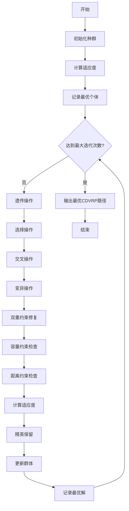
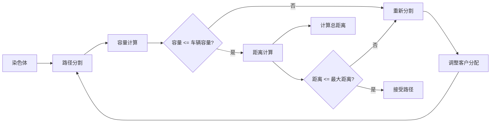
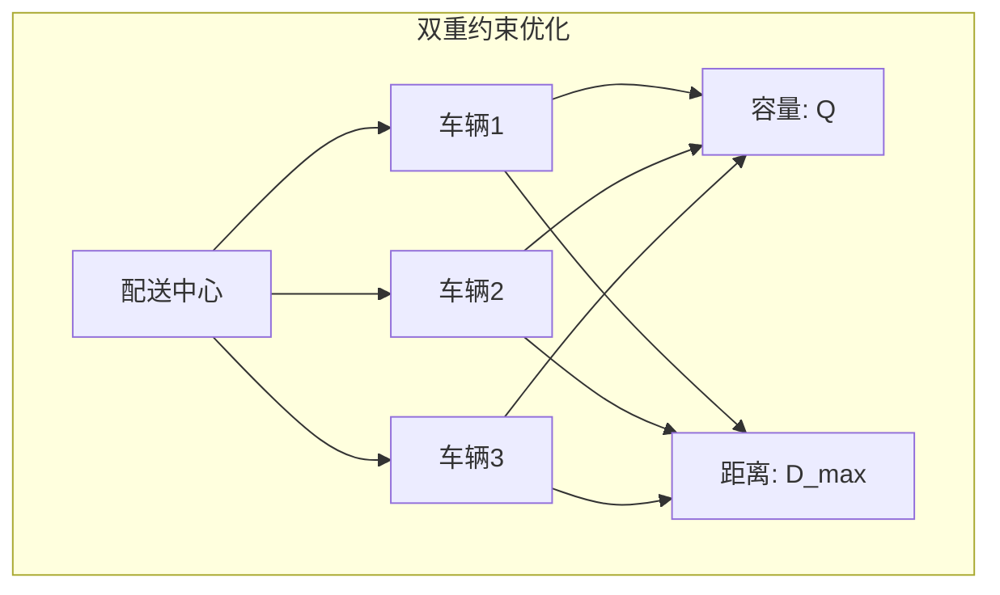
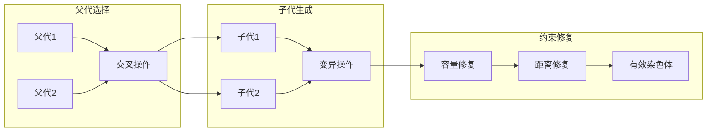

# GA-CDVRP: 遗传算法求解容量距离约束车辆路径问题

## 问题描述

容量距离约束车辆路径问题 (Capacitated Distance-constrained Vehicle Routing Problem, CDVRP) 是VRP的扩展版本，同时考虑车辆容量约束和行驶距离约束的双重限制。

### 数学模型

**目标函数：**
$$\min \sum_{k=1}^{K} \sum_{i=0}^{n} \sum_{j=0}^{n} d_{ij} x_{ijk}$$

**约束条件：**
1. **容量约束：**
   $$\sum_{j=1}^{n} q_j \sum_{i=0}^{n} x_{ijk} \leq Q, \quad \forall k = 1,2,...,K$$
   
2. **距离约束：**
   $$\sum_{i=0}^{n} \sum_{j=0}^{n} d_{ij} x_{ijk} \leq D_{max}, \quad \forall k = 1,2,...,K$$
   
3. **路径约束：**
   $$\sum_{k=1}^{K} \sum_{i=0}^{n} x_{ijk} = 1, \quad \forall j = 1,2,...,n$$

## 算法逻辑框架

### GA-CDVRP流程图


### 双重约束修复机制


### CDVRP路径结构


### 遗传操作示意图


### 伪代码框架
```
初始化种群
计算适应度
记录最优个体

while 未达到最大迭代次数:
    选择操作：轮盘赌选择
    交叉操作：部分映射交叉
    变异操作：交换变异
    双重约束修复：处理容量和距离约束
    计算适应度
    精英保留：保留最优个体
    更新群体
    记录最优解

输出最优CDVRP路径
```

## 关键实现特点

### 染色体编码
- **路径表示**：使用客户序列表示车辆路径
- **双重约束处理**：在适应度计算中同时考虑容量和距离约束
- **修复机制**：自动处理容量超载和距离超限问题

### 遗传操作设计
```matlab
% 双重约束修复示例
function [new_chromosome, feasible] = repair_constraints(chromosome, capacity, max_distance)
    % 分割路径为子路径
    sub_routes = split_routes(chromosome);
    
    % 检查每个子路径的约束
    for i = 1:length(sub_routes)
        % 检查容量约束
        load = sum(Demand(sub_routes{i}));
        if load > capacity
            sub_routes{i} = repair_capacity(sub_routes{i});
        end
        
        % 检查距离约束
        distance = calculate_route_distance(sub_routes{i});
        if distance > max_distance
            sub_routes{i} = repair_distance(sub_routes{i});
        end
    end
    
    % 合并修复后的子路径
    new_chromosome = merge_routes(sub_routes);
end
```

### 适应度函数
- **主要目标**：最小化总行驶距离
- **约束处理**：对违反约束的解进行惩罚
- **多目标考虑**：平衡距离最小化和约束满足

## 文件结构

```
GA_CDVRP/
├── Main.m              % 主程序入口
├── InitPop.m           % 种群初始化
├── Fitness.m           % 适应度计算
├── Select.m            % 选择操作
├── Crossover.m         % 交叉操作
├── Mutate.m            % 变异操作
├── Reins.m             % 重插入操作
├── Reverse.m           % 路径反转优化
├── DrawPath.m          % 路径可视化
├── TextOutput.m        % 结果输出
└── dsxy2figxy.m        % 坐标转换工具
```

## 参数配置

| 参数名称 | 建议值 | 说明 |
|---------|--------|------|
| 种群大小 | 100-200 | 根据问题规模调整 |
| 交叉概率 | 0.8-0.9 | 高交叉概率促进搜索 |
| 变异概率 | 0.1-0.2 | 低变异概率保持稳定性 |
| 最大迭代次数 | 500-1000 | 根据收敛情况调整 |
| 精英保留比例 | 0.1-0.2 | 保留优秀个体 |

## 使用示例

```matlab
% 运行主程序
Main

% 结果将显示：
% 1. 最优CDVRP路径图
% 2. 每辆车的载货量和行驶距离
% 3. 算法收敛曲线
% 4. 双重约束满足情况
```

## 算法性能分析

### 收敛特性
- **收敛速度**：中等，需要较多迭代
- **解的质量**：较好，能找到接近最优解
- **稳定性**：较高，多次运行结果差异不大

### 时间复杂度
- **种群初始化**：O(pop_size × n)
- **适应度计算**：O(pop_size × n²)
- **遗传操作**：O(pop_size × n)
- **约束修复**：O(pop_size × n²)

## 可视化与分析

### 输出结果
1. **最优路径图**：显示车辆路径和约束满足情况
2. **载货量分析**：展示每辆车的载货利用率
3. **距离分析**：展示每辆车的行驶距离
4. **收敛曲线**：展示算法收敛过程

## 优缺点分析

### 优点
- 能够处理复杂的双重约束
- 具有良好的全局搜索能力
- 易于并行化实现
- 适合大规模问题

### 缺点
- 算法复杂度较高
- 参数调节较为敏感
- 约束修复计算开销大
- 可能需要较长时间收敛

## 实际应用

CDVRP适用于：
- 城市配送系统（同时考虑载重和里程限制）
- 冷链物流（载重和续航双重限制）
- 危险品运输（重量和路线长度限制）
- 快递物流（车辆载重和司机工作时间限制）