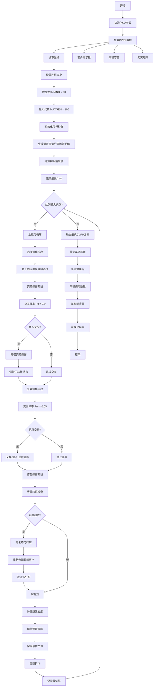
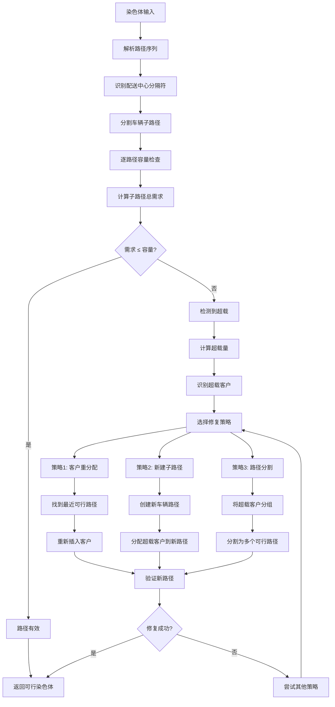
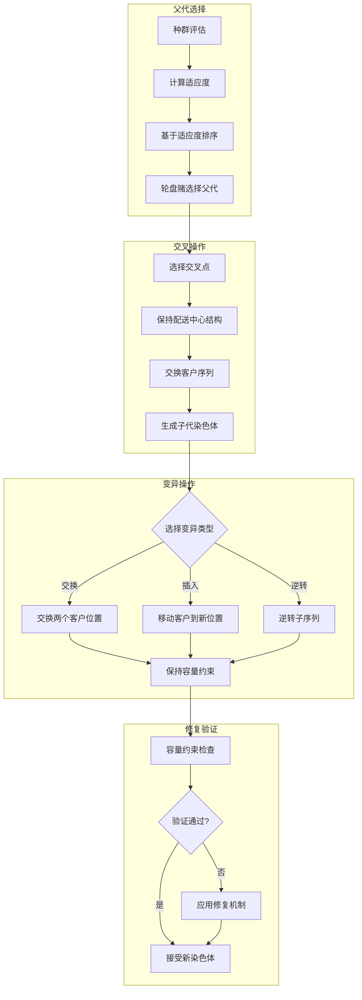
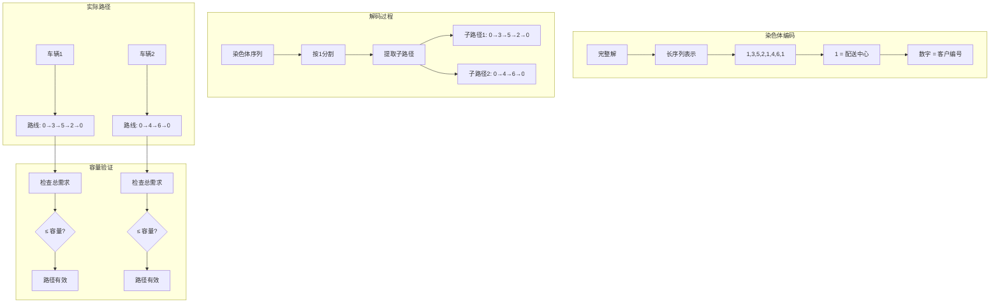
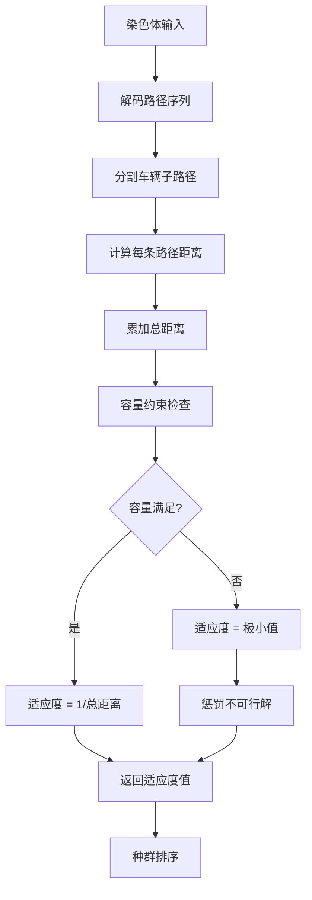
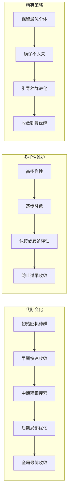

# GA_CVRP - 遗传算法求解容量约束车辆路径问题

## 问题描述

**容量约束车辆路径问题 (Capacitated Vehicle Routing Problem, CVRP)**

CVRP是VRP的基本形式，考虑车辆容量限制。目标是设计一组车辆路径，从配送中心出发，服务所有客户需求后返回配送中心，使得总运输成本最小。

### 数学模型

目标函数：
$min \sum_{k=1}^{K} \sum_{i=0}^{n} \sum_{j=0}^{n} d_{ij} x_{ijk}$

约束条件：
$\sum_{k=1}^{K} \sum_{i=0}^{n} x_{ijk} = 1, \quad \forall j = 1,2,...,n$

$\sum_{j=1}^{n} q_j \sum_{i=0}^{n} x_{ijk} \leq Q, \quad \forall k = 1,2,...,K$  (容量约束)

$\sum_{i=0}^{n} x_{ihk} - \sum_{j=0}^{n} x_{hjk} = 0, \quad \forall h = 1,2,...,n; \forall k = 1,2,...,K$

$\sum_{i=1}^{n} x_{i0k} = 1, \quad \sum_{j=1}^{n} x_{0jk} = 1, \quad \forall k = 1,2,...,K$

## 算法流程

### 基于遗传算法的CVRP求解

1. **编码方案**
   - 使用路径表示法：将VRP解表示为包含配送中心的长序列
   - 编码示例：[1,3,5,1,2,4,1]表示两辆车：路线1：0→3→5→0，路线2：0→2→4→0

2. **初始化种群**
   - 随机生成满足容量约束的初始解
   - 使用贪心算法生成部分可行解以提高初始质量

3. **适应度评估**
   - 计算每条路径的总距离
   - 检查容量约束：对违反约束的解进行惩罚
   - 适应度函数：$f(x) = 1 / (total\_distance + penalty)$

4. **遗传操作**
   - **选择**：基于适应度的轮盘赌选择
   - **交叉**：路径交叉，保持子路径结构
   - **变异**：交换、插入、逆转等操作，确保容量约束

## 算法逻辑框架

### GA-CVRP完整优化流程图


### 容量约束修复机制详解


### 遗传操作详解


### 路径编码与解码机制


### 适应度计算与评估


### 种群进化过程


### 伪代码框架
```
初始化GA-CVRP参数:
    种群大小 NIND = 60
    最大代数 MAXGEN = 100
    交叉概率 Pc = 0.9
    变异概率 Pm = 0.05
    代沟概率 GGAP = 0.9
    车辆容量 Q
    客户数量 N

加载CVRP数据:
    城市坐标 City.mat
    客户需求 Demands.mat
    车辆容量 Capacity.mat
    距离矩阵 Distance.mat

主优化过程:
% 初始化可行种群
种群 = InitPop(NIND, N, Demand, Capacity)
最优解 = []
最优适应度 = 0

for gen = 1 to MAXGEN:
    % 适应度评估
    [总距离, 适应度] = Fitness(种群, Distance, Demand, Capacity)
    
    % 记录最优个体
    [当前最优, 当前适应度] = findBest(种群, 适应度)
    if 当前适应度 > 最优适应度:
        最优解 = 当前最优
        最优适应度 = 当前适应度
    
    % 选择操作
    父代 = Select(种群, 适应度, GGAP)
    
    % 交叉操作
    子代 = []
    for i = 1 to size(父代,1)/2:
        if rand() < Pc:
            [子代1, 子代2] = Crossover(父代[i], 父代[i+1])
            子代.add(子代1)
            子代.add(子代2)
        else:
            子代.add(父代[i])
            子代.add(父代[i+1])
    
    % 变异操作
    for i = 1 to size(子代,1):
        if rand() < Pm:
            子代[i] = Mutate(子代[i])
    
    % 修复操作
    for i = 1 to size(子代,1):
        if not checkCapacity(子代[i], Demand, Capacity):
            子代[i] = repairSolution(子代[i], Demand, Capacity)
    
    % 精英保留
    子代 = Reins(子代, 最优解)
    
    % 更新种群
    种群 = 子代
    
    % 记录统计信息
    recordStatistics(gen, 最优适应度, 最优解)

输出最优CVRP方案:
    最优车辆路径 = 最优解
    总运输距离 = calculateTotalDistance(最优解, Distance)
    车辆使用数量 = countVehicles(最优解)
    每车载货量 = calculateLoadPerVehicle(最优解, Demand)
    
可视化CVRP路径
```

## 关键实现特点

### 容量约束处理
```matlab
% 路径合法性检查
function isValid = checkCapacity(route, Demand, Capacity)
    currentLoad = 0;
    for i = 1:length(route)
        if route(i) == 1  % 配送中心
            currentLoad = 0;  % 重置载货量
        else
            currentLoad = currentLoad + Demand(route(i));
            if currentLoad > Capacity
                isValid = false;
                return;
            end
        end
    end
    isValid = true;
end
```

### 路径分割机制
- 使用配送中心的出现来分割不同车辆的路径
- 每辆车从配送中心出发，服务若干客户后返回配送中心
- 确保每辆车的载货量不超过容量限制

### 适应度计算
```matlab
function [ttlDistance, FitnV] = Fitness(Chrom, Distance, Demand, Capacity)
    for i = 1:size(Chrom, 1)
        route = Chrom(i, :);
        totalDist = 0;
        currentLoad = 0;
        isValid = true;
        
        % 计算距离并检查容量约束
        for j = 2:length(route)
            totalDist = totalDist + Distance(route(j-1), route(j));
            if route(j) ~= 1
                currentLoad = currentLoad + Demand(route(j));
                if currentLoad > Capacity
                    totalDist = inf;  % 惩罚不可行解
                    isValid = false;
                    break;
                end
            else
                currentLoad = 0;  % 返回配送中心
            end
        end
        
        ttlDistance(i) = totalDist;
    end
    FitnV = 1 ./ (ttlDistance + eps);
end
```

## 文件结构

- `Main.m`：GA_CVRP主程序
- `InitPop.m`：初始化种群（生成可行解）
- `Fitness.m`：适应度计算（含约束检查）
- `Crossover.m`：交叉操作
- `Mutate.m`：变异操作
- `Select.m`：选择操作
- `Reins.m`：重插入操作
- `Reverse.m`：逆转操作
- `DrawPath.m`：路径可视化
- `TextOutput.m`：结果输出
- `dsxy2figxy.m`：坐标转换工具

## 参数配置

- 种群大小(NIND)：60
- 最大代数(MAXGEN)：100
- 交叉概率(Pc)：0.9
- 变异概率(Pm)：0.05
- 代沟概率(GGAP)：0.9

## 约束处理策略

### 1. 初始化约束
- 在初始化种群时确保每个解都满足容量约束
- 使用贪心算法或启发式方法生成初始可行解

### 2. 遗传操作约束
- 交叉和变异操作后检查新解的可行性
- 对不可行解进行修复或重新生成

### 3. 惩罚函数
- 对违反容量约束的解赋予极大适应度值
- 确保不可行解在进化过程中被淘汰

## 使用示例

1. 准备数据文件：
   - `City.mat`：客户和配送中心坐标
   - `Distance.mat`：距离矩阵
   - `Demand.mat`：各客户需求量
   - `Capacity.mat`：车辆容量

2. 运行`Main.m`执行求解

3. 输出结果：
   - 最优车辆路径方案
   - 每辆车的载货量
   - 总运输距离
   - 路径可视化图

## 性能优化

### 1. 初始解质量
- 使用节约算法(C-W算法)生成高质量初始解
- 结合最近邻算法提高初始种群质量

### 2. 局部搜索
- 在遗传算法中加入2-opt局部改进
- 提高解的局部优化能力

### 3. 自适应参数
- 根据收敛情况动态调整交叉和变异概率
- 平衡探索与开发能力

## 实际应用

CVRP广泛应用于：
- **物流配送**：最后一公里配送
- **供应链管理**：分销网络优化
- **零售配送**：连锁超市配送
- **电商物流**：快递配送路线规划
- **冷链运输**：温控产品配送