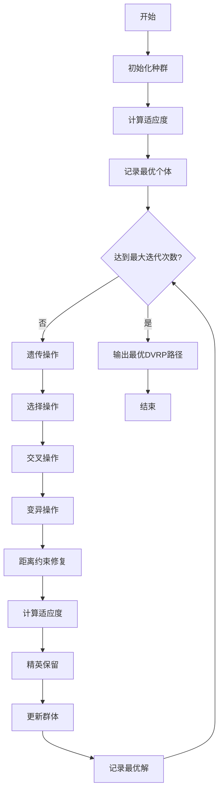
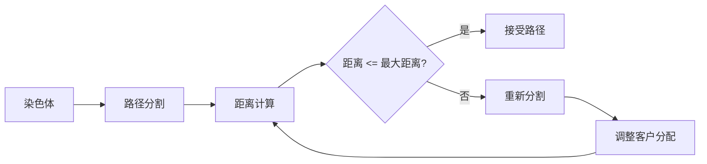
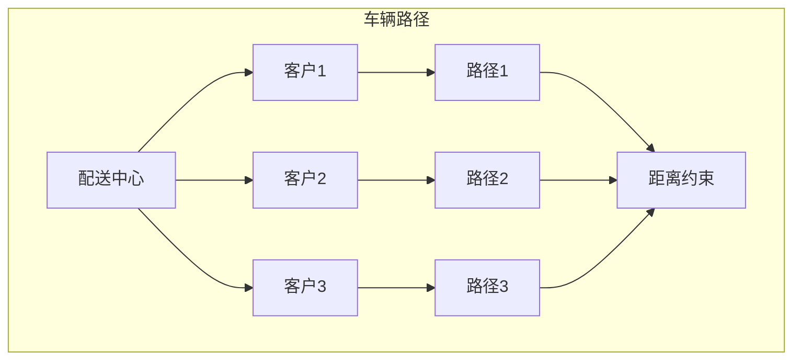

# GA_DVRP - 遗传算法求解距离约束车辆路径问题

## 问题描述

**距离约束车辆路径问题 (Distance-constrained Vehicle Routing Problem, DVRP)**

DVRP在基本VRP基础上增加了车辆行驶距离约束，每辆车的总行驶距离不能超过预设的最大行驶距离限制。

### 数学模型

目标函数：
$min \sum_{k=1}^{K} \sum_{i=0}^{n} \sum_{j=0}^{n} d_{ij} x_{ijk}$

约束条件：
$\sum_{k=1}^{K} \sum_{i=0}^{n} x_{ijk} = 1, \quad \forall j = 1,2,...,n$

$\sum_{i=0}^{n} \sum_{j=0}^{n} d_{ij} x_{ijk} \leq D_{max}, \quad \forall k = 1,2,...,K$  (距离约束)

$\sum_{i=0}^{n} x_{ihk} - \sum_{j=0}^{n} x_{hjk} = 0, \quad \forall h = 1,2,...,n; \forall k = 1,2,...,K$

$\sum_{i=1}^{n} x_{i0k} = 1, \quad \sum_{j=1}^{n} x_{0jk} = 1, \quad \forall k = 1,2,...,K$

## 算法流程

### 基于遗传算法的DVRP求解

1. **距离约束检查**
   - 实时计算车辆从当前位置到目标客户的往返距离
   - 关键约束：$DisTraveled + Distance(current, target) + Distance(target, depot) \leq Travelcon$
   - 考虑从配送中心到客户的完整往返距离

2. **路径构建策略**
   - 采用子路径表示法，每辆车从配送中心出发并返回
   - 在选择下一个客户时，必须确保完成该客户服务后能返回配送中心
   - 动态跟踪每辆车的累计行驶距离

3. **遗传操作设计**
   - **初始化**：生成满足距离约束的初始解
   - **适应度**：基于路径长度和约束满足度
   - **交叉**：保持子路径结构的交叉操作
   - **变异**：局部调整，保持距离约束

## 算法逻辑框架

### GA-DVRP流程图


### 距离约束修复机制


### DVRP路径结构


### 伪代码框架
```
初始化参数
生成初始可行种群（满足距离约束）
while 未达到最大代数:
    计算种群适应度（含距离约束检查）
    记录最优个体
    选择操作
    交叉操作（保持可行性）
    变异操作（保持可行性）
    精英保留
    更新种群
输出最优路径方案
```

## 关键实现特点

### 距离约束处理
```matlab
% 距离约束检查
function isValid = checkDistance(route, Distance, maxDistance)
    currentDist = 0;
    startPos = 1;  % 配送中心
    
    for i = 2:length(route)
        if route(i) == 1  % 返回配送中心
            % 计算当前子路径的往返距离
            subDist = calculateSubPathDistance(route(startPos:i), Distance);
            if subDist > maxDistance
                isValid = false;
                return;
            end
            startPos = i;
            currentDist = 0;
        end
    end
    isValid = true;
end
```

### 距离计算机制
- **往返距离**：每段路径都需要计算从配送中心出发，经过若干客户后返回的总距离
- **累计跟踪**：实时更新当前车辆的行驶距离
- **重置机制**：当车辆返回配送中心时，重置距离计数器

### 适应度计算
```matlab
function [ttlDistance, FitnV] = Fitness(Chrom, Distance, Travelcon)
    for i = 1:size(Chrom, 1)
        route = Chrom(i, :);
        totalDist = 0;
        currentDist = 0;
        startIndex = 1;
        isValid = true;
        
        % 计算每个子路径的距离
        for j = 2:length(route)
            if route(j) == 1
                % 计算子路径距离
                subDist = calculateSubPathDistance(route(startIndex:j), Distance);
                if subDist > Travelcon
                    totalDist = inf;  % 惩罚不可行解
                    isValid = false;
                    break;
                end
                totalDist = totalDist + subDist;
                startIndex = j;
            end
        end
        
        ttlDistance(i) = totalDist;
    end
    FitnV = 1 ./ (ttlDistance + eps);
end
```

## 文件结构

- `Main.m`：GA_DVRP主程序
- `InitPop.m`：初始化种群（生成可行解）
- `Fitness.m`：适应度计算（含距离约束检查）
- `Crossover.m`：交叉操作
- `Mutate.m`：变异操作
- `Select.m`：选择操作
- `Reins.m`：重插入操作
- `Reverse.m`：逆转操作
- `DrawPath.m`：路径可视化
- `TextOutput.m`：结果输出
- `dsxy2figxy.m`：坐标转换工具

## 参数配置

- 种群大小(NIND)：60
- 最大代数(MAXGEN)：100
- 交叉概率(Pc)：0.9
- 变异概率(Pm)：0.05
- 代沟概率(GGAP)：0.9
- 最大行驶距离：从Travelcon.mat读取

## 距离约束特点

### 1. 往返距离计算
- 每辆车必须考虑从配送中心出发并返回的完整路径
- 计算距离时需要包含：配送中心→客户→配送中心的往返

### 2. 子路径分割
- 使用配送中心的出现来标识不同车辆的路径
- 每个子路径必须满足距离约束

### 3. 约束传播
- 距离约束会影响车辆的服务范围
- 距离限制越严格，需要的车辆数量越多

## 使用示例

1. 准备数据文件：
   - `City.mat`：客户和配送中心坐标
   - `Distance.mat`：距离矩阵
   - `Travelcon.mat`：车辆最大行驶距离

2. 运行`Main.m`执行求解

3. 输出结果：
   - 最优车辆路径方案
   - 每辆车的行驶距离
   - 总运输距离
   - 路径可视化图

## 算法优化策略

### 1. 初始解生成
- 使用最近邻算法生成初始可行解
- 结合节约算法提高初始解质量

### 2. 局部改进
- 在遗传算法中加入2-opt改进
- 针对每个子路径进行局部优化

### 3. 参数自适应
- 根据收敛情况调整遗传参数
- 平衡全局搜索和局部搜索

## 实际应用

DVRP适用于：
- **电动车配送**：续航里程限制
- **城市配送**：限行区域距离约束
- **冷链运输**：温控设备续航限制
- **危险品运输**：安全距离限制
- **无人机配送**：飞行距离限制

## 与CVRP的区别

| 特征 | CVRP | DVRP |
|------|------|------|
| 主要约束 | 车辆容量 | 行驶距离 |
| 约束类型 | 载重限制 | 里程限制 |
| 应用场景 | 重量敏感 | 距离敏感 |
| 计算重点 | 载货量累计 | 往返距离计算 |