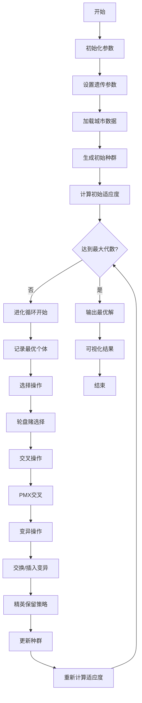
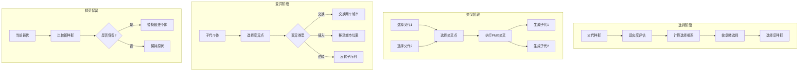
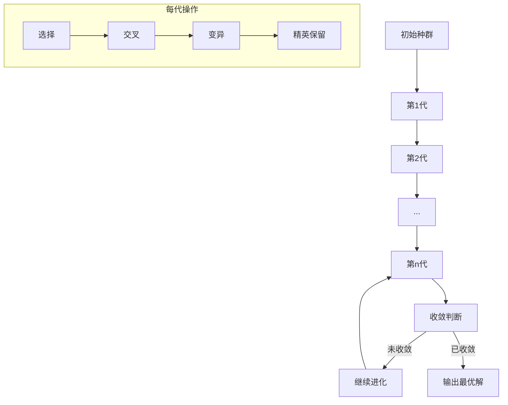
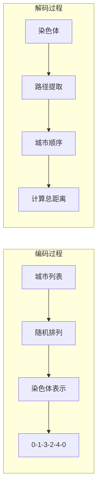

# GA_TSP - 遗传算法求解旅行商问题

## 问题描述

**旅行商问题 (Traveling Salesman Problem, TSP)**

TSP是经典的NP-hard组合优化问题，目标是找到一条经过所有城市且每个城市只经过一次的最短哈密顿回路。

### 数学模型

目标函数：
$min \sum_{i=1}^{n} \sum_{j=1}^{n} d_{ij} x_{ij}$

约束条件：
$\sum_{j=1}^{n} x_{ij} = 1, \quad \forall i = 1,2,...,n$

$\sum_{i=1}^{n} x_{ij} = 1, \quad \forall j = 1,2,...,n$

$\sum_{i \in S} \sum_{j \in S} x_{ij} \leq |S| - 1, \quad \forall S \subset V, 2 \leq |S| \leq n-1$

其中：
- $d_{ij}$：城市i到城市j的距离
- $x_{ij}$：二进制变量，路径中包含边(i,j)时为1，否则为0
- $n$：城市数量

## 算法流程

### 遗传算法 (Genetic Algorithm, GA)

1. **初始化种群**
   - 随机生成NIND个初始解（路径）
   - 每个解是城市的随机排列
   - 确保每个城市只出现一次

2. **适应度评估**
   - 计算每个个体的路径长度
   - 适应度函数：$f(x) = 1 / (path\_length + \epsilon)$
   - 路径越短，适应度越高

3. **遗传操作**
   - **选择**：轮盘赌选择，适应度高的个体更可能被选中
   - **交叉**：部分映射交叉(PMX)或顺序交叉(OX)
   - **变异**：交换变异、插入变异或逆转变异

4. **精英保留策略**
   - 保留每一代的最优个体
   - 防止最优解在遗传操作中丢失

## 算法逻辑框架

### GA-TSP完整进化流程图


### 遗传操作详细流程


### 适应度计算与评估
```mermaid
graph LR
    A[染色体编码] --> B[路径解码]
    B --> C[计算路径长度]
    C --> D[距离累加]
    D --> E[适应度转换]
    E --> F[f = 1/(长度+ε)]
    F --> G[适应度值]
    G --> H[选择概率计算]
```

### 种群进化过程


### 染色体编码与解码


### 伪代码框架
```
初始化参数:
    种群大小 NIND = 60
    最大代数 MAXGEN = 100
    交叉概率 Pc = 0.9
    变异概率 Pm = 0.05
    代沟概率 GGAP = 0.9

加载数据:
    城市坐标 City.mat
    距离矩阵 Distance.mat

主循环:
初始化种群 Chrom = InitPop(NIND, N)
计算适应度 [ObjV, FitnV] = Fitness(Distance, Chrom)

for gen = 1 to MAXGEN:
    % 选择操作
    SelCh = Select(Chrom, FitnV, GGAP)
    
    % 交叉操作
    SelCh = Crossover(SelCh, Pc)
    
    % 变异操作
    SelCh = Mutate(SelCh, Pm)
    
    % 计算子代适应度
    [ObjVSel, FitnVSel] = Fitness(Distance, SelCh)
    
    % 重插入操作
    [Chrom, ObjV] = Reins(Chrom, SelCh, ObjV, ObjVSel)
    
    % 精英保留
    Chrom = EliteReserve(Chrom, ObjV)
    
    % 记录最优解
    [minObjV, minIndex] = min(ObjV)
    trace(gen) = minObjV

输出最优路径和最短距离
```

## 遗传操作详解

### 1. 选择操作
**轮盘赌选择**：
$P_i = \frac{f_i}{\sum_{j=1}^{N} f_j}$

其中$P_i$是个体i被选中的概率，$f_i$是其适应度值。

### 2. 交叉操作
**部分映射交叉(PMX)**：
1. 随机选择两个交叉点
2. 交换两点间的子序列
3. 处理冲突，保持合法性

示例：
父代1：[1 2 3 4 5 6 7 8]
父代2：[8 7 6 5 4 3 2 1]
交叉点：3-6

### 3. 变异操作
**交换变异**：
随机选择两个位置，交换这两个位置的城市。

**插入变异**：
随机选择一个城市，插入到随机选择的另一个位置。

**逆转变异**：
随机选择两个位置，反转这两个位置间的子序列。

## 关键实现特点

### 路径表示
- 使用城市编号的排列表示路径
- 编码为：[0, 城市1, 城市2, ..., 城市n, 0]
- 起点和终点都是配送中心（编码为0）

### 适应度计算
```matlab
function [ttlDistance, FitnV] = Fitness(Distance, Chrom)
    % 计算路径长度
    for i = 1:size(Chrom, 1)
        route = Chrom(i, :);
        dist = 0;
        for j = 2:length(route)
            dist = dist + Distance(route(j-1)+1, route(j)+1);
        end
        ttlDistance(i) = dist;
    end
    % 适应度 = 1/(路径长度 + 小常数)
    FitnV = 1 ./ (ttlDistance + eps);
end
```

### 精英策略
- 每代保留最优个体
- 替换最差个体，确保收敛

## 文件结构

- `Main.m`：GA_TSP主程序
- `InitPop.m`：初始化种群
- `Fitness.m`：适应度计算
- `Crossover.m`：交叉操作
- `Mutate.m`：变异操作
- `Select.m`：选择操作
- `Reins.m`：重插入操作
- `Reverse.m`：逆转操作
- `DrawPath.m`：路径可视化
- `TextOutput.m`：结果输出
- `dsxy2figxy.m`：坐标转换工具

## 参数配置

- 种群大小(NIND)：60
- 最大代数(MAXGEN)：100
- 交叉概率(Pc)：0.9
- 变异概率(Pm)：0.05
- 代沟概率(GGAP)：0.9

## 算法性能分析

### 收敛特性
- 早期：快速收敛
- 中期：平衡探索与开发
- 后期：精细搜索

### 参数影响
- **种群大小**：影响搜索空间的覆盖度
- **交叉概率**：影响新解的生成速度
- **变异概率**：影响种群的多样性
- **最大代数**：影响算法的收敛精度

## 使用示例

1. 准备数据文件：
   - `City.mat`：城市坐标数据
   - `Distance.mat`：城市间距离矩阵

2. 运行`Main.m`执行求解

3. 输出结果：
   - 最优路径
   - 最短距离
   - 收敛曲线
   - 路径可视化图

## 优缺点分析

### 优点
- 全局搜索能力强
- 并行性好，适合并行计算
- 不依赖梯度信息
- 对问题结构要求低

### 缺点
- 可能早熟收敛
- 参数调优困难
- 计算量较大
- 局部搜索能力弱

## 改进方向

1. **混合算法**：与局部搜索结合
2. **自适应参数**：动态调整交叉和变异概率
3. **多种群策略**：提高搜索多样性
4. **并行化**：利用并行计算提高效率