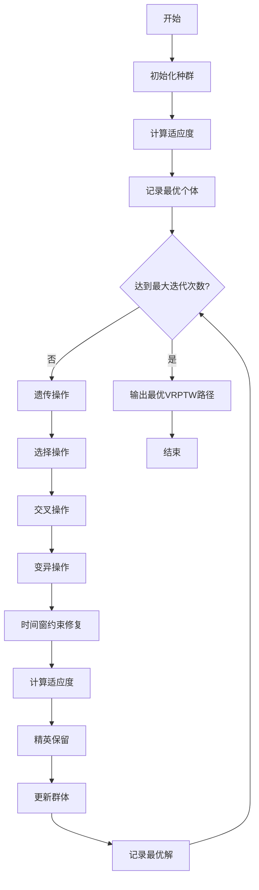
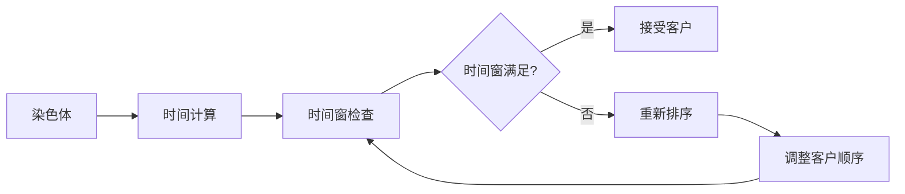

# GA-VRPTW: 遗传算法求解带时间窗车辆路径问题

## 问题描述

带时间窗车辆路径问题 (Vehicle Routing Problem with Time Windows, VRPTW) 是在VRP基础上增加了客户时间窗约束的复杂问题。每个客户i有服务时间窗 [e_i, l_i]，车辆必须在时间窗内到达客户处进行服务。

### 数学模型

**目标函数：**
$$\min \sum_{i=0}^{n} \sum_{j=0}^{n} \sum_{k=1}^{m} c_{ij} x_{ijk}$$

**约束条件：**
1. **时间窗约束：**
   $$e_i \leq a_i \leq l_i, \quad \forall i \in \{1,2,...,n\}$$
   
2. **容量约束：**
   $$\sum_{i=1}^{n} q_i y_{ik} \leq Q, \quad \forall k \in \{1,2,...,m\}$$
   
3. **路径约束：**
   $$\sum_{k=1}^{m} \sum_{i=0}^{n} x_{ijk} = 1, \quad \forall j \in \{1,2,...,n\}$$

## 算法逻辑框架

### GA-VRPTW流程图


### 时间窗约束修复机制


### VRPTW时间窗结构
```mermaid
graph TD
    subgraph "时间窗客户"
        A[配送中心] --> B[客户1: [8:00-12:00]]
        A --> C[客户2: [9:00-14:00]]
        A --> D[客户3: [10:00-16:00]]
        
        B --> E[车辆1路径]
        C --> F[车辆2路径]
        D --> G[车辆3路径]
        
        E --> H[时间窗检查]
        F --> H
        G --> H
    end
```

### 伪代码框架
```
初始化种群
计算适应度
记录最优个体

while 未达到最大迭代次数:
    选择操作：轮盘赌选择
    交叉操作：部分映射交叉
    变异操作：交换变异
    时间窗约束修复：处理时间窗冲突
    计算适应度
    精英保留：保留最优个体
    更新群体
    记录最优解

输出最优VRPTW路径
```

## 关键实现特点

### 染色体编码
- **路径表示**：使用客户序列表示车辆路径
- **时间窗处理**：在适应度计算中考虑时间窗约束
- **修复机制**：自动处理时间窗冲突

### 遗传操作
```matlab
% 交叉操作示例
function [offspring1, offspring2] = crossover(parent1, parent2)
    % 部分映射交叉(PMX)
    % 保持路径的相对顺序
end

% 变异操作示例
function offspring = mutate(individual)
    % 交换变异
    % 随机交换两个客户位置
end
```

### 时间窗处理
- **到达时间计算**：考虑行驶时间和服务时间
- **等待时间处理**：车辆可以提前到达等待时间窗开始
- **惩罚函数**：对违反时间窗的解进行惩罚

## 文件结构

```
GA_VRPTW/
├── Main.m              % 主程序入口
├── InitPop.m           % 种群初始化
├── Fitness.m           % 适应度计算
├── Select.m            % 选择操作
├── Crossover.m         % 交叉操作
├── Mutate.m            % 变异操作
├── Reins.m             % 重插入操作
├── Reverse.m           % 路径反转优化
├── DrawPath.m          % 路径可视化
├── TextOutput.m        % 结果输出
└── dsxy2figxy.m        % 坐标转换工具
```

## 参数配置

| 参数名称 | 建议值 | 说明 |
|---------|--------|------|
| 种群大小 | 100-200 | 根据问题规模调整 |
| 交叉概率 | 0.8-0.9 | 高交叉概率促进搜索 |
| 变异概率 | 0.1-0.2 | 低变异概率保持稳定性 |
| 最大迭代次数 | 500-1000 | 根据收敛情况调整 |
| 精英保留比例 | 0.1-0.2 | 保留优秀个体 |

## 使用示例

```matlab
% 运行主程序
Main

% 结果将显示：
% 1. 最优路径图
% 2. 客户分配方案
% 3. 时间窗满足情况
% 4. 算法收敛曲线
```

## 算法性能分析

### 收敛特性
- **收敛速度**：中等，需要较多迭代
- **解的质量**：较好，能找到接近最优解
- **稳定性**：较高，多次运行结果差异不大

### 时间复杂度
- **种群初始化**：O(pop_size × n)
- **适应度计算**：O(pop_size × n²)
- **遗传操作**：O(pop_size × n)

## 可视化与分析

### 输出结果
1. **最优路径图**：显示车辆路径和客户时间窗
2. **收敛曲线**：展示算法收敛过程
3. **时间窗分析**：展示每个客户的服务时间
4. **车辆利用率**：显示每辆车的负载情况

## 优缺点分析

### 优点
- 能够处理复杂的时间窗约束
- 具有良好的全局搜索能力
- 易于并行化实现
- 适合大规模问题

### 缺点
- 收敛速度相对较慢
- 参数调节较为敏感
- 可能陷入局部最优
- 需要设计有效的修复机制

## 改进方向

1. **混合算法**：结合局部搜索提升解质量
2. **自适应参数**：动态调整遗传参数
3. **多目标优化**：考虑时间窗违反最小化
4. **并行计算**：利用并行计算加速搜索