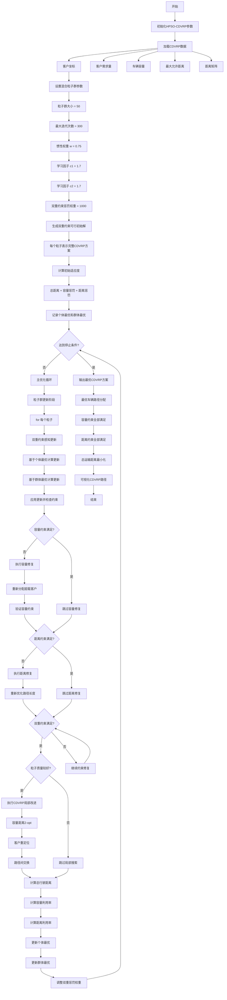
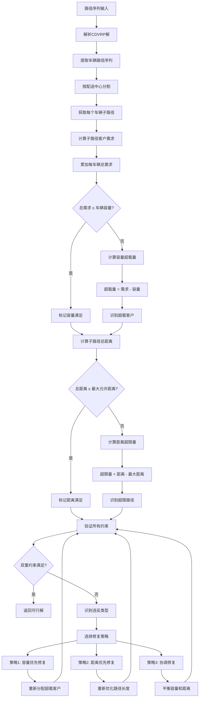
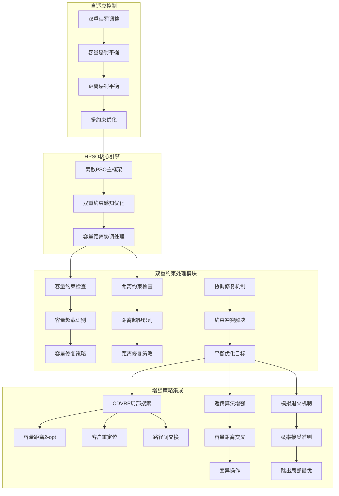
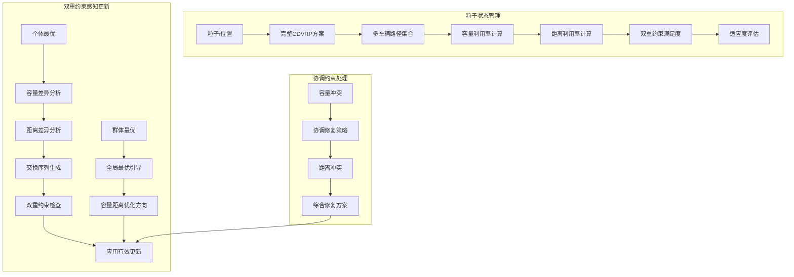
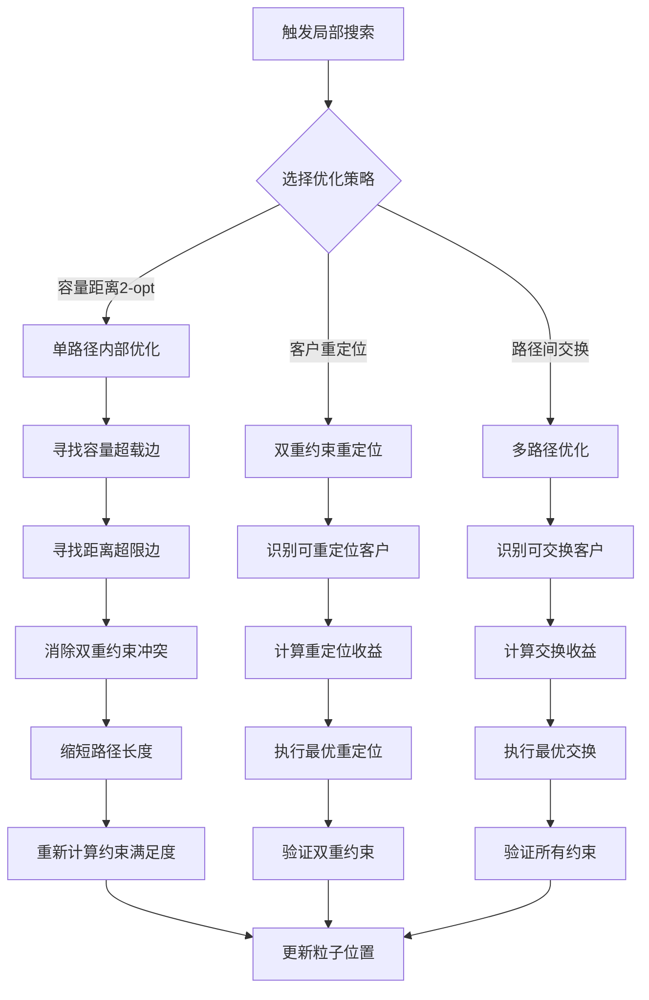
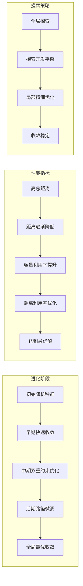

# HPSO_CDVRP - 混合粒子群算法求解容量距离约束车辆路径问题

## 问题描述

**容量距离约束车辆路径问题 (Capacitated Distance-constrained Vehicle Routing Problem, CDVRP)**

CDVRP是VRP的最复杂变体之一，同时考虑车辆载重容量和最大行驶距离双重约束。每辆车必须同时满足：
1. 载重不超过车辆容量限制
2. 总行驶距离不超过最大允许距离

### 数学模型

目标函数：
$min \sum_{k=1}^{m} \sum_{i=0}^{n} \sum_{j=0}^{n} c_{ij} x_{ijk}$

约束条件：
1. **容量约束**：
$\sum_{i=1}^{n} q_i y_{ik} \leq Q_k, \quad \forall k$

2. **距离约束**：
$\sum_{i=0}^{n} \sum_{j=0}^{n} d_{ij} x_{ijk} \leq D_{max}, \quad \forall k$

3. **客户分配**：
$\sum_{k=1}^{m} y_{ik} = 1, \quad \forall i = 1,2,...,n$

4. **流量守恒**：
$\sum_{j=0}^{n} x_{ijk} - \sum_{j=0}^{n} x_{jik} = 0, \quad \forall i,k$

5. **子回路消除**：
$\sum_{i \in S} \sum_{j \in S} x_{ijk} \leq |S| - 1, \quad \forall S \subseteq V \setminus \{0\}, \forall k$

## 算法挑战

### 双重约束的复杂性

CDVRP面临的主要挑战：
1. **约束耦合**：容量和距离约束相互影响，一个约束的改变可能影响另一个
2. **搜索空间急剧缩减**：双重约束使可行解空间大幅减少
3. **计算复杂度倍增**：需要同时检查两种约束
4. **邻域操作受限**：操作必须同时满足两个约束
5. **修复难度增加**：需要协调两种约束的修复过程

### 约束冲突类型

**冲突分类**：
1. **容量超载**：路径总需求超过车辆容量
2. **距离超限**：路径总距离超过最大允许距离
3. **双重违反**：同时违反容量和距离约束
4. **约束冲突**：修复一种约束可能导致另一种约束违反

## 算法设计

### 混合粒子群优化框架

HPSO_CDVRP采用分层处理策略：
1. **双层约束检查**：并行检查容量和距离约束
2. **协调修复机制**：综合处理双重约束违反
3. **智能邻域操作**：设计考虑双重约束的邻域结构
4. **自适应参数调整**：根据约束违反情况动态调整参数

### 粒子表示设计

**复合粒子结构**：
```matlab
% CDVRP粒子类定义
class CDVRPParticle
    properties
        routes          % 车辆路径集合
        loads           % 每辆车的装载量
        distances       % 每条路径的总距离
        capacities      % 车辆容量限制
        maxDistances    % 最大允许距离
        violations      % 约束违反记录
        pbestRoutes     % 个体最优路径
        pbestDistance   % 个体最优距离
    end
end
```

## 算法流程

### 基于HPSO的CDVRP求解

1. **初始化阶段**
   - 生成同时满足双重约束的初始粒子群
   - 建立双重约束检查机制
   - 初始化协调修复策略

2. **双层约束检查**
   - 并行检查容量约束：load ≤ Q
   - 并行检查距离约束：distance ≤ Dmax
   - 识别约束违反的类型和程度

3. **协调修复机制**
   - 容量优先修复：先处理容量超载
   - 距离优先修复：再处理距离超限
   - 综合协调修复：平衡两种约束

4. **智能邻域操作**
   - 设计考虑双重约束的邻域结构
   - 预评估操作的双重约束影响
   - 选择最优的约束友好操作

5. **自适应优化**
   - 根据约束违反调整搜索策略
   - 动态平衡两种约束的重要性
   - 智能引导搜索方向

## 算法逻辑框架

### HPSO-CDVRP完整优化流程图


### 双重约束检查机制详解


### 混合策略架构图


### 粒子群动态更新机制


### 局部搜索优化详解


### 算法收敛过程


### 伪代码框架
```
初始化HPSO-CDVRP参数:
    粒子群大小 SwarmSize = 50
    最大迭代次数 MaxIter = 300
    惯性权重 w = 0.75
    个体学习因子 c1 = 1.7
    群体学习因子 c2 = 1.7
    容量惩罚权重 = 1000
    距离惩罚权重 = 1000
    车辆容量 Q
    最大允许距离 Dmax
    客户数量 N

加载CDVRP数据:
    客户坐标 Customers.mat
    客户需求 Demands.mat
    车辆容量 Capacity.mat
    最大允许距离 MaxDistance.mat
    距离矩阵 Distance.mat

主优化过程:
% 初始化双重约束可行的粒子群
for i = 1 to SwarmSize:
    粒子i位置 = generateFeasibleCDVRPSolution(客户坐标, 客户需求, 车辆容量, 最大距离)
    粒子i速度 = 空交换序列
    粒子i个体最优 = 粒子i位置
    计算粒子i适应度(总距离 + 容量惩罚 + 距离惩罚)

群体最优 = 适应度最好的粒子位置

for iter = 1 to MaxIter:
    for 每个粒子i:
        % 双重约束感知更新 - 离散交换序列
        个体交换序列 = 计算个体交换序列(粒子i位置, 粒子i个体最优)
        群体交换序列 = 计算群体交换序列(粒子i位置, 群体最优)
        
        粒子i速度 = w * 粒子i速度 + c1 * rand() * 个体交换序列 + c2 * rand() * 群体交换序列
        
        % 位置更新 - 应用交换序列
        粒子i新位置 = 应用交换序列(粒子i位置, 粒子i速度)
        
        % 双重约束检查与修复
        [容量满足, 距离满足] = checkDualConstraints(粒子i新位置, 客户需求, 车辆容量, 最大距离)
        
        if not 容量满足:
            粒子i新位置 = repairCapacityViolations(粒子i新位置, 超载信息)
            粒子i新位置 = verifyDistanceConstraints(粒子i新位置, 最大距离)
        
        if not 距离满足:
            粒子i新位置 = repairDistanceViolations(粒子i新位置, 超限信息)
            粒子i新位置 = verifyCapacityConstraints(粒子i新位置, 客户需求, 车辆容量)
        
        % 局部搜索触发
        if 粒子i适应度改善率 > 局部搜索阈值:
            粒子i新位置 = CDVRPLocalImprovement(粒子i新位置)
        
        % 适应度评估
        新适应度 = calculateCDVRPTotalDistance(粒子i新位置)
        新适应度 += capacityPenalty(粒子i新位置)
        新适应度 += distancePenalty(粒子i新位置)
        
        % 更新个体最优
        if 新适应度 < 粒子i历史最优适应度:
            粒子i个体最优 = 粒子i新位置
            粒子i历史最优适应度 = 新适应度
    
    % 更新群体最优
    当前最优粒子 = 找出最佳适应度粒子
    if 当前最优粒子适应度 < 群体最优适应度:
        群体最优 = 当前最优粒子位置
        群体最优适应度 = 当前最优粒子适应度
    
    % 自适应参数调整
    w = w * 0.99  % 逐渐降低惯性权重
    容量惩罚权重 = 容量惩罚权重 * 1.01
    距离惩罚权重 = 距离惩罚权重 * 1.01
    
    记录统计信息

输出最优CDVRP方案:
    最优车辆路径 = 群体最优
    总运输距离 = 群体最优适应度
    容量满足率 = calculateCapacitySatisfaction(群体最优)
    距离满足率 = calculateDistanceSatisfaction(群体最优)
    车辆使用数量 = countVehicles(群体最优)
    
可视化CDVRP路径
```

## 关键实现特点

### 1. 双重约束检查机制

**并行约束检查**：
```matlab
% 同时检查容量和距离约束
function [feasible, violations, priorities] = checkDualConstraints(routes, demands, capacity, maxDistance, distanceMatrix, depot)
    violations = struct('capacity', [], 'distance', []);
    
    for k = 1:length(routes)
        route = routes{k};
        
        % 容量检查
        totalDemand = sum(demands(route));
        capacityViolation = max(0, totalDemand - capacity);
        violations.capacity(k) = capacityViolation;
        
        % 距离检查
        totalDistance = calculateRouteDistance(route, depot, distanceMatrix);
        distanceViolation = max(0, totalDistance - maxDistance);
        violations.distance(k) = distanceViolation;
    end
    
    % 确定修复优先级
    priorities = determineRepairPriority(violations);
    feasible = all([violations.capacity, violations.distance] == 0);
end
```

### 2. 协调修复策略

**分层修复算法**：
```matlab
% 协调双重约束修复
function repairedRoutes = coordinateDualRepair(routes, violations, priorities, demands, capacity, maxDistance, distanceMatrix, depot)
    repairedRoutes = routes;
    
    % 按优先级执行修复
    for priority in priorities
        switch priority.type
            case 'capacity'
                repairedRoutes = repairCapacityViolation(repairedRoutes, priority.routeIdx, demands, capacity);
                % 检查距离约束影响
                repairedRoutes = verifyDistanceConstraints(repairedRoutes, maxDistance, distanceMatrix, depot);
                
            case 'distance'
                repairedRoutes = repairDistanceViolation(repairedRoutes, priority.routeIdx, maxDistance, distanceMatrix, depot);
                % 检查容量约束影响
                repairedRoutes = verifyCapacityConstraints(repairedRoutes, demands, capacity);
        end
    end
end
```

### 3. 智能邻域操作

**双重约束感知操作**：
```matlab
% 双重约束感知的客户交换
function newRoutes = dualConstraintSwap(routes, i, j, demands, capacity, maxDistance, distanceMatrix, depot)
    % 预评估交换的双重约束影响
    route1 = routes{i};
    route2 = routes{j};
    
    % 寻找双重约束可行的交换方案
    feasibleSwaps = findDualFeasibleSwaps(route1, route2, demands, capacity, maxDistance, distanceMatrix, depot);
    
    if ~isempty(feasibleSwaps)
        % 选择最优的双重约束友好交换
        [bestSwap, improvement] = selectBestDualSwap(feasibleSwaps);
        newRoutes = applyDualSwap(routes, bestSwap);
    else
        newRoutes = routes;  % 保持原方案
    end
end
```

### 4. 自适应协调机制

**动态权重调整**：
```matlab
% 自适应协调权重调整
function [alpha, beta] = adaptDualWeights(violations, iteration)
    % 根据约束违反情况调整权重
    totalCapacityViolation = sum(violations.capacity);
    totalDistanceViolation = sum(violations.distance);
    
    % 动态平衡两种约束的重要性
    if totalCapacityViolation > totalDistanceViolation
        alpha = min(1.5, 1.0 + 0.1 * iteration/100);  % 容量权重增加
        beta = max(0.5, 1.0 - 0.1 * iteration/100);   % 距离权重减少
    else
        alpha = max(0.5, 1.0 - 0.1 * iteration/100);  % 容量权重减少
        beta = min(1.5, 1.0 + 0.1 * iteration/100);   % 距离权重增加
    end
end
```

## 文件结构

- `Main.m`：HPSO_CDVRP主程序
- `CDVRPParticle.m`：CDVRP粒子类定义
- `DualCheck.m`：双重约束检查
- `CoordinateRepair.m`：协调修复机制
- `DualLocalSearch.m`：双重优化局部搜索
- `AdaptiveWeights.m`：自适应权重调整
- `RouteCoordination.m`：路径协调优化
- `DualVisualization.m`：双重约束可视化
- `ComplexMetrics.m`：复杂性能指标

## 参数配置

### HPSO参数（针对双重约束优化）
- 粒子数量：100-150（考虑双重约束复杂性）
- 最大迭代次数：1200-2000
- 惯性权重(w)：0.75 → 0.25（更慢递减）
- 个体学习因子(c1)：2.0 → 0.7
- 群体学习因子(c2)：0.7 → 2.0

### CDVRP参数
- 车辆容量(Q)：根据车辆类型设定
- 最大行驶距离(Dmax)：考虑实际限制
- 双重约束容忍度：0.05-0.1
- 协调修复迭代：每次主迭代3-5次

### 自适应参数
- 初始双重权重：$\alpha_0 = 1.0$, $\beta_0 = 1.0$
- 权重调整步长：0.1
- 协调修复深度：2层嵌套
- 复杂约束检查频率：每5次迭代

## 协调修复机制

### 1. 分层修复策略

**容量优先修复**：
```matlab
% 容量约束修复
function repairedRoutes = repairCapacityViolation(routes, routeIdx, demands, capacity)
    route = routes{routeIdx};
    totalDemand = sum(demands(route));
    
    if totalDemand > capacity
        % 识别超载客户
        overload = totalDemand - capacity;
        customersToMove = identifyCustomersToMove(route, demands, overload);
        
        % 寻找最优重分配方案
        bestAllocation = findOptimalAllocation(customersToMove, routes, demands, capacity);
        
        % 执行重分配
        repairedRoutes = executeAllocation(routes, bestAllocation);
    else
        repairedRoutes = routes;
    end
end
```

**距离优先修复**：
```matlab
% 距离约束修复
function repairedRoutes = repairDistanceViolation(routes, routeIdx, maxDistance, distanceMatrix, depot)
    route = routes{routeIdx};
    totalDistance = calculateRouteDistance(route, depot, distanceMatrix);
    
    if totalDistance > maxDistance
        % 识别需要分割的位置
        excessDistance = totalDistance - maxDistance;
        splitPoints = findOptimalSplitPoints(route, excessDistance, distanceMatrix, depot);
        
        % 执行路径分割
        repairedRoutes = splitRouteAtPoints(routes, routeIdx, splitPoints);
    else
        repairedRoutes = routes;
    end
end
```

### 2. 协调优化算法

**双重约束平衡**：
```matlab
% 双重约束平衡优化
function balancedRoutes = balanceDualConstraints(routes, demands, capacity, maxDistance, distanceMatrix, depot)
    balancedRoutes = routes;
    
    % 计算当前约束状态
    [utilizations, violations] = analyzeDualConstraints(balancedRoutes, demands, capacity, maxDistance, distanceMatrix, depot);
    
    % 执行协调优化
    for iter = 1:5  % 协调迭代
        % 容量优化
        balancedRoutes = optimizeCapacityUtilization(balancedRoutes, demands, capacity);
        
        % 距离优化
        balancedRoutes = optimizeDistanceUtilization(balancedRoutes, maxDistance, distanceMatrix, depot);
        
        % 检查协调效果
        [newUtilizations, newViolations] = analyzeDualConstraints(balancedRoutes, demands, capacity, maxDistance, distanceMatrix, depot);
        
        if all(newViolations.capacity == 0) && all(newViolations.distance == 0)
            break;  % 达到协调平衡
        end
    end
end
```

## 复杂性能指标

### 1. 双重约束满足度

**综合满足度**：
$S_{dual} = \frac{1}{2}(S_{capacity} + S_{distance})$

其中：
- $S_{capacity} = 1 - \frac{\sum \text{容量违反}}{n \cdot Q}$
- $S_{distance} = 1 - \frac{\sum \text{距离违反}}{m \cdot D_{max}}$

### 2. 资源利用效率

**双重资源效率**：
$E_{dual} = \frac{\sum_{k=1}^{m} (\frac{L_k}{Q} \cdot \frac{D_k}{D_{max}})}{m}$

### 3. 协调优化效果

**协调度指标**：
$C_{coordination} = 1 - \frac{|U_{capacity} - U_{distance}|}{\max(U_{capacity}, U_{distance})}$

其中：
- $U_{capacity}$：平均容量利用率
- $U_{distance}$：平均距离利用率

## 实际应用场景

### 1. 综合物流配送
- **冷链物流**：冷藏车的容量和续航双重限制
- **危险品运输**：载重限制和安全距离限制
- **大型配送中心**：多仓库协调的复杂约束

### 2. 城市配送优化
- **电动车配送**：电池容量和续航里程双重约束
- **时间窗配送**：结合时间窗的双重约束优化
- **多车型配送**：不同车辆的异质约束

### 3. 工业供应链
- **原材料配送**：供应商到工厂的复杂约束
- **成品配送**：工厂到经销商的多重限制
- **逆向物流**：回收物流的双重约束

## 算法扩展功能

### 1. 多目标优化
- **成本-服务平衡**：平衡运输成本和服务质量
- **效率-鲁棒性**：平衡效率和系统鲁棒性
- **多维度优化**：同时优化距离、时间、成本

### 2. 动态约束处理
- **实时调整**：根据实时情况调整约束参数
- **预测优化**：基于预测数据优化约束处理
- **自适应机制**：根据历史数据自适应调整

### 3. 分布式优化
- **多区域协调**：跨区域配送的协调优化
- **层次化优化**：总部-区域-网点的层次优化
- **协同配送**：多个配送商的协同优化

## 注意事项与最佳实践

### 1. 约束建模
- **准确建模**：确保容量和距离约束的准确性
- **合理松弛**：适当设置约束松弛度避免过度限制
- **优先级设置**：根据实际业务设置约束优先级

### 2. 参数调优
- **渐进调优**：从简单约束开始逐步增加复杂度
- **分层调优**：分别调优容量和距离相关参数
- **协调调优**：同时考虑两种约束的参数协调

### 3. 计算优化
- **并行计算**：利用并行计算处理双重约束检查
- **缓存机制**：缓存距离计算结果提高效率
- **启发式加速**：使用启发式规则加速收敛

### 4. 结果验证
- **多重验证**：使用不同方法验证结果正确性
- **敏感性分析**：分析约束参数变化的影响
- **实际测试**：在实际场景中进行测试验证