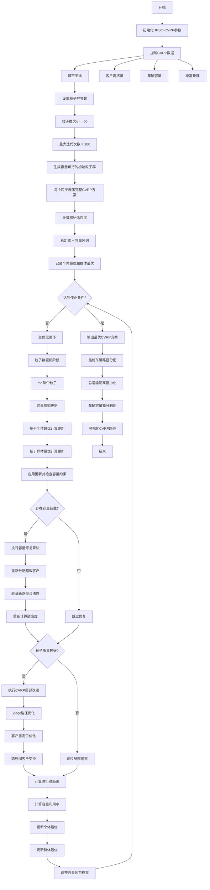
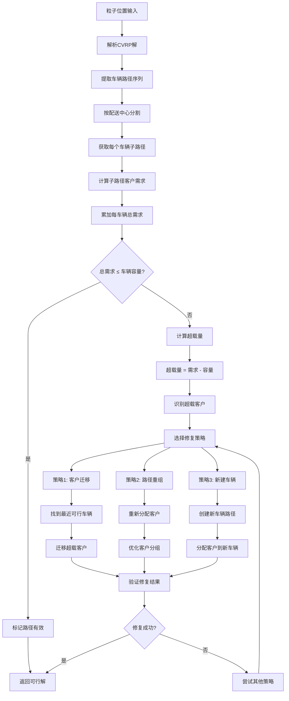
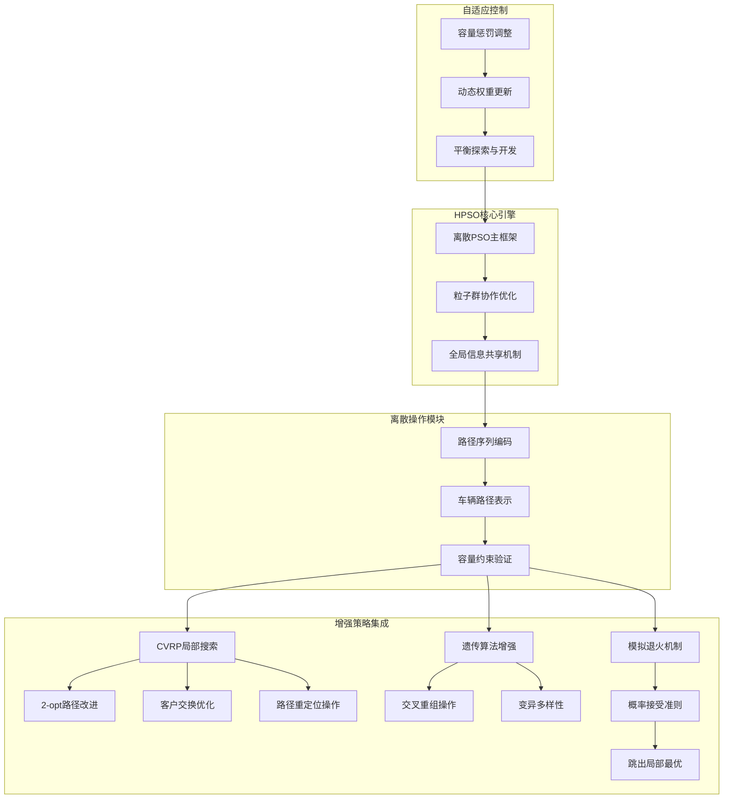
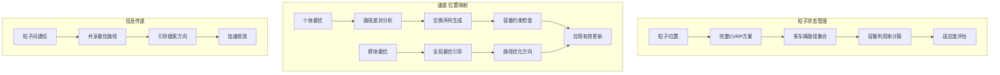
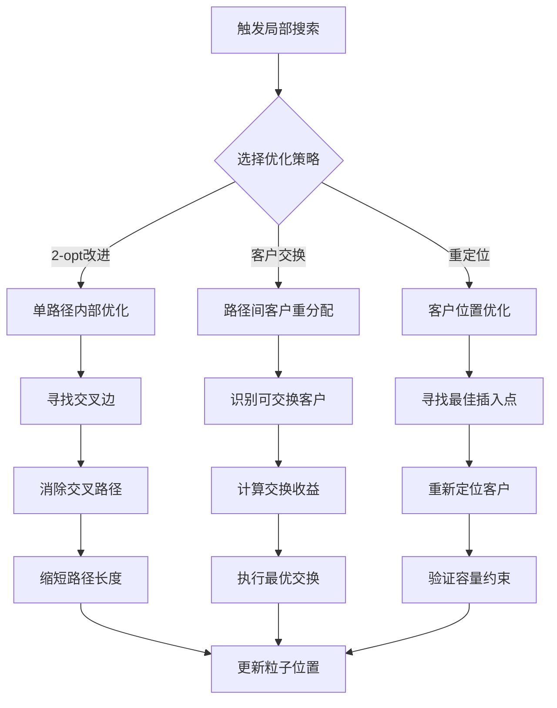
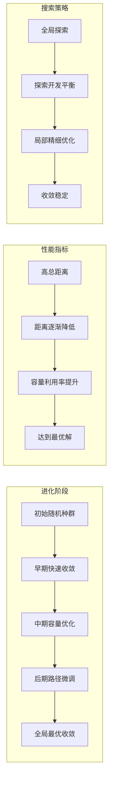

# HPSO_CVRP - 混合粒子群算法求解容量约束车辆路径问题

## 问题描述

**容量约束车辆路径问题 (Capacitated Vehicle Routing Problem, CVRP)**

CVRP是VRP的基本变体，要求每辆车从仓库出发，为多个客户提供服务，每辆车有载重容量限制，目标是找到总行驶距离最短的路径方案。

### 数学模型

目标函数：
$min \sum_{k=1}^{m} \sum_{i=0}^{n} \sum_{j=0}^{n} d_{ij} x_{ijk}$

约束条件：
1. **容量约束**：
$\sum_{i=1}^{n} q_i y_{ik} \leq Q_k, \quad \forall k$

2. **客户分配**：
$\sum_{k=1}^{m} y_{ik} = 1, \quad \forall i = 1,2,...,n$

3. **流量守恒**：
$\sum_{j=0}^{n} x_{ijk} - \sum_{j=0}^{n} x_{jik} = 0, \quad \forall i,k$

4. **子回路消除**：
$\sum_{i \in S} \sum_{j \in S} x_{ijk} \leq |S| - 1, \quad \forall S \subseteq V \setminus \{0\}, \forall k$

## 算法原理

### 混合粒子群优化在CVRP中的应用

HPSO_CVRP通过以下方式处理容量约束：
1. **离散粒子表示**：使用路径序列表示粒子位置
2. **容量感知更新**：在粒子更新时考虑容量约束
3. **局部搜索增强**：使用VRP专用局部改进算子
4. **约束处理机制**：智能处理容量约束违反

### 粒子表示设计

**路径编码**：
- 使用客户排列表示车辆路径
- 插入仓库节点作为路径分隔符
- 例如：[0,1,3,2,0,4,5,6,0]表示两辆车：
  - 车辆1：0→1→3→2→0
  - 车辆2：0→4→5→6→0

**容量检查**：
- 每个粒子必须满足容量约束
- 超载粒子需要进行修复
- 适应度计算考虑容量违反惩罚

## 算法流程

### 基于HPSO的CVRP求解

1. **初始化**
   - 生成满足容量约束的初始粒子群
   - 每个粒子表示一个完整的CVRP方案
   - 计算每个粒子的总距离和容量利用率

2. **容量感知更新**
   - 基于个体和群体最优进行粒子更新
   - 在更新过程中检查容量约束
   - 修复超载路径保持可行性

3. **局部搜索优化**
   - 对优质粒子进行路径改进
   - 使用2-opt、relocate等VRP算子
   - 优化单车路径和车辆间分配

4. **约束处理**
   - 容量约束检查机制
   - 超载路径修复算法
   - 惩罚函数引导搜索

## 算法逻辑框架

### HPSO-CVRP完整优化流程图


### 容量约束处理机制详解


### 混合策略架构图


### 粒子群动态更新机制


### 局部搜索优化详解


### 算法收敛过程


### 伪代码框架
```
初始化HPSO-CVRP参数:
    粒子群大小 SwarmSize = 50
    最大迭代次数 MaxIter = 100
    惯性权重 w = 0.7
    个体学习因子 c1 = 1.5
    群体学习因子 c2 = 1.5
    局部搜索触发阈值 = 0.1
    容量惩罚权重 = 1000
    车辆容量 Q
    客户数量 N

加载CVRP数据:
    城市坐标 City.mat
    客户需求 Demands.mat
    车辆容量 Capacity.mat
    距离矩阵 Distance.mat

主优化过程:
% 初始化容量可行的粒子群
for i = 1 to SwarmSize:
    粒子i位置 = generateFeasibleCVRPSolution(城市坐标, 客户需求, 车辆容量)
    粒子i速度 = 空交换序列
    粒子i个体最优 = 粒子i位置
    计算粒子i适应度(总距离 + 容量惩罚)

群体最优 = 适应度最好的粒子位置

for iter = 1 to MaxIter:
    for 每个粒子i:
        % 容量感知更新 - 离散交换序列
        个体交换序列 = 计算个体交换序列(粒子i位置, 粒子i个体最优)
        群体交换序列 = 计算群体交换序列(粒子i位置, 群体最优)
        
        粒子i速度 = w * 粒子i速度 + c1 * rand() * 个体交换序列 + c2 * rand() * 群体交换序列
        
        % 位置更新 - 应用交换序列
        粒子i新位置 = 应用交换序列(粒子i位置, 粒子i速度)
        
        % 容量约束检查与修复
        if not checkCapacityConstraints(粒子i新位置, 客户需求, 车辆容量):
            粒子i新位置 = repairCVRPSolution(粒子i新位置, 超载信息)
        
        % 局部搜索触发
        if 粒子i适应度改善率 > 局部搜索触发阈值:
            粒子i新位置 = CVRPLocalImprovement(粒子i新位置)
        
        % 适应度评估
        新适应度 = calculateCVRPTotalDistance(粒子i新位置)
        新适应度 += capacityPenalty(粒子i新位置)
        
        % 更新个体最优
        if 新适应度 < 粒子i历史最优适应度:
            粒子i个体最优 = 粒子i新位置
            粒子i历史最优适应度 = 新适应度
    
    % 更新群体最优
    当前最优粒子 = 找出最佳适应度粒子
    if 当前最优粒子适应度 < 群体最优适应度:
        群体最优 = 当前最优粒子位置
        群体最优适应度 = 当前最优粒子适应度
    
    % 自适应参数调整
    w = w * 0.99  % 逐渐降低惯性权重
    容量惩罚权重 = 容量惩罚权重 * 1.01  % 逐步增强约束
    
    记录统计信息

输出最优CVRP方案:
    最优车辆路径 = 群体最优
    总运输距离 = 群体最优适应度
    车辆使用数量 = countVehicles(群体最优)
    每车载货量 = calculateLoadPerVehicle(群体最优)
    
可视化CVRP路径
```

## 关键实现特点

### 1. 容量约束粒子表示
```matlab
% CVRP粒子类定义
class CVRPParticle
    properties
        routes         % 车辆路径集合
        loads          % 每辆车的装载量
        totalDistance  % 总行驶距离
        capacityUtil   % 容量利用率
        pbestRoutes    % 个体最优路径
        pbestDistance  % 个体最优距离
    end
end
```

### 2. 容量感知更新机制

**基于路径的更新**：
```matlab
% 容量感知的路径更新
function newRoutes = capacityAwareUpdate(current, pbest, gbest)
    % 分析当前路径的容量利用情况
    currentUtil = calculateCapacityUtilization(current);
    
    % 基于个体最优的路径改进
    pbestImprovement = identifyImprovements(current, pbest);
    
    % 基于群体最优的路径学习
    gbestLearning = extractPatterns(gbest);
    
    % 综合更新保持容量可行
    newRoutes = applyImprovements(current, pbestImprovement, gbestLearning);
end
```

### 3. CVRP专用局部搜索

**单车路径优化**：
```matlab
% 单车路径2-opt改进
function improvedRoute = route2opt(route, distanceMatrix)
    n = length(route);
    improved = false;
    
    for i = 1:n-3
        for j = i+2:n-1
            % 计算2-opt改进
            delta = calculate2optDelta(route, i, j, distanceMatrix);
            
            if delta < -epsilon
                route = apply2opt(route, i, j);
                improved = true;
            end
        end
    end
    
    improvedRoute = route;
end
```

**车辆间客户重分配**：
```matlab
% 车辆间客户重分配优化
function newRoutes = interRouteOptimization(routes, demands, capacity)
    % 识别重分配机会
    opportunities = identifyReallocationOpportunities(routes, demands, capacity);
    
    % 执行客户重分配
    for opportunity in opportunities
        [sourceRoute, targetRoute, customer] = opportunity;
        
        % 检查重分配的可行性
        if checkReallocationFeasibility(sourceRoute, targetRoute, customer, capacity)
            newRoutes = executeReallocation(routes, opportunity);
        end
    end
end
```

### 4. 容量约束处理机制

**智能修复算法**：
```matlab
% 容量超载修复
function repairedRoutes = repairCapacityViolation(routes, demands, capacity)
    % 识别超载路径
    overloadedRoutes = findOverloadedRoutes(routes, demands, capacity);
    
    for route in overloadedRoutes
        % 计算超载量
        overload = calculateOverload(route, demands, capacity);
        
        % 寻找最优修复方案
        bestRepair = findOptimalRepair(route, overload, otherRoutes);
        
        % 执行修复
        repairedRoutes = applyRepair(repairedRoutes, bestRepair);
    end
end
```

## 文件结构

- `Main.m`：HPSO_CVRP主程序
- `CVRPParticle.m`：CVRP粒子类定义
- `CapacityCheck.m`：容量约束检查
- `RouteInitialization.m`：初始路径生成
- `LocalSearch.m`：CVRP局部搜索
- `CapacityRepair.m`：容量修复算法
- `InterRouteOptimization.m`：车辆间优化
- `DrawRoutes.m`：多车辆路径可视化
- `PerformanceMetrics.m`：性能指标计算

## 参数配置

### PSO参数
- 粒子数量：60-120（考虑CVRP复杂性）
- 最大迭代次数：800-1500
- 惯性权重(w)：0.85 → 0.35
- 个体学习因子(c1)：1.8 → 0.8
- 群体学习因子(c2)：0.8 → 1.8

### CVRP参数
- 车辆容量(Q)：根据实际问题设定
- 车辆数量：动态计算（m = ceil(sum(demands)/Q)）
- 最大车辆数：考虑实际限制

### 局部搜索参数
- 局部搜索频率：每15次迭代
- 2-opt迭代次数：每辆车3-5次
- 车辆间优化频率：每50次迭代

## 容量约束处理技术

### 1. 容量利用率计算
```matlab
% 计算容量利用率
function utilization = calculateCapacityUtilization(route, demands, capacity)
    totalDemand = sum(demands(route(route ~= 0)));
    utilization = totalDemand / capacity;
end

% 计算整体容量利用率
function avgUtilization = calculateAverageUtilization(routes, demands, capacity)
    totalUtilization = 0;
    for i = 1:length(routes)
        util = calculateCapacityUtilization(routes{i}, demands, capacity);
        totalUtilization = totalUtilization + util;
    end
    avgUtilization = totalUtilization / length(routes);
end
```

### 2. 容量可行路径生成

**贪心初始化**：
```matlab
% 贪心算法生成容量可行初始解
function routes = generateGreedyCVRPSolution(customers, demands, capacity)
    unvisited = customers;
    routes = {};
    
    while ~isempty(unvisited)
        route = [0];  % 从仓库开始
        currentLoad = 0;
        
        while true
            % 寻找最近的未访问客户
            [nextCustomer, idx] = findNearestFeasibleCustomer(route(end), unvisited, demands, capacity - currentLoad);
            
            if isempty(nextCustomer)
                break;  % 无法添加更多客户
            end
            
            route = [route, nextCustomer];
            currentLoad = currentLoad + demands(nextCustomer);
            unvisited(idx) = [];
        end
        
        route = [route, 0];  % 返回仓库
        routes{end+1} = route;
    end
end
```

### 3. 容量感知邻域操作

**容量约束交换**：
```matlab
% 容量感知的客户交换
function newRoutes = capacityAwareSwap(routes, i, j, demands, capacity)
    % 预检查交换的可行性
    route1 = routes{i};
    route2 = routes{j};
    
    % 寻找可行的客户交换对
    feasibleSwaps = findFeasibleSwaps(route1, route2, demands, capacity);
    
    if ~isempty(feasibleSwaps)
        % 选择最优的交换方案
        [bestSwap, improvement] = selectBestSwap(feasibleSwaps);
        newRoutes = applySwap(routes, bestSwap);
    else
        newRoutes = routes;  % 保持原方案
    end
end
```

## 局部搜索优化

### 1. 单车路径优化

**2-opt改进**：
```matlab
% 单车路径的2-opt局部改进
function improvedRoute = intraRouteOptimization(route, distanceMatrix)
    n = length(route);
    improved = true;
    
    while improved
        improved = false;
        
        for i = 1:n-3
            for j = i+2:n-1
                % 计算2-opt改进量
                before = distanceMatrix(route(i), route(i+1)) + ...
                        distanceMatrix(route(j), route(j+1));
                after = distanceMatrix(route(i), route(j)) + ...
                       distanceMatrix(route(i+1), route(j+1));
                
                if after < before - 0.001
                    % 执行2-opt交换
                    route = [route(1:i), fliplr(route(i+1:j)), route(j+1:end)];
                    improved = true;
                end
            end
        end
    end
    
    improvedRoute = route;
end
```

### 2. 车辆间优化

**客户重定位**：
```matlab
% 车辆间客户重定位优化
function optimizedRoutes = relocateOptimization(routes, demands, capacity, distanceMatrix)
    improved = true;
    
    while improved
        improved = false;
        
        for i = 1:length(routes)
            for j = 1:length(routes)
                if i ~= j
                    % 寻找重定位机会
                    [customer, insertPos, improvement] = findBestRelocation(routes{i}, routes{j}, demands, capacity, distanceMatrix);
                    
                    if improvement > 0.001
                        % 执行重定位
                        routes = applyRelocation(routes, i, j, customer, insertPos);
                        improved = true;
                    end
                end
            end
        end
    end
    
    optimizedRoutes = routes;
end
```

## 性能指标与分析

### 1. 关键性能指标

**距离指标**：
- 总行驶距离：$D_{total} = \sum_{k=1}^{m} D_k$
- 平均单车距离：$D_{avg} = D_{total} / m$
- 最大单车距离：$D_{max} = \max(D_k)$

**容量指标**：
- 平均容量利用率：$U_{avg} = \frac{1}{m} \sum_{k=1}^{m} \frac{L_k}{Q}$
- 最小容量利用率：$U_{min} = \min(\frac{L_k}{Q})$
- 容量平衡度：$U_{balance} = 1 - \frac{\sigma_U}{U_{avg}}$

### 2. 收敛分析

**多维度收敛**：
- 距离收敛：总距离随迭代的变化
- 容量收敛：容量利用率的变化
- 车辆数收敛：使用车辆数的变化

### 3. 可视化输出

**路径可视化**：
- 客户分布图：显示客户和仓库位置
- 车辆路径图：不同颜色的车辆路径
- 容量标注：显示每辆车的装载情况

**性能图表**：
- 距离收敛曲线
- 容量利用率分布
- 车辆使用统计

## 实际应用场景

### 1. 物流配送
- **快递配送**：优化快递配送路线
- **超市配送**：优化超市商品配送
- **电商物流**：优化电商最后一公里配送

### 2. 服务调度
- **维修服务**：优化维修人员路线
- **垃圾收集**：优化垃圾车收集路线
- **邮政投递**：优化邮件投递路线

### 3. 工业应用
- **制造业**：优化原材料配送
- **零售业**：优化门店补货
- **冷链物流**：优化冷链商品配送

## 算法对比分析

| 特征 | HPSO_CVRP | GA_CVRP | ACO_CVRP | SA_CVRP |
|------|-----------|---------|----------|---------|
| 搜索策略 | 混合群体 | 进化搜索 | 群体智能 | 单点搜索 |
| 容量处理 | 智能修复 | 惩罚+修复 | 惩罚+修复 | 惩罚+修复 |
| 局部优化 | 强 | 中等 | 弱 | 中等 |
| 收敛速度 | 快 | 中等 | 慢 | 中等 |
| 参数调优 | 中等 | 复杂 | 复杂 | 简单 |
| 实现复杂度 | 中等 | 中等 | 高 | 中等 |

## 扩展功能

### 1. 多仓库支持
- 支持多个配送中心
- 客户分配到最近仓库
- 仓库间协调优化

### 2. 时间窗扩展
- 结合VRPTW问题
- 考虑客户服务时间窗
- 时间窗可行性检查

### 3. 异质车辆
- 支持不同类型车辆
- 不同容量和成本
- 车辆选择优化

## 注意事项与建议

### 1. 参数调优
- 粒子数量与问题规模相关
- 容量约束的严格程度影响搜索空间
- 局部搜索频率需要平衡计算时间

### 2. 数据准备
- 确保客户需求的准确性
- 车辆容量设置要合理
- 距离矩阵要包含实际道路距离

### 3. 算法调优
- 根据问题特征调整局部搜索策略
- 容量惩罚权重需要动态调整
- 考虑使用并行计算提高效率