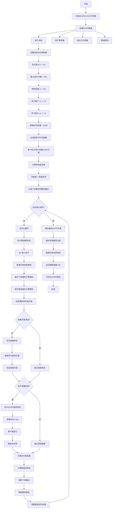
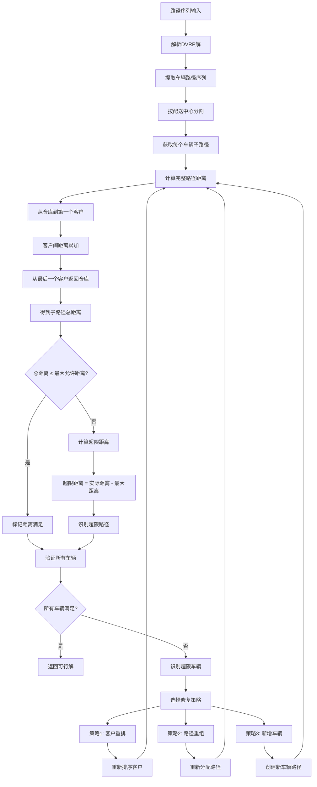
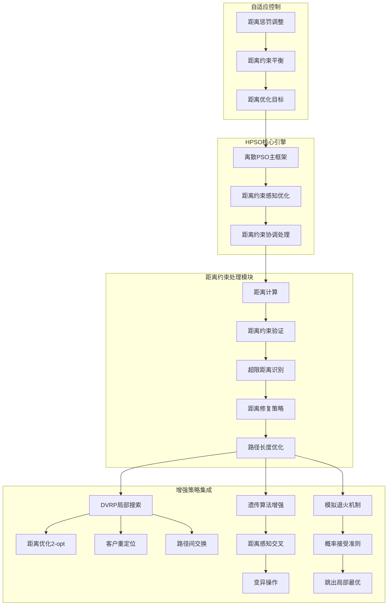
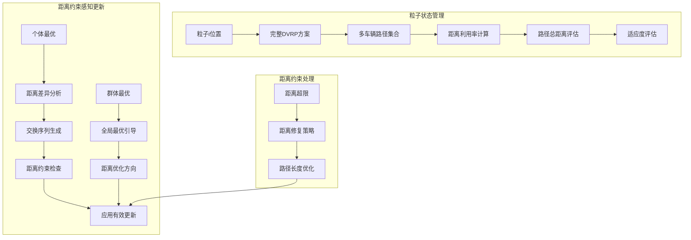
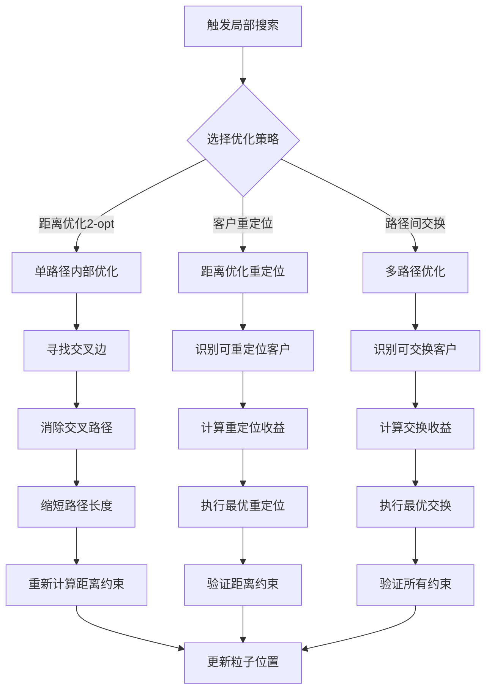
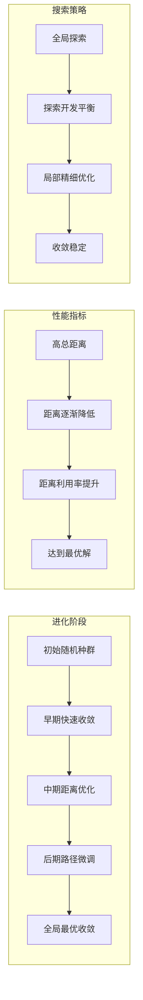

# HPSO_DVRP - 混合粒子群算法求解距离约束车辆路径问题

## 问题描述

**距离约束车辆路径问题 (Distance-constrained Vehicle Routing Problem, DVRP)**

DVRP是VRP的重要变体，增加了每辆车的最大行驶距离约束。每辆车从仓库出发，完成配送任务后必须返回仓库，且总行驶距离不能超过最大允许距离。

### 数学模型

目标函数：
$min \sum_{k=1}^{m} \sum_{i=0}^{n} \sum_{j=0}^{n} d_{ij} x_{ijk}$

约束条件：
1. **距离约束**：
$\sum_{i=0}^{n} \sum_{j=0}^{n} d_{ij} x_{ijk} \leq D_{max}, \quad \forall k$

2. **客户分配**：
$\sum_{k=1}^{m} \sum_{i=0}^{n} x_{ijk} = 1, \quad \forall j = 1,2,...,n$

3. **流量守恒**：
$\sum_{j=0}^{n} x_{ijk} - \sum_{j=0}^{n} x_{jik} = 0, \quad \forall i,k$

4. **子回路消除**：
$\sum_{i \in S} \sum_{j \in S} x_{ijk} \leq |S| - 1, \quad \forall S \subseteq V \setminus \{0\}, \forall k$

## 算法原理

### 混合粒子群优化在DVRP中的应用

HPSO_DVRP通过以下方式处理距离约束：
1. **距离感知粒子表示**：使用距离约束的路径编码
2. **距离约束更新**：在粒子更新时考虑距离限制
3. **距离优化局部搜索**：使用距离优化的局部改进算子
4. **距离约束修复**：智能处理距离超限问题

### 距离约束的挑战

**主要挑战**：
1. **距离计算复杂性**：需要精确计算每条路径的总距离
2. **约束耦合性**：距离约束影响客户分配和路径规划
3. **搜索空间限制**：可行解空间大幅减少
4. **邻域操作限制**：操作必须保持距离可行性

## 算法流程

### 基于HPSO的DVRP求解

1. **初始化**
   - 生成满足距离约束的初始粒子群
   - 每个粒子表示一个完整的DVRP方案
   - 计算每条路径的精确距离

2. **距离感知更新**
   - 基于距离约束进行粒子更新
   - 预评估更新的距离影响
   - 保持距离可行性

3. **距离优化局部搜索**
   - 对优质粒子进行距离优化
   - 使用距离感知的局部改进算子
   - 优化路径减少总距离

4. **距离约束处理**
   - 实时距离计算和检查
   - 距离超限路径修复
   - 距离惩罚引导搜索

## 算法逻辑框架

### HPSO-DVRP完整优化流程图


### 距离约束检查机制详解


### 混合策略架构图


### 粒子群动态更新机制


### 局部搜索优化详解


### 算法收敛过程


### 伪代码框架
```
初始化HPSO-DVRP参数:
    粒子群大小 SwarmSize = 50
    最大迭代次数 MaxIter = 250
    惯性权重 w = 0.8
    个体学习因子 c1 = 1.6
    群体学习因子 c2 = 1.6
    距离惩罚权重 = 1000
    最大允许距离 Dmax
    客户数量 N

加载DVRP数据:
    客户坐标 Customers.mat
    客户需求 Demands.mat
    最大允许距离 MaxDistance.mat
    距离矩阵 Distance.mat

主优化过程:
% 初始化距离可行的粒子群
for i = 1 to SwarmSize:
    粒子i位置 = generateFeasibleDVRPSolution(客户坐标, 客户需求, 最大距离)
    粒子i速度 = 空交换序列
    粒子i个体最优 = 粒子i位置
    计算粒子i适应度(总距离 + 距离惩罚)

群体最优 = 适应度最好的粒子位置

for iter = 1 to MaxIter:
    for 每个粒子i:
        % 距离约束感知更新 - 离散交换序列
        个体交换序列 = 计算个体交换序列(粒子i位置, 粒子i个体最优)
        群体交换序列 = 计算群体交换序列(粒子i位置, 群体最优)
        
        粒子i速度 = w * 粒子i速度 + c1 * rand() * 个体交换序列 + c2 * rand() * 群体交换序列
        
        % 位置更新 - 应用交换序列
        粒子i新位置 = 应用交换序列(粒子i位置, 粒子i速度)
        
        % 距离约束检查与修复
        if not checkDistanceConstraints(粒子i新位置, 最大距离):
            粒子i新位置 = repairDistanceViolations(粒子i新位置, 超限信息)
        
        % 局部搜索触发
        if 粒子i适应度改善率 > 局部搜索阈值:
            粒子i新位置 = DVRPLocalImprovement(粒子i新位置)
        
        % 适应度评估
        新适应度 = calculateDVRPTotalDistance(粒子i新位置)
        新适应度 += distancePenalty(粒子i新位置)
        
        % 更新个体最优
        if 新适应度 < 粒子i历史最优适应度:
            粒子i个体最优 = 粒子i新位置
            粒子i历史最优适应度 = 新适应度
    
    % 更新群体最优
    当前最优粒子 = 找出最佳适应度粒子
    if 当前最优粒子适应度 < 群体最优适应度:
        群体最优 = 当前最优粒子位置
        群体最优适应度 = 当前最优粒子适应度
    
    % 自适应参数调整
    w = w * 0.99  % 逐渐降低惯性权重
    距离惩罚权重 = 距离惩罚权重 * 1.01
    
    记录统计信息

输出最优DVRP方案:
    最优车辆路径 = 群体最优
    总运输距离 = 群体最优适应度
    距离满足率 = calculateDistanceSatisfaction(群体最优)
    车辆使用数量 = countVehicles(群体最优)
    
可视化DVRP路径
```

## 关键实现特点

### 1. 距离约束粒子表示
```matlab
% DVRP粒子类定义
class DVRPParticle
    properties
        routes          % 车辆路径集合
        distances       % 每条路径的总距离
        maxDistances    % 最大允许距离
        distanceUtil    % 距离利用率
        totalDistance   % 总行驶距离
        pbestRoutes     % 个体最优路径
        pbestDistance   % 个体最优距离
    end
end
```

### 2. 精确距离计算

**完整路径距离计算**：
```matlab
% 计算完整路径距离（包含往返仓库）
function totalDistance = calculateRouteDistance(route, depot, distanceMatrix)
    if isempty(route)
        totalDistance = 0;
        return;
    end
    
    % 从仓库到第一个客户
    distance = distanceMatrix(depot, route(1));
    
    % 客户间的距离
    for i = 1:length(route)-1
        distance = distance + distanceMatrix(route(i), route(i+1));
    end
    
    % 从最后一个客户返回仓库
    distance = distance + distanceMatrix(route(end), depot);
    
    totalDistance = distance;
end
```

### 3. 距离约束检查

**实时距离监控**：
```matlab
% 检查路径是否满足距离约束
function [feasible, distance, utilization] = checkDistanceConstraint(route, maxDistance, distanceMatrix, depot)
    distance = calculateRouteDistance(route, depot, distanceMatrix);
    feasible = distance <= maxDistance;
    utilization = distance / maxDistance;
end
```

### 4. 距离感知邻域操作

**距离约束交换**：
```matlab
% 距离感知的客户交换
function newRoutes = distanceAwareSwap(routes, i, j, maxDistance, distanceMatrix, depot)
    % 预计算交换的距离影响
    route1 = routes{i};
    route2 = routes{j};
    
    % 寻找距离可行的交换方案
    feasibleSwaps = findDistanceFeasibleSwaps(route1, route2, maxDistance, distanceMatrix, depot);
    
    if ~isempty(feasibleSwaps)
        % 选择最优的交换方案
        [bestSwap, improvement] = selectBestDistanceSwap(feasibleSwaps);
        newRoutes = applyDistanceSwap(routes, bestSwap);
    else
        newRoutes = routes;  % 保持原方案
    end
end
```

## 文件结构

- `Main.m`：HPSO_DVRP主程序
- `DVRPParticle.m`：DVRP粒子类定义
- `DistanceCalculation.m`：精确距离计算
- `DistanceCheck.m`：距离约束检查
- `DistanceRepair.m`：距离修复算法
- `DistanceLocalSearch.m`：距离优化局部搜索
- `RouteSplitting.m`：路径分割算法
- `DrawDistanceRoutes.m`：距离约束路径可视化
- `DistanceMetrics.m`：距离性能指标

## 参数配置

### PSO参数（针对距离约束优化）
- 粒子数量：70-130（考虑距离约束复杂性）
- 最大迭代次数：1000-1800
- 惯性权重(w)：0.8 → 0.3
- 个体学习因子(c1)：1.9 → 0.9
- 群体学习因子(c2)：0.9 → 1.9

### DVRP参数
- 最大行驶距离(Dmax)：根据车辆类型设定
- 距离计算精度：精确到小数点后2位
- 距离利用率阈值：0.85-0.95

### 局部搜索参数
- 局部搜索频率：每12次迭代
- 距离优化迭代：每辆车4-6次
- 路径分割频率：每60次迭代

## 距离约束处理技术

### 1. 距离利用率分析

**利用率计算**：
```matlab
% 计算距离利用率分布
function [utilizations, avgUtil, maxUtil, minUtil] = analyzeDistanceUtilization(routes, maxDistance, distanceMatrix, depot)
    utilizations = zeros(1, length(routes));
    
    for i = 1:length(routes)
        distance = calculateRouteDistance(routes{i}, depot, distanceMatrix);
        utilizations(i) = distance / maxDistance;
    end
    
    avgUtil = mean(utilizations);
    maxUtil = max(utilizations);
    minUtil = min(utilizations);
end
```

### 2. 距离约束路径生成

**距离感知初始化**：
```matlab
% 生成满足距离约束的初始解
function routes = generateDistanceFeasibleSolution(customers, maxDistance, distanceMatrix, depot)
    unvisited = customers;
    routes = {};
    
    while ~isempty(unvisited)
        route = [depot];  % 从仓库开始
        currentDistance = 0;
        
        while true
            % 寻找距离最近的未访问客户
            [nextCustomer, distance, idx] = findNearestFeasibleCustomer(route, unvisited, maxDistance - currentDistance, distanceMatrix);
            
            if isempty(nextCustomer)
                break;  % 无法添加更多客户
            end
            
            route = [route, nextCustomer];
            currentDistance = currentDistance + distance;
            unvisited(idx) = [];
        end
        
        route = [route, depot];  % 返回仓库
        routes{end+1} = route(2:end-1);  % 去除仓库节点
    end
end
```

### 3. 距离优化局部搜索

**距离感知的2-opt改进**：
```matlab
% 距离优化的2-opt局部改进
function improvedRoute = distance2opt(route, maxDistance, distanceMatrix, depot)
    n = length(route);
    improved = true;
    
    while improved
        improved = false;
        
        for i = 1:n-3
            for j = i+2:n-1
                % 计算2-opt改进并检查距离约束
                [delta, newRoute, newDistance] = evaluateDistance2opt(route, i, j, maxDistance, distanceMatrix, depot);
                
                if delta < -0.001 && newDistance <= maxDistance
                    route = newRoute;
                    improved = true;
                end
            end
        end
    end
    
    improvedRoute = route;
end
```

### 4. 智能路径分割

**距离约束分割算法**：
```matlab
% 智能路径分割算法
function newRoutes = intelligentDistanceSplit(overloadedRoute, maxDistance, distanceMatrix, depot)
    % 分析路径的距离分布
    distanceProfile = analyzeDistanceDistribution(overloadedRoute, distanceMatrix, depot);
    
    % 寻找最优分割点
    splitPoints = findOptimalDistanceSplitPoints(distanceProfile, maxDistance);
    
    % 生成分割后的可行路径
    newRoutes = generateDistanceSplitRoutes(overloadedRoute, splitPoints, depot);
end
```

## 距离优化策略

### 1. 距离平衡优化

**车辆间距离平衡**：
```matlab
% 平衡各车辆的距离负载
function balancedRoutes = balanceDistanceLoad(routes, maxDistance, distanceMatrix, depot)
    distances = zeros(1, length(routes));
    
    % 计算各车辆的距离
    for i = 1:length(routes)
        distances(i) = calculateRouteDistance(routes{i}, depot, distanceMatrix);
    end
    
    % 识别需要平衡的车辆
    avgDistance = mean(distances);
    overloaded = distances > avgDistance * 1.2;
    underloaded = distances < avgDistance * 0.8;
    
    % 执行客户重分配平衡
    balancedRoutes = redistributeCustomersForBalance(routes, overloaded, underloaded, maxDistance, distanceMatrix, depot);
end
```

### 2. 距离利用率优化

**提高距离利用率**：
```matlab
% 优化距离利用率
function optimizedRoutes = optimizeDistanceUtilization(routes, maxDistance, distanceMatrix, depot)
    % 计算当前利用率
    [utilizations, avgUtil] = analyzeDistanceUtilization(routes, maxDistance, distanceMatrix, depot);
    
    % 识别低利用率路径
    lowUtilPaths = find(utilizations < 0.7);
    
    % 合并相邻的低利用率路径
    for pathIdx in lowUtilPaths
        [mergedRoute, success] = tryMergeRoutes(routes, pathIdx, maxDistance, distanceMatrix, depot);
        
        if success
            routes = mergedRoute;
        end
    end
    
    optimizedRoutes = routes;
end
```

## 性能指标与分析

### 1. 距离性能指标

**距离效率指标**：
- 总行驶距离：$D_{total} = \sum_{k=1}^{m} D_k$
- 平均距离利用率：$U_{avg} = \frac{1}{m} \sum_{k=1}^{m} \frac{D_k}{D_{max}}$
- 距离平衡度：$D_{balance} = 1 - \frac{\sigma_D}{D_{avg}}$
- 距离效率：$E_{distance} = \frac{\text{服务客户数}}{D_{total}}$

### 2. 车辆效率指标

**车辆使用效率**：
- 车辆利用率：$V_{util} = \frac{\text{实际使用车辆数}}{\text{最大可用车辆数}}$
- 平均单车服务客户数：$C_{avg} = \frac{n}{m}$
- 车辆负载均衡度：$V_{balance} = 1 - \frac{\sigma_C}{C_{avg}}$

### 3. 算法收敛分析

**多维度收敛**：
- 距离收敛：总距离随迭代的变化
- 利用率收敛：距离利用率的变化
- 车辆数收敛：使用车辆数的变化
- 平衡度收敛：距离平衡度的变化

## 实际应用场景

### 1. 电动车辆配送
- **续航里程限制**：电动车辆的电池续航限制
- **充电站规划**：考虑充电站位置的距离约束
- **路线优化**：在续航限制下优化配送路线

### 2. 城市物流配送
- **工作时间限制**：司机工作时间的距离限制
- **交通拥堵考虑**：考虑交通拥堵的距离影响
- **多点配送优化**：在城市环境下的距离优化

### 3. 特殊车辆应用
- **冷链车辆**：冷链车辆的温控设备续航限制
- **危险品运输**：危险品运输的距离限制
- **大型车辆**：大型车辆的道路限制和距离约束

## 算法对比分析

| 特征 | HPSO_DVRP | GA_DVRP | ACO_DVRP | SA_DVRP |
|------|-----------|---------|----------|---------|
| 距离计算 | 精确计算 | 近似计算 | 启发式 | 精确计算 |
| 约束处理 | 智能修复 | 惩罚+修复 | 惩罚+修复 | 惩罚+修复 |
| 搜索策略 | 混合群体 | 进化搜索 | 群体智能 | 单点搜索 |
| 局部优化 | 强 | 中等 | 弱 | 中等 |
| 收敛速度 | 快 | 中等 | 慢 | 中等 |
| 参数调优 | 中等 | 复杂 | 复杂 | 简单 |

## 扩展功能

### 1. 动态距离约束
- **实时调整**：根据实时路况调整最大距离
- **自适应约束**：根据历史数据自适应调整距离限制
- **柔性距离**：允许一定程度的距离超限

### 2. 多类型车辆
- **异质车辆**：支持不同最大距离的车辆
- **车辆选择**：根据距离约束选择合适车辆
- **混合车队**：优化不同类型车辆的分配

### 3. 时间窗扩展
- **DVRPTW**：结合时间窗的距离约束优化
- **时间-距离平衡**：平衡时间窗和距离约束
- **综合优化**：同时优化时间、距离和成本

## 注意事项与建议

### 1. 距离数据准确性
- 使用实际道路距离而非直线距离
- 考虑交通拥堵对距离的影响
- 定期更新距离矩阵

### 2. 约束参数设置
- 最大距离应根据实际车辆性能设定
- 考虑安全余量避免过度约束
- 根据实际路况调整距离限制

### 3. 算法调优建议
- 距离约束的严格程度影响搜索空间
- 需要平衡距离利用率和解质量
- 建议根据问题规模调整局部搜索强度