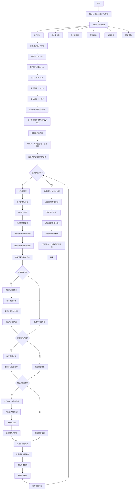
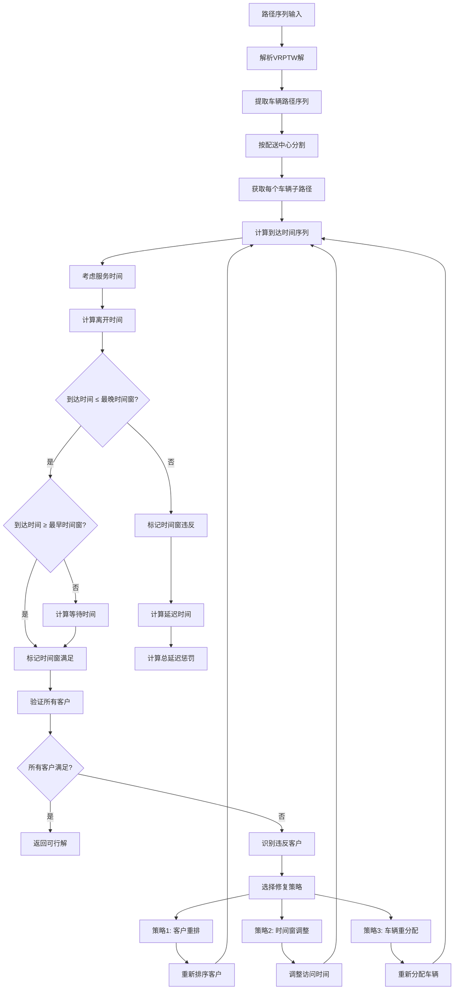
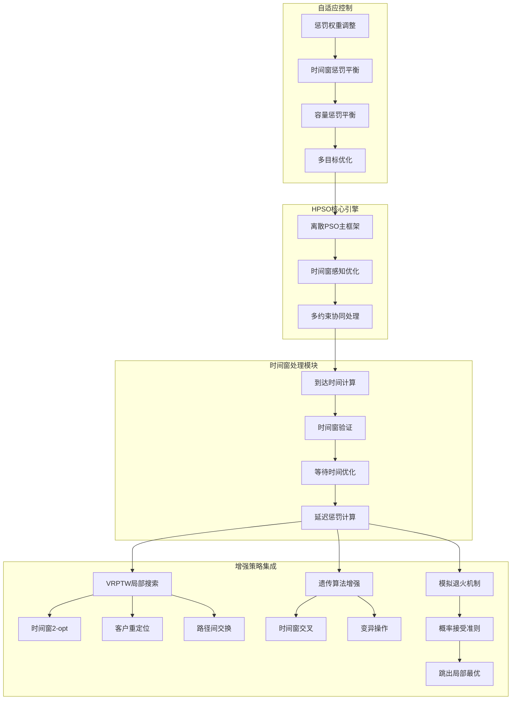
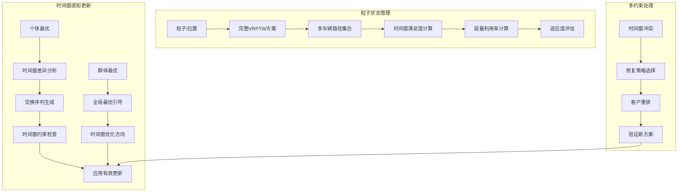
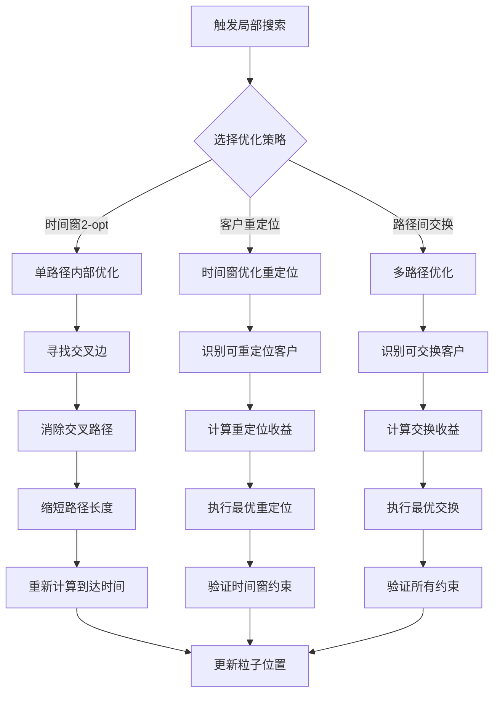
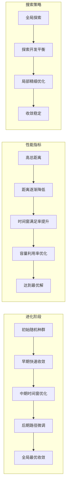

# HPSO-VRPTW: 混合粒子群算法求解带时间窗车辆路径问题

## 问题描述

带时间窗车辆路径问题 (Vehicle Routing Problem with Time Windows, VRPTW) 是一个复杂的组合优化问题，要求车辆在给定的时间窗内服务客户，同时最小化总行驶距离。

### 数学模型

**目标函数：**
$$\min \sum_{i=0}^{n} \sum_{j=0}^{n} \sum_{k=1}^{m} c_{ij} x_{ijk}$$

**约束条件：**
1. **时间窗约束：**
   $$e_i \leq a_i \leq l_i, \quad \forall i \in \{1,2,...,n\}$$
   
2. **容量约束：**
   $$\sum_{i=1}^{n} q_i y_{ik} \leq Q, \quad \forall k \in \{1,2,...,m\}$$
   
3. **路径约束：**
   $$\sum_{k=1}^{m} \sum_{i=0}^{n} x_{ijk} = 1, \quad \forall j \in \{1,2,...,n\}$$

## 算法逻辑框架

### HPSO-VRPTW完整优化流程图


### 时间窗约束检查机制详解


### 混合策略架构图


### 粒子群动态更新机制


### 局部搜索优化详解


### 算法收敛过程


### 伪代码框架
```
初始化HPSO-VRPTW参数:
    粒子群大小 SwarmSize = 50
    最大迭代次数 MaxIter = 200
    惯性权重 w = 0.8
    个体学习因子 c1 = 1.8
    群体学习因子 c2 = 1.8
    时间窗惩罚权重 = 1000
    容量惩罚权重 = 1000
    车辆容量 Q
    客户数量 N
    服务时间 ServiceTime

加载VRPTW数据:
    客户坐标 Customers.mat
    客户需求 Demands.mat
    时间窗 TimeWindows.mat
    服务时间 ServiceTimes.mat
    车辆容量 Capacity.mat
    距离矩阵 Distance.mat

主优化过程:
% 初始化时间窗可行的粒子群
for i = 1 to SwarmSize:
    粒子i位置 = generateFeasibleVRPTWSolution(客户坐标, 客户需求, 时间窗, 车辆容量)
    粒子i速度 = 空交换序列
    粒子i个体最优 = 粒子i位置
    计算粒子i适应度(总距离 + 时间窗惩罚 + 容量惩罚)

群体最优 = 适应度最好的粒子位置

for iter = 1 to MaxIter:
    for 每个粒子i:
        % 时间窗感知更新 - 离散交换序列
        个体交换序列 = 计算个体交换序列(粒子i位置, 粒子i个体最优)
        群体交换序列 = 计算群体交换序列(粒子i位置, 群体最优)
        
        粒子i速度 = w * 粒子i速度 + c1 * rand() * 个体交换序列 + c2 * rand() * 群体交换序列
        
        % 位置更新 - 应用交换序列
        粒子i新位置 = 应用交换序列(粒子i位置, 粒子i速度)
        
        % 时间窗约束检查与修复
        if not checkTimeWindowConstraints(粒子i新位置, 时间窗, 服务时间):
            粒子i新位置 = repairTimeWindowViolations(粒子i新位置, 时间窗冲突)
        
        % 容量约束检查与修复
        if not checkCapacityConstraints(粒子i新位置, 客户需求, 车辆容量):
            粒子i新位置 = repairCapacityViolations(粒子i新位置, 超载信息)
        
        % 局部搜索触发
        if 粒子i适应度改善率 > 局部搜索阈值:
            粒子i新位置 = VRPTWLocalImprovement(粒子i新位置)
        
        % 适应度评估
        新适应度 = calculateVRPTWTotalDistance(粒子i新位置)
        新适应度 += timeWindowPenalty(粒子i新位置)
        新适应度 += capacityPenalty(粒子i新位置)
        
        % 更新个体最优
        if 新适应度 < 粒子i历史最优适应度:
            粒子i个体最优 = 粒子i新位置
            粒子i历史最优适应度 = 新适应度
    
    % 更新群体最优
    当前最优粒子 = 找出最佳适应度粒子
    if 当前最优粒子适应度 < 群体最优适应度:
        群体最优 = 当前最优粒子位置
        群体最优适应度 = 当前最优粒子适应度
    
    % 自适应参数调整
    w = w * 0.99  % 逐渐降低惯性权重
    时间窗惩罚权重 = 时间窗惩罚权重 * 1.01
    容量惩罚权重 = 容量惩罚权重 * 1.01
    
    记录统计信息

输出最优VRPTW方案:
    最优车辆路径 = 群体最优
    总运输距离 = 群体最优适应度
    时间窗满足率 = calculateTimeWindowSatisfaction(群体最优)
    车辆使用数量 = countVehicles(群体最优)
    每车载货量 = calculateLoadPerVehicle(群体最优)
    
可视化VRPTW路径和时间窗
```

## 关键实现特点

### 离散粒子表示
- **路径编码**：使用客户序列表示车辆路径
- **时间窗处理**：在粒子更新中考虑时间窗约束
- **交换序列**：定义离散空间中的粒子速度

### 混合策略设计
```matlab
% 时间窗约束处理示例
function [new_path, feasible] = handle_time_windows(path, time_windows)
    % 计算到达时间
    arrival_time = calculate_arrival_time(path);
    
    % 检查时间窗约束
    feasible = check_time_window_constraints(arrival_time, time_windows);
    
    if ~feasible
        % 修复时间窗冲突
        new_path = repair_time_window_violations(path, time_windows);
    else
        new_path = path;
    end
end
```

### 适应度函数
- **主要目标**：最小化总行驶距离
- **约束处理**：时间窗违反的惩罚项
- **多目标考虑**：可扩展为距离和时间窗违反最小化

## 文件结构

```
HPSO_VRPTW/
├── Main.m              % 主程序入口
├── InitPop.m           % 种群初始化
├── Fitness.m           % 适应度计算
├── UpdateVelocity.m    % 速度更新
├── UpdatePosition.m    % 位置更新
├── LocalSearch.m       % 局部搜索
├── Crossover.m         % 遗传交叉
├── Mutate.m            % 遗传变异
├── Repair.m            % 约束修复
├── DrawPath.m          % 路径可视化
├── TextOutput.m        % 结果输出
└── dsxy2figxy.m        % 坐标转换工具
```

## 参数配置

| 参数名称 | 建议值 | 说明 |
|---------|--------|------|
| 粒子数量 | 30-50 | 根据问题规模调整 |
| 学习因子 c1 | 1.5-2.0 | 个体学习权重 |
| 学习因子 c2 | 1.5-2.0 | 群体学习权重 |
| 惯性权重 w | 0.7-0.9 | 速度惯性系数 |
| 最大迭代次数 | 200-500 | 根据收敛情况调整 |
| 局部搜索概率 | 0.1-0.3 | 局部搜索触发概率 |

## 使用示例

```matlab
% 运行主程序
Main

% 结果将显示：
% 1. 最优VRPTW路径图
% 2. 客户时间窗满足情况
% 3. 算法收敛曲线
% 4. 车辆调度时间表
```

## 算法性能分析

### 收敛特性
- **收敛速度**：中等偏快，混合策略加速收敛
- **解的质量**：优秀，能找到高质量解
- **稳定性**：较高，多次运行结果一致性好

### 时间复杂度
- **粒子更新**：O(particle_num × n²)
- **局部搜索**：O(particle_num × n² × local_search_iter)
- **遗传操作**：O(particle_num × n)

## 可视化与分析

### 输出结果
1. **最优路径图**：显示车辆路径和客户时间窗
2. **时间窗甘特图**：展示每个客户的服务时间
3. **收敛曲线**：展示算法收敛过程
4. **时间窗满足率**：统计时间窗满足情况

## 优缺点分析

### 优点
- 有效处理复杂的时间窗约束
- 混合策略提升搜索效率
- 自适应参数调整机制
- 良好的全局和局部搜索平衡

### 缺点
- 算法复杂度较高
- 参数调节需要经验
- 计算开销较大
- 对大规模问题可能需要较长时间

## 改进方向

1. **自适应机制**：根据搜索状态动态调整参数
2. **多目标优化**：同时优化距离和时间窗违反
3. **并行计算**：利用GPU加速粒子群计算
4. **混合算法**：结合其他元启发式算法