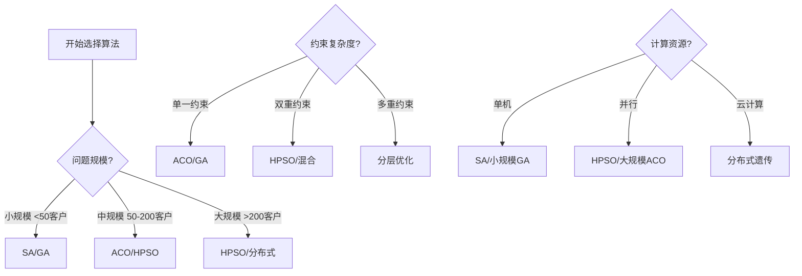
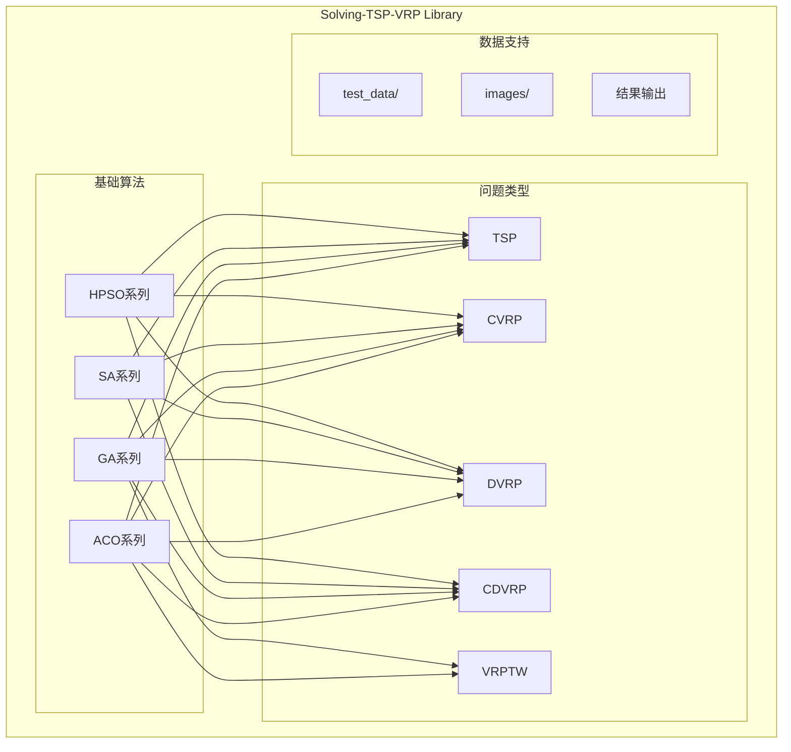

# Solving-TSP-VRP 智能优化算法求解库

## 项目概述

本项目是一个综合性的旅行商问题(TSP)和车辆路径问题(VRP)求解库，集成了多种智能优化算法，包括蚁群算法(ACO)、遗传算法(GA)、模拟退火算法(SA)和混合粒子群算法(HPSO)。项目采用MATLAB开发，提供了从基础TSP到复杂VRP变体的完整解决方案。

## 算法分类与问题映射

### 基础TSP问题
- **ACO_TSP**: 蚁群算法求解旅行商问题
- **GA_TSP**: 遗传算法求解旅行商问题  
- **SA_TSP**: 模拟退火算法求解旅行商问题
- **HPSO_TSP**: 混合粒子群算法求解旅行商问题

### 容量约束VRP (CVRP)
- **ACO_CVRP**: 蚁群算法求解容量约束车辆路径问题
- **GA_CVRP**: 遗传算法求解容量约束车辆路径问题
- **SA_CVRP**: 模拟退火算法求解容量约束车辆路径问题
- **HPSO_CVRP**: 混合粒子群算法求解容量约束车辆路径问题

### 距离约束VRP (DVRP)
- **ACO_DVRP**: 蚁群算法求解距离约束车辆路径问题
- **GA_DVRP**: 遗传算法求解距离约束车辆路径问题
- **SA_DVRP**: 模拟退火算法求解距离约束车辆路径问题
- **HPSO_DVRP**: 混合粒子群算法求解距离约束车辆路径问题

### 容量距离约束VRP (CDVRP)
- **ACO_CDVRP**: 蚁群算法求解容量距离约束车辆路径问题
- **GA_CDVRP**: 遗传算法求解容量距离约束车辆路径问题
- **SA_CDVRP**: 模拟退火算法求解容量距离约束车辆路径问题
- **HPSO_CDVRP**: 混合粒子群算法求解容量距离约束车辆路径问题

### 时间窗约束VRP (VRPTW)
- **ACO_VRPTW**: 蚁群算法求解带时间窗的车辆路径问题
- **GA_VRPTW**: 遗传算法求解带时间窗的车辆路径问题

## 文件夹命名规则

文件夹名称结构: `算法名称` + `问题类型`

### 算法缩写对照表

| 算法缩写 | 算法全称 | 中文名称 |
|----------|----------|----------|
| GA  | Genetic Algorithm  | 遗传算法 |
| ACO  | Ant Colony Optimization  | 蚁群算法 |
| SA  | Simulated Annealing  | 模拟退火算法 |
| HPSO  | Hybrid Particle Swarm Optimization | 混合粒子群算法 |

### 问题类型对照表

| 问题缩写 | 问题全称 | 中文名称 | 主要约束 |
|----------|----------|----------|----------|
| TSP  | Traveling Salesman Problem  | 旅行商问题 | 无 |
| CVRP  | Capacitated Vehicle Routing Problem | 容量约束车辆路径问题 | 车辆容量 |
| DVRP  | Distance-constrained Vehicle Routing Problem | 距离约束车辆路径问题 | 行驶距离 |
| CDVRP  | Capacitated Distance-constrained VRP | 容量距离约束车辆路径问题 | 容量+距离 |
| VRPTW  | Vehicle Routing Problem with Time Windows | 时间窗车辆路径问题 | 容量+距离+时间窗 |

## 数学模型框架

### 通用目标函数
$min \sum_{k=1}^{m} \sum_{i=0}^{n} \sum_{j=0}^{n} c_{ij} x_{ijk}$

### 约束条件分类

#### 1. 容量约束
$\sum_{i=1}^{n} q_i y_{ik} \leq Q_k, \quad \forall k$

#### 2. 距离约束  
$\sum_{i=0}^{n} \sum_{j=0}^{n} d_{ij} x_{ijk} \leq D_{max}, \quad \forall k$

#### 3. 时间窗约束
$e_i \leq t_i \leq l_i, \quad \forall i$

#### 4. 客户分配约束
$\sum_{k=1}^{m} y_{ik} = 1, \quad \forall i$

## 算法特点对比

| 算法类型 | 搜索策略 | 全局能力 | 局部优化 | 参数调优 | 收敛速度 | 适用场景 |
|----------|----------|----------|----------|----------|----------|----------|
| **ACO** | 群体智能 | 强 | 中等 | 中等 | 中等 | 离散优化 |
| **GA** | 进化搜索 | 强 | 中等 | 复杂 | 中等 | 组合优化 |
| **SA** | 单点搜索 | 强 | 强 | 简单 | 慢 | 全局优化 |
| **HPSO** | 混合搜索 | 强 | 强 | 中等 | 快 | 复杂约束 |

### 算法选择决策图



### 项目整体架构图



## 快速开始

### 1. 基础TSP求解
```matlab
% 加载数据
load('City.mat');
load('Distance.mat');

% 运行ACO_TSP
addpath('ACO_TSP');
[bestPath, bestDistance] = Main();

% 显示结果
fprintf('最优路径: %s\n', mat2str(bestPath));
fprintf('最短距离: %.2f\n', bestDistance);
```

### 2. CVRP求解
```matlab
% 加载数据
load('City.mat');
load('Distance.mat');
load('Demand.mat');

% 设置参数
vehicleCapacity = 100;

% 运行HPSO_CVRP
addpath('HPSO_CVRP');
[bestRoutes, bestDistance] = Main(vehicleCapacity);

% 显示结果
fprintf('最优方案包含 %d 辆车\n', length(bestRoutes));
fprintf('总行驶距离: %.2f\n', bestDistance);
```

## 输出结果示例

### 1. 命令窗口文本输出

```MATLAB
...
Iteration = 90, Min Distance = 204.65 km
Iteration = 91, Min Distance = 204.65 km
Iteration = 92, Min Distance = 204.65 km
Iteration = 93, Min Distance = 204.65 km
Iteration = 94, Min Distance = 204.65 km
Iteration = 95, Min Distance = 204.65 km
Iteration = 96, Min Distance = 204.65 km
Iteration = 97, Min Distance = 204.65 km
Iteration = 98, Min Distance = 204.65 km
Iteration = 99, Min Distance = 204.65 km
Iteration = 100, Min Distance = 204.65 km
-------------------------------------------------------------
Elapsed time is 0.340380 seconds.
Total Distance = 204.653 km
Best Route:
0 -> 5 -> 10 -> 2 -> 0 -> 3 -> 6 -> 9 -> 1 -> 0 -> 7 -> 4 -> 8 -> 0
-------------------------------------------------------------
Route of vehichle No.1: 0 -> 5 -> 10 -> 2 -> 0
Time of arrival: 0 - 46.9 - 59.5 - 159.7 - 216.1 min
Distance traveled: 70.15 km, time elapsed: 216.1 min, load rate: 90.00%;
-------------------------------------------------------------
Route of vehichle No.2: 0 -> 3 -> 6 -> 9 -> 1 -> 0
Time of arrival: 0 - 45.9 - 58 - 72.7 - 97.3 - 138.4 min
Distance traveled: 74.29 km, time elapsed: 138.4 min, load rate: 90.00%;
-------------------------------------------------------------
Route of vehichle No.3: 0 -> 7 -> 4 -> 8 -> 0
Time of arrival: 0 - 48 - 72.1 - 90.6 - 128.2 min
Distance traveled: 60.22 km, time elapsed: 128.2 min, load rate: 90.00%;
-------------------------------------------------------------
```

### 2. 可视化结果

#### 优化过程图


#### TSP路径图


#### VRP路径图（考虑时间窗约束）


## 使用指南

### 基本使用方法

1. **克隆代码库**
```bash
git clone https://github.com/liukewia/Solving-TSP-VRP.git
cd Solving-TSP-VRP
```

2. **运行特定算法**
- 进入对应算法文件夹
- 打开并运行 `Main.m` 文件
- 查看命令窗口输出和生成的图表

3. **自定义数据**
- 编辑 `test_data` 文件夹中的数据文件
- 包括客户坐标、需求量、时间窗等信息

### 参数配置建议

#### 通用参数
- **最大迭代次数**: 500-2000（根据问题规模）
- **收敛精度**: 1e-4
- **随机种子**: 固定以获得可重复结果

#### 算法特定参数

**ACO参数**:
- 蚂蚁数量: 50-100
- 信息素重要度(α): 1.0-2.0
- 启发式信息重要度(β): 2.0-5.0
- 信息素蒸发率(ρ): 0.1-0.5

**GA参数**:
- 种群规模: 100-200
- 交叉概率: 0.7-0.9
- 变异概率: 0.01-0.1
- 精英保留比例: 10-20%

**SA参数**:
- 初始温度: 1000-5000
- 终止温度: 1e-3-1e-6
- 降温速率: 0.9-0.99
- 链长: 100-500

**HPSO参数**:
- 粒子数量: 60-120
- 惯性权重: 0.9-0.4（线性递减）
- 个体学习因子: 2.0-0.5
- 群体学习因子: 0.5-2.0

## 实际应用场景

### 1. 物流配送
- **快递配送**: 优化最后一公里配送路线
- **冷链物流**: 考虑温控设备的容量和续航限制
- **电商仓储**: 多仓库协调配送优化

### 2. 城市服务
- **垃圾收集**: 优化垃圾车收集路线
- **邮政投递**: 考虑投递时间窗的路径规划
- **维修服务**: 平衡服务质量和响应时间

### 3. 工业应用
- **制造业**: 原材料配送和成品分销
- **零售业**: 门店补货和库存优化
- **医疗配送**: 药品和医疗器械的冷链配送

## 算法选择建议

### 按问题规模选择
- **小规模 (<50客户)**: SA_TSP, GA_TSP
- **中规模 (50-200客户)**: ACO_CVRP, HPSO_CVRP
- **大规模 (>200客户)**: HPSO_CDVRP, 分布式算法

### 按约束复杂度选择
- **单一约束**: ACO, GA
- **双重约束**: HPSO, 混合算法
- **多重约束**: 分层优化, 多阶段算法

### 按计算资源选择
- **单机计算**: SA, 小规模GA
- **并行计算**: HPSO, 大规模ACO
- **云计算**: 分布式遗传算法

## 文件结构说明

```
Solving-TSP-VRP/
├── ACO_TSP/          # 蚁群算法求解TSP
├── ACO_CVRP/         # 蚁群算法求解CVRP
├── ACO_DVRP/         # 蚁群算法求解DVRP
├── ACO_CDVRP/        # 蚁群算法求解CDVRP
├── ACO_VRPTW/        # 蚁群算法求解VRPTW
├── GA_TSP/           # 遗传算法求解TSP
├── GA_CVRP/          # 遗传算法求解CVRP
├── GA_DVRP/          # 遗传算法求解DVRP
├── GA_CDVRP/         # 遗传算法求解CDVRP
├── SA_TSP/           # 模拟退火算法求解TSP
├── SA_CVRP/          # 模拟退火算法求解CVRP
├── SA_DVRP/          # 模拟退火算法求解DVRP
├── SA_CDVRP/         # 模拟退火算法求解CDVRP
├── HPSO_TSP/         # 混合粒子群算法求解TSP
├── HPSO_CVRP/        # 混合粒子群算法求解CVRP
├── HPSO_DVRP/        # 混合粒子群算法求解DVRP
├── HPSO_CDVRP/       # 混合粒子群算法求解CDVRP
├── test_data/        # 测试数据文件夹
├── images/           # 结果图片文件夹
└── README.md         # 项目说明文档
```

## 性能评估指标

### 基础指标
- **最优解质量**: 与已知最优解的偏差
- **收敛速度**: 达到最优解的迭代次数
- **计算时间**: 算法执行时间
- **稳定性**: 多次运行的标准差

### VRP专用指标
- **车辆利用率**: 平均容量利用率
- **距离效率**: 单位距离服务的客户数
- **平衡度**: 各车辆负载的均衡程度
- **约束满足率**: 约束条件的满足程度

## 开发路线图

### 近期计划
- [ ] 增加并行计算支持
- [ ] 集成机器学习优化参数
- [ ] 开发Web界面
- [ ] 增加更多测试案例

### 中期计划
- [ ] 支持异质车辆优化
- [ ] 集成GIS地理信息
- [ ] 开发移动端应用
- [ ] 增加实时优化功能

### 长期愿景
- [ ] 构建智能物流平台
- [ ] 集成区块链技术
- [ ] 支持无人驾驶配送
- [ ] 建立行业标准库

## 贡献指南

### 代码贡献
1. Fork项目仓库
2. 创建功能分支
3. 提交代码变更
4. 发起Pull Request

### 文档贡献
1. 完善算法文档
2. 增加使用案例
3. 翻译多语言文档
4. 更新最佳实践

### 测试贡献
1. 增加测试案例
2. 性能基准测试
3. 边界条件测试
4. 跨平台测试

## 许可证
GNU General Public License (GPL)

## 联系方式
- **项目维护**: 王晗课题组
- **技术支持**: 代码库维护团队
- **问题反馈**: GitHub Issues
- **功能建议**: GitHub Discussions

## 致谢
感谢所有贡献者和使用者的支持，特别感谢：
- 算法理论研究团队
- 实际应用测试企业
- 开源社区贡献者
- 学术合作伙伴

---

**最后更新**: 2024年12月
**版本**: v2.0
**维护团队**: 王晗课题组智能优化算法研究组
