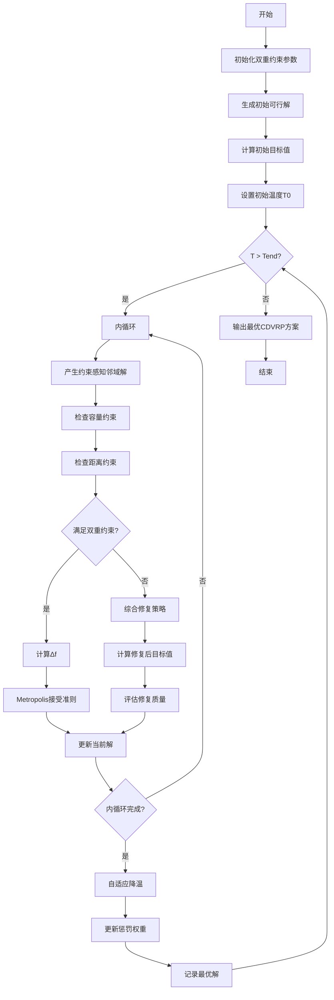
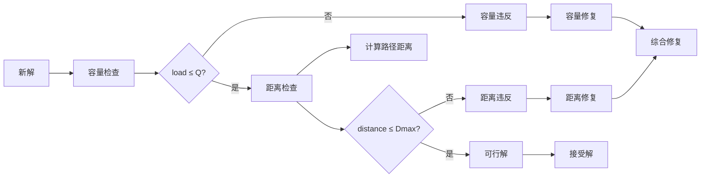
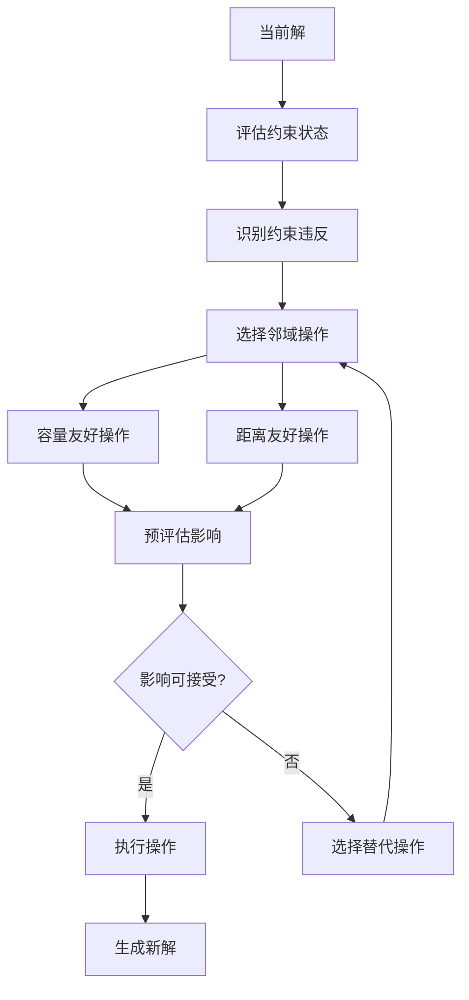

# SA_CDVRP - 模拟退火算法求解容量距离约束车辆路径问题

## 问题描述

**容量距离约束车辆路径问题 (Capacitated Distance-constrained Vehicle Routing Problem, CDVRP)**

CDVRP是VRP的复杂变体，同时考虑车辆载重容量和最大行驶距离双重约束。每辆车必须满足：
1. 载重不超过车辆容量
2. 总行驶距离不超过最大允许距离

### 数学模型

目标函数：
$min \sum_{k=1}^{m} \sum_{i=0}^{n} \sum_{j=0}^{n} c_{ij} x_{ijk}$

约束条件：
1. **容量约束**：
$\sum_{i=1}^{n} q_i y_{ik} \leq Q_k, \quad \forall k$

2. **距离约束**：
$\sum_{i=0}^{n} \sum_{j=0}^{n} d_{ij} x_{ijk} \leq D_{max}, \quad \forall k$

3. **客户分配**：
$\sum_{k=1}^{m} y_{ik} = 1, \quad \forall i = 1,2,...,n$

4. **流量守恒**：
$\sum_{j=0}^{n} x_{ijk} - \sum_{j=0}^{n} x_{jik} = 0, \quad \forall i,k$

5. **子回路消除**：
$\sum_{i \in S} \sum_{j \in S} x_{ijk} \leq |S| - 1, \quad \forall S \subseteq V \setminus \{0\}, \forall k$

## 算法挑战

### 双重约束的复杂性

CDVRP相比单一约束的CVRP或DVRP，面临更大的挑战：
1. **约束耦合**：容量和距离约束相互影响
2. **搜索空间缩减**：可行解空间大幅减少
3. **邻域操作限制**：操作必须同时满足两个约束
4. **解的可行性**：保持解的可行性更加困难

### 约束冲突处理

**冲突类型**：
1. **容量超载**：路径总需求超过车辆容量
2. **距离超限**：路径总距离超过最大允许距离
3. **双重违反**：同时违反容量和距离约束

**处理策略**：
1. **优先级处理**：根据约束类型设置处理优先级
2. **综合修复**：同时修复两种约束违反
3. **惩罚函数**：使用加权惩罚处理约束违反

## 算法流程

### 基于模拟退火的CDVRP求解

1. **初始化阶段**
   - 生成同时满足双重约束的初始解
   - 设置SA参数，考虑双重约束的复杂性
   - 建立约束检查机制

2. **双重约束检查**
   - 并行检查容量和距离约束
   - 识别约束违反的类型和程度
   - 计算约束违反的惩罚值

3. **复杂邻域操作**
   - 设计考虑双重约束的邻域操作
   - 预评估操作的可行性
   - 优先选择约束友好的操作

4. **综合修复策略**
   - 容量约束修复
   - 距离约束修复
   - 协调两种约束的修复过程

## 算法逻辑框架

### SA-CDVRP双重约束流程图


### 双重约束检查机制


### 约束感知邻域操作


### 温度调度与约束适应


### 伪代码框架
```
初始化双重约束参数
生成初始可行解（满足容量+距离）
计算初始目标值和约束违反
设置初始温度T0（考虑约束复杂性）

while T > Tend:
    for i = 1 to L:
        产生约束感知的邻域新解
        检查容量约束：load ≤ Q
        检查距离约束：distance ≤ Dmax
        
        if 满足双重约束:
            计算目标值变化Δf
            按Metropolis准则接受
        else:
            使用综合修复策略
            计算修复后的目标值
            评估修复质量
    
    自适应降温：T = q * T
    更新约束惩罚权重
    记录最优可行解

输出最优CDVRP方案
```

## 关键实现特点

### 1. 双重约束检查机制
```matlab
% 同时检查容量和距离约束
function [feasible, violations] = checkDualConstraints(route, ...)
    % 容量检查
    totalLoad = sum(demands(route(route ~= 0)));
    capacityViolation = max(0, totalLoad - vehicleCapacity);
    
    % 距离检查
    totalDistance = calculateRouteDistance(route, distanceMatrix);
    distanceViolation = max(0, totalDistance - maxDistance);
    
    % 综合评估
    feasible = (capacityViolation == 0) && (distanceViolation == 0);
    violations = [capacityViolation, distanceViolation];
end
```

### 2. 约束感知邻域操作

**智能交换操作**：
```matlab
% 考虑双重约束的客户交换
function newSolution = constrainedSwap(current, i, j)
    % 评估交换对容量和距离的影响
    capacityImpact = evaluateCapacityChange(current, i, j);
    distanceImpact = evaluateDistanceChange(current, i, j);
    
    % 仅当交换不会导致严重约束违反时才执行
    if capacityImpact + distanceImpact < threshold:
        newSolution = performSwap(current, i, j);
    else:
        newSolution = findAlternativeMove(current, i, j);
    end
end
```

### 3. 综合修复策略

**分层修复算法**：
1. **容量优先修复**：
   - 识别超载路径
   - 将超载客户转移到其他路径
   - 确保新路径满足容量约束

2. **距离优先修复**：
   - 识别超长路径
   - 分割超长路径
   - 重新规划客户分配

3. **协调修复**：
   - 同时考虑两种约束
   - 寻找最优修复方案
   - 最小化对解质量的影响

### 4. 自适应惩罚函数

**动态惩罚权重**：
$F = D + \alpha \cdot C_{violation} + \beta \cdot D_{violation}$

其中：
- $\alpha$：容量约束惩罚权重
- $\beta$：距离约束惩罚权重
- 权重随搜索阶段动态调整

## 文件结构

- `Main.m`：SA_CDVRP主程序
- `Evaluation.m`：双重约束评估
- `NewSolution.m`：约束感知邻域操作
- `DualCheck.m`：容量+距离约束检查
- `ComprehensiveRepair.m`：综合修复策略
- `AdaptivePenalty.m`：自适应惩罚权重
- `DrawPath.m`：复杂路径可视化
- `TextOutput.m`：详细结果输出

## 参数配置

### SA参数（针对双重约束优化）
- 初始温度(T0)：800（考虑约束复杂性）
- 终止温度(Tend)：1e-4
- 降温速率(q)：0.94（较慢降温）
- 链长(L)：400（更长搜索）
- 最大迭代次数：2500

### CDVRP参数
- 车辆容量(Q)：根据车辆类型设定
- 最大行驶距离(Dmax)：考虑实际限制
- 客户数量：n
- 车辆数量：m（动态计算）

### 自适应参数
- 初始惩罚权重：$\alpha_0 = 100$, $\beta_0 = 50$
- 权重调整因子：0.95
- 约束违反容忍度：0.1

## 约束处理技术

### 1. 约束预检查
```matlab
% 快速预检查操作可行性
function feasibility = preCheckOperation(route, operation)
    % 快速容量预检查
    quickCapacityCheck = sum(demands(operation.affectedCustomers)) <= vehicleCapacity;
    
    % 快速距离预检查（使用近似计算）
    quickDistanceCheck = estimateDistanceChange(route, operation) <= maxDistance;
    
    feasibility = quickCapacityCheck && quickDistanceCheck;
end
```

### 2. 智能客户重分配

**基于约束的分配策略**：
1. **容量优先**：优先将客户分配到容量充足的路径
2. **距离优先**：优先将客户分配到距离合适的路径
3. **综合优化**：同时考虑容量和距离的最优分配

### 3. 路径分割算法

**智能分割策略**：
```matlab
% 智能路径分割算法
function newRoutes = intelligentPathSplit(overloadedRoute)
    % 分析路径的容量和距离特征
    loadProfile = analyzeLoadDistribution(overloadedRoute);
    distanceProfile = analyzeDistanceDistribution(overloadedRoute);
    
    % 寻找最优分割点
    splitPoints = findOptimalSplitPoints(loadProfile, distanceProfile);
    
    % 生成分割后的可行路径
    newRoutes = generateSplitRoutes(overloadedRoute, splitPoints);
end
```

## 算法性能优化

### 1. 分层搜索策略

**多阶段搜索**：
1. **粗粒度搜索**：快速找到可行区域
2. **细粒度搜索**：精细优化可行解
3. **局部改进**：针对约束边界优化

### 2. 约束引导搜索

**基于约束的搜索方向**：
- 优先搜索约束边界附近的解
- 利用约束信息指导搜索方向
- 避免深入不可行区域

### 3. 并行约束检查

**并行处理**：
- 并行检查容量和距离约束
- 并行评估多个邻域操作
- 并行执行修复策略

## 可视化与分析

### 1. 约束可视化
- **容量利用率图**：显示每条路径的容量使用情况
- **距离利用率图**：显示每条路径的距离使用情况
- **约束违反热力图**：可视化约束违反的分布

### 2. 搜索过程分析
- **双重约束收敛图**：显示容量和距离约束的收敛过程
- **惩罚权重变化图**：显示自适应权重的调整过程
- **修复成功率统计**：分析修复策略的效果

### 3. 结果对比
- **约束满足率**：统计约束满足的成功率
- **解质量对比**：与单一约束问题的解质量对比
- **计算复杂度**：分析双重约束带来的额外计算负担

## 实际应用场景

### 1. 冷链物流配送
- **双重约束**：
  - 冷藏车容量限制
  - 温控设备续航距离限制
  - 多点配送的复杂约束

- **优化目标**：
  - 最小化总配送成本
  - 确保温控要求
  - 满足时效性要求

### 2. 城市快递配送
- **约束特征**：
  - 电动三轮车容量限制
  - 电池续航距离限制
  - 城市配送的复杂路况

### 3. 工业物流
- **特殊要求**：
  - 重型卡车载重限制
  - 高速公路行驶距离限制
  - 多点装卸的复杂约束

## 算法对比分析

| 特征 | CDVRP | CVRP | DVRP |
|------|-------|------|------|
| 约束数量 | 2个 | 1个 | 1个 |
| 可行解空间 | 最小 | 中等 | 较大 |
| 计算复杂度 | 最高 | 中等 | 中等 |
| 实际应用 | 最广泛 | 常见 | 常见 |
| 求解难度 | 最大 | 中等 | 中等 |

## 扩展与改进

### 1. 多目标优化
- **成本优化**：同时考虑运输成本和约束违反成本
- **服务优化**：平衡服务质量和约束满足
- **鲁棒优化**：考虑不确定性因素

### 2. 动态约束
- **实时调整**：根据实时情况调整约束参数
- **自适应约束**：根据历史数据自适应调整约束
- **柔性约束**：允许一定程度的约束违反

### 3. 混合算法
- **SA+局部搜索**：在SA框架内加入局部优化
- **SA+启发式**：结合启发式规则加速收敛
- **多算法融合**：集成多种优化算法

## 注意事项

### 1. 参数敏感性
- 双重约束对参数更加敏感
- 需要更细致的参数调优
- 建议使用自适应参数调整

### 2. 计算资源
- 双重约束检查增加计算负担
- 建议优化约束检查算法
- 考虑并行计算策略

### 3. 实际约束建模
- 准确建模实际约束条件
- 考虑约束间的相互影响
- 建立约束优先级机制