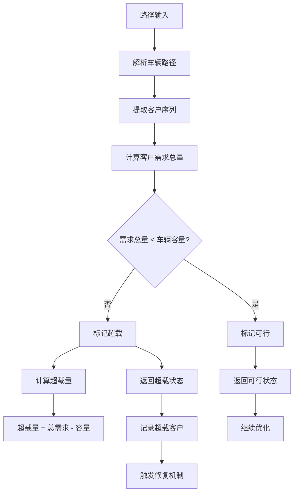
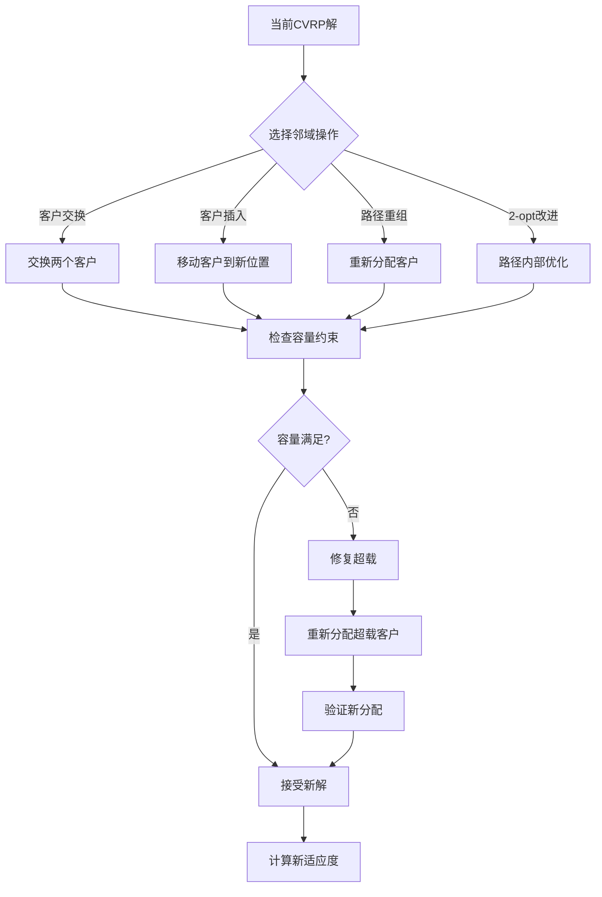
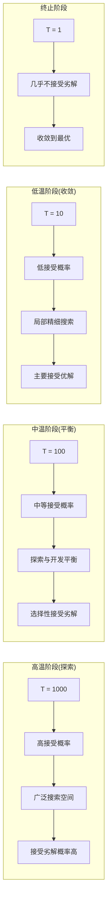
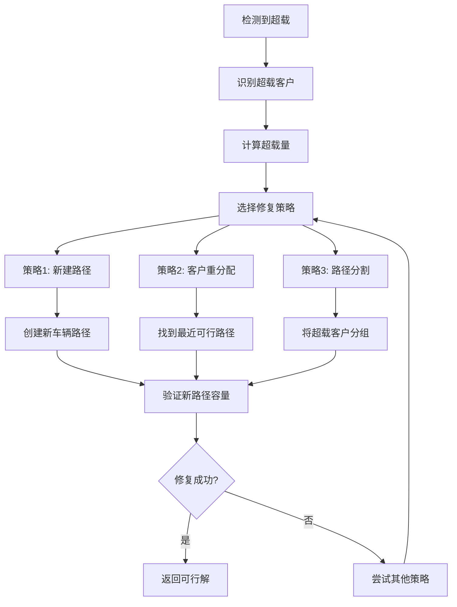
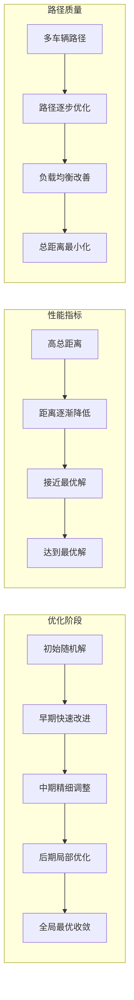

# SA_CVRP - 模拟退火算法求解容量约束车辆路径问题

## 问题描述

**容量约束车辆路径问题 (Capacitated Vehicle Routing Problem, CVRP)**

CVRP是VRP的基本变体，要求每辆车从仓库出发，为多个客户提供服务，每辆车有载重容量限制，目标是找到总行驶距离最短的路径方案。

### 数学模型

目标函数：
$min \sum_{i=0}^{n} \sum_{j=0}^{n} d_{ij} x_{ij}$

约束条件：
1. **容量约束**：
$\sum_{i=1}^{n} q_i y_{ik} \leq Q, \quad \forall k$

2. **路径约束**：
$\sum_{k=1}^{m} y_{ik} = 1, \quad \forall i = 1,2,...,n$

3. **流量守恒**：
$\sum_{j=0}^{n} x_{ijk} - \sum_{j=0}^{n} x_{jik} = 0, \quad \forall i,k$

4. **子回路消除**：
$\sum_{i \in S} \sum_{j \in S} x_{ijk} \leq |S| - 1, \quad \forall S \subseteq V \setminus \{0\}, \forall k$

## 算法原理

### 模拟退火算法在CVRP中的应用

SA算法通过以下方式处理CVRP：
1. **解的表示**：使用路径序列表示车辆路径
2. **邻域操作**：设计适合CVRP的邻域结构
3. **约束处理**：确保新解满足容量约束
4. **目标函数**：考虑总距离和约束违反惩罚

### 解的编码方式

**路径表示法**：
- 将多个车辆的路径串联为一个序列
- 使用分隔符标记不同车辆的路径
- 例如：[0,1,3,2,0,4,5,6,0]表示两辆车：
  - 车辆1：0→1→3→2→0
  - 车辆2：0→4→5→6→0

## 算法流程

### 基于模拟退火的CVRP求解

1. **初始化**
   - 生成初始可行解（满足容量约束）
   - 设置SA参数：温度、降温速率、链长
   - 计算初始目标值

2. **邻域搜索**
   - 设计适合CVRP的邻域操作
   - 确保新解满足容量约束
   - 计算新解的目标值

3. **约束处理**
   - 容量约束检查
   - 不可行解的修复或拒绝
   - 惩罚函数方法

4. **接受准则**
   - 按Metropolis准则接受新解
   - 处理约束违反的情况

## 算法逻辑框架

### SA-CVRP完整优化流程图
```mermaid
graph TD
    A[开始] --> B[初始化SA参数]
    B --> C[加载CVRP数据]
    C --> D[城市坐标]
    C --> E[客户需求量]
    C --> F[车辆容量]
    D --> G[生成初始可行解]
    G --> H[容量约束检查]
    H --> I[计算初始适应度]
    I --> J[记录最优解]
    J --> K{温度 > 终止温度?}
    K -->|是| L[外循环开始]
    L --> M[设置内循环计数器]
    M --> N[内循环开始]
    N --> O[生成邻域新解]
    O --> P[邻域操作选择]
    P --> Q[客户交换操作]
    P --> R[客户插入操作]
    P --> S[2-opt改进]
    Q --> T[容量约束检查]
    R --> T
    S --> T
    T --> U{容量满足?}
    U -->|是| V[计算新适应度]
    U -->|否| W[修复不可行解]
    W --> V
    V --> X[计算适应度差Δf]
    X --> Y{新解更好?}
    Y -->|是| Z[直接接受]
    Y -->|否| AA[按概率接受]
    Z --> AB[更新当前解]
    AA --> AC[Metropolis准则]
    AC --> AD{概率 < exp(-Δf/T)?}
    AD -->|是| AB
    AD -->|否| AE[拒绝新解]
    AB --> AF[更新最优解]
    AE --> AG[保持原解]
    AF --> AH{内循环完成?}
    AG --> AH
    AH -->|否| N
    AH -->|是| AI[降低温度]
    AI --> AJ[温度 = q * 当前温度]
    AJ --> K
    K -->|否| AK[输出最优CVRP方案]
    AK --> AL[车辆路径分配]
    AL --> AM[总行驶距离]
    AM --> AN[可视化路径]
    AN --> AO[结束]
```

### 容量约束检查机制


### 邻域操作详解


### 温度调度与搜索策略


### 修复机制流程


### 算法收敛过程


### 伪代码框架
```
初始化SA-CVRP参数:
    初始温度 T0 = 1000
    终止温度 Tend = 1
    降温速率 q = 0.95
    内循环次数 L = 100
    车辆容量 Q
    城市数量 N
    客户数量 M

加载CVRP数据:
    城市坐标 City.mat
    客户需求 Demands.mat
    距离矩阵 Distance.mat

主优化过程:
% 生成初始可行解
初始解 = generateInitialFeasibleSolution(城市坐标, 客户需求, 车辆容量)
当前适应度 = calculateCVRPFitness(初始解, 距离矩阵)
最优解 = 初始解
最优适应度 = 当前适应度
当前温度 = T0

while 当前温度 > Tend:
    for iter = 1 to L:
        % 生成邻域新解
        邻域操作 = 随机选择([客户交换, 客户插入, 路径重组, 2-opt])
        新解 = generateNeighborhoodSolution(当前解, 邻域操作)
        
        % 容量约束检查与修复
        [可行性, 超载信息] = checkCapacityConstraints(新解, 客户需求, 车辆容量)
        if not 可行性:
            新解 = repairOverloadedRoutes(新解, 超载信息)
        
        % 适应度评估
        新适应度 = calculateCVRPFitness(新解, 距离矩阵)
        
        % Metropolis接受准则
        Δf = 新适应度 - 当前适应度
        if Δf < 0:
            接受新解 = true
        else:
            接受概率 = exp(-Δf / 当前温度)
            if rand() < 接受概率:
                接受新解 = true
            else:
                接受新解 = false
        
        if 接受新解:
            当前解 = 新解
            当前适应度 = 新适应度
            
            if 当前适应度 < 最优适应度:
                最优解 = 当前解
                最优适应度 = 当前适应度
    
    % 降温
    当前温度 = q * 当前温度
    
    % 记录统计信息
    recordStatistics(当前温度, 最优适应度)

输出最优CVRP方案:
    最优车辆路径 = 最优解
    总行驶距离 = 最优适应度
    车辆使用数量 = countVehicles(最优解)
    
可视化CVRP路径
```

## 关键实现特点

### 1. 初始解生成
```matlab
% 生成初始可行CVRP解
function [routes, loads] = generateInitialSolution()
    % 使用贪心算法生成初始解
    % 确保每个客户被访问一次
    % 满足车辆容量约束
end
```

### 2. 容量约束检查
```matlab
% 检查路径是否满足容量约束
function [feasible, load] = checkCapacity(route, demands, capacity)
    totalDemand = sum(demands(route(route ~= 0)));
    feasible = totalDemand <= capacity;
    load = totalDemand;
end
```

### 3. 邻域操作设计

**交换操作**：
1. **客户交换**：交换两个客户的位置
2. **路径交换**：交换不同车辆的客户
3. **插入操作**：将客户从一个路径移到另一个路径

**2-opt改进**：
- 在单条路径内部进行2-opt优化
- 保持容量约束的前提下改进路径

### 4. 约束处理方法

**修复策略**：
1. **容量检查**：计算每条路径的总需求
2. **路径分割**：将超过容量的路径分割为多个可行路径
3. **客户重分配**：将超载的客户分配到其他路径

**惩罚函数**：
$F = D + \alpha \cdot \max(0, L - Q)$

其中：
- $D$：总行驶距离
- $L$：路径负载
- $Q$：车辆容量
- $\alpha$：惩罚系数

## 文件结构

- `Main.m`：SA_CVRP主程序
- `Evaluation.m`：CVRP解的评估函数
- `NewSolution.m`：CVRP邻域新解生成
- `CapacityCheck.m`：容量约束检查
- `RouteRepair.m`：不可行解修复
- `DrawPath.m`：路径可视化
- `TextOutput.m`：结果输出

## 参数配置

### SA参数
- 初始温度(T0)：1000
- 终止温度(Tend)：1e-3
- 降温速率(q)：0.95
- 链长(L)：300
- 最大迭代次数：2000

### CVRP参数
- 车辆容量(Q)：根据实际数据设置
- 客户数量：n
- 车辆数量：m（通常m = ceil(sum(demands)/Q)）

## 算法性能分析

### 收敛特性
1. **早期阶段**：高温下接受劣解，探索不同路径组合
2. **中期阶段**：平衡探索与开发，优化路径结构
3. **后期阶段**：低温下精细调整，局部优化

### 邻域操作效果
- **客户交换**：改变客户访问顺序
- **路径交换**：优化车辆间客户分配
- **2-opt**：改进单条路径的局部结构

### 约束处理策略
- **严格约束**：只接受可行解
- **惩罚函数**：允许轻微违反，通过惩罚引导搜索
- **修复策略**：将不可行解转化为可行解

## 使用示例

### 1. 数据准备
```matlab
% 客户数据
load('City.mat');  % 客户坐标
load('Demand.mat');  % 客户需求
load('Distance.mat');  % 距离矩阵

% 设置参数
vehicleCapacity = 100;  % 车辆容量
numVehicles = 5;  % 车辆数量
```

### 2. 运行求解
```matlab
% 运行SA_CVRP
[bestRoutes, bestDistance, vehicleLoads] = SA_CVRP(...);

% 结果分析
fprintf('最优总距离: %.2f\n', bestDistance);
fprintf('使用车辆数: %d\n', length(bestRoutes));
```

### 3. 结果输出
- 每辆车的路径
- 每辆车的装载量
- 总行驶距离
- 收敛过程图
- 路径可视化

## 算法改进策略

### 1. 混合邻域结构
- 结合多种邻域操作
- 自适应选择操作类型
- 基于搜索状态调整操作概率

### 2. 自适应参数调整
- 动态调整降温速率
- 根据改进情况调整链长
- 温度依赖的邻域大小

### 3. 局部搜索增强
- 在SA框架内加入局部优化
- 2-opt、3-opt局部改进
- 路径间客户重分配优化

### 4. 并行化策略
- 多个初始解并行搜索
- 温度并行化
- 邻域操作并行化

## 实际应用场景

### 物流配送
- **快递配送**：优化配送路线，减少运输成本
- **超市配送**：多车辆配送，满足门店需求
- **冷链物流**：考虑时间窗和容量约束

### 服务调度
- **维修服务**：优化维修人员路线
- **垃圾收集**：规划垃圾车收集路线
- **邮政投递**：邮件投递路线优化

### 算法对比

| 特征 | SA_CVRP | GA_CVRP | ACO_CVRP |
|------|---------|---------|----------|
| 搜索策略 | 单点搜索 | 群体搜索 | 群体搜索 |
| 约束处理 | 惩罚+修复 | 惩罚+修复 | 惩罚+修复 |
| 参数调优 | 较少 | 较多 | 较多 |
| 收敛速度 | 中等 | 较快 | 较慢 |
| 解质量 | 高 | 中等 | 高 |

## 注意事项

1. **参数调优**：需要根据问题规模调整SA参数
2. **初始解**：好的初始解可以加速收敛
3. **邻域设计**：邻域操作对算法性能影响很大
4. **约束处理**：需要平衡可行性和搜索空间
5. **计算时间**：大规模问题可能需要较长时间