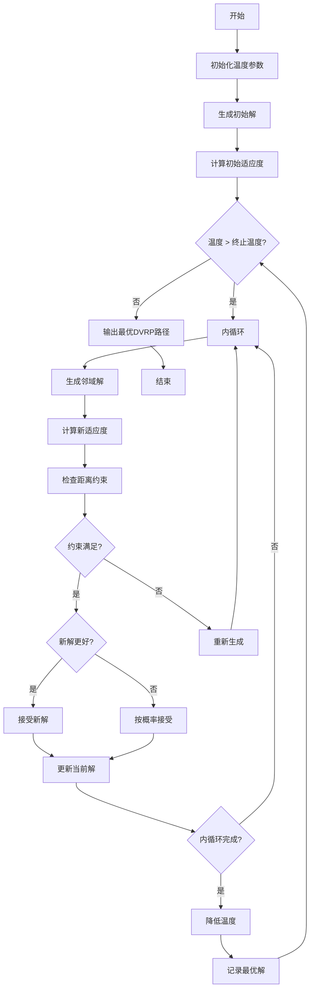
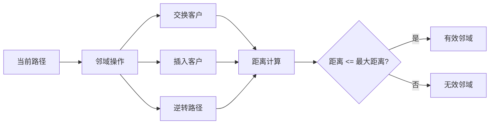

# SA_DVRP - 模拟退火算法求解距离约束车辆路径问题

## 问题描述

**距离约束车辆路径问题 (Distance-constrained Vehicle Routing Problem, DVRP)**

DVRP是VRP的重要变体，除了基本的车辆路径要求外，增加了每辆车的最大行驶距离约束。每辆车从仓库出发，完成配送任务后必须返回仓库，且总行驶距离不能超过最大允许距离。

### 数学模型

目标函数：
$min \sum_{k=1}^{m} \sum_{i=0}^{n} \sum_{j=0}^{n} d_{ij} x_{ijk}$

约束条件：
1. **距离约束**：
$\sum_{i=0}^{n} \sum_{j=0}^{n} d_{ij} x_{ijk} \leq D_{max}, \quad \forall k$

2. **客户分配**：
$\sum_{k=1}^{m} \sum_{i=0}^{n} x_{ijk} = 1, \quad \forall j = 1,2,...,n$

3. **流量守恒**：
$\sum_{j=0}^{n} x_{ijk} - \sum_{j=0}^{n} x_{jik} = 0, \quad \forall i,k$

4. **子回路消除**：
$\sum_{i \in S} \sum_{j \in S} x_{ijk} \leq |S| - 1, \quad \forall S \subseteq V \setminus \{0\}, \forall k$

## 算法原理

### 距离约束的处理

在SA算法中处理DVRP的关键挑战：
1. **距离计算**：精确计算每条路径的总距离
2. **约束检查**：确保每条路径满足距离约束
3. **邻域设计**：设计保持距离可行性的邻域操作
4. **不可行解处理**：如何处理违反距离约束的解

### 距离计算机制

**单条路径距离**：
$D_k = \sum_{i=1}^{L_k-1} d_{route_k(i), route_k(i+1)}$

其中：
- $D_k$：第k辆车的总距离
- $L_k$：第k辆车的路径长度
- $route_k$：第k辆车的访问序列

## 算法流程

### 基于模拟退火的DVRP求解

1. **初始化**
   - 生成初始可行解（满足距离约束）
   - 设置SA参数：温度、降温速率、链长
   - 计算每条路径的精确距离

2. **距离约束检查**
   - 计算每条路径的总距离
   - 检查是否超过最大允许距离
   - 标记不可行的路径

3. **邻域操作设计**
   - 设计距离感知的邻域操作
   - 优先选择不会违反距离约束的移动
   - 处理约束违反的修复策略

4. **接受准则**
   - 考虑距离约束的Metropolis准则
   - 惩罚函数方法处理轻微违反
   - 严格约束确保解的可行性

## 算法逻辑框架

### SA-DVRP流程图


### 距离约束邻域搜索


### 温度与接受概率


### 伪代码框架
```
初始化参数
生成初始可行解
计算初始总距离
设置初始温度T0

while T > Tend:
    for i = 1 to L:
        产生邻域新解
        计算每条路径距离
        检查距离约束
        
        if 满足距离约束:
            计算目标值变化Δf
            按Metropolis准则接受
        else:
            修复或拒绝新解
    
    降温：T = q * T
    更新最优解

输出最优路径方案
```

## 关键实现特点

### 1. 距离约束检查
```matlab
% 检查路径是否满足距离约束
function [feasible, distance] = checkDistance(route, distanceMatrix, maxDistance)
    totalDist = 0;
    for i = 2:length(route)
        totalDist = totalDist + distanceMatrix(route(i-1), route(i));
    end
    feasible = totalDist <= maxDistance;
    distance = totalDist;
end
```

### 2. 初始解生成策略
```matlab
% 生成满足距离约束的初始解
function routes = generateFeasibleSolution(demands, distances, maxDistance)
    % 使用贪心算法生成初始路径
    % 确保每条路径满足距离约束
    % 考虑客户间的距离关系
end
```

### 3. 邻域操作设计

**距离感知交换**：
1. **局部交换**：在单条路径内部交换客户
2. **路径间交换**：在不同路径间交换客户
3. **插入操作**：将客户插入到合适的路径位置

**距离评估**：
- 预先计算交换前后的距离变化
- 快速评估操作的可行性
- 避免计算完整的距离

### 4. 距离修复策略

**路径分割**：
当路径超过距离约束时：
1. 找到合适的分割点
2. 将路径分为两个子路径
3. 确保两个子路径都满足距离约束

**客户重分配**：
1. 识别超载路径中的客户
2. 计算将客户分配到其他路径的可行性
3. 选择最优的重分配方案

## 文件结构

- `Main.m`：SA_DVRP主程序
- `Evaluation.m`：DVRP解的评估函数
- `NewSolution.m`：距离感知邻域操作
- `DistanceCheck.m`：距离约束检查
- `DistanceRepair.m`：距离约束修复
- `RouteSplit.m`：路径分割算法
- `DrawPath.m`：路径可视化
- `TextOutput.m`：结果输出

## 参数配置

### SA参数
- 初始温度(T0)：500
- 终止温度(Tend)：1e-4
- 降温速率(q)：0.92
- 链长(L)：250
- 最大迭代次数：1500

### DVRP参数
- 最大行驶距离(Dmax)：根据实际问题设置
- 客户数量：n
- 车辆数量：m（通常m = ceil(totalDistance/Dmax)）

## 距离约束处理技术

### 1. 精确距离计算
```matlab
% 计算完整路径距离（包含往返）
function totalDistance = calculateRouteDistance(route, depot, distanceMatrix)
    % 从仓库到第一个客户
    dist = distanceMatrix(depot, route(1));
    
    % 客户间的距离
    for i = 1:length(route)-1
        dist = dist + distanceMatrix(route(i), route(i+1));
    end
    
    % 从最后一个客户返回仓库
    dist = dist + distanceMatrix(route(end), depot);
    
    totalDistance = dist;
end
```

### 2. 快速距离评估
```matlab
% 快速评估交换操作的距离变化
function deltaDistance = evaluateSwap(route, i, j, distanceMatrix)
    % 只计算受影响的部分
    % 避免重新计算整个路径
    
    % 计算移除i和j的影响
    % 计算插入i和j的影响
    % 返回距离变化量
end
```

### 3. 距离约束松弛

**惩罚函数方法**：
$F = D + \beta \cdot \max(0, D - D_{max})$

其中：
- $D$：实际距离
- $D_{max}$：最大允许距离
- $\beta$：惩罚系数（通常取较大的值）

## 算法性能优化

### 1. 邻域操作优化
- **距离优先选择**：优先选择距离相近的客户进行交换
- **约束感知操作**：在产生新解时考虑距离约束
- **局部改进**：对单条路径进行2-opt改进

### 2. 参数自适应调整
- **温度依赖的距离检查**：在高温时允许轻微违反
- **动态惩罚系数**：根据搜索阶段调整惩罚强度
- **自适应链长**：根据改进情况调整迭代次数

### 3. 混合策略
- **局部搜索结合**：在SA框架内加入局部优化
- **多起点搜索**：多个初始解并行搜索
- **精英保留**：保留历史最优解

## 实际应用案例

### 1. 快递配送优化
- **问题特征**：
  - 配送距离受车辆续航里程限制
  - 需要规划充电/加油路线
  - 考虑时间窗和距离双重约束

- **解决方案**：
  - 设置合理的最大行驶距离
  - 考虑充电站位置
  - 优化路径减少总距离

### 2. 城市垃圾收集
- **约束条件**：
  - 垃圾车最大工作时间限制
  - 垃圾填埋场距离限制
  - 车辆载重和距离双重约束

### 3. 冷链物流配送
- **特殊要求**：
  - 冷链车辆续航里程限制
  - 温控设备工作时间限制
  - 多点配送的距离优化

## 算法对比分析

| 特征 | SA_DVRP | GA_DVRP | ACO_DVRP |
|------|---------|---------|----------|
| 距离计算 | 精确计算 | 近似计算 | 启发式 |
| 约束处理 | 惩罚+修复 | 惩罚+修复 | 惩罚+修复 |
| 搜索策略 | 单点精细搜索 | 群体并行搜索 | 群体协作搜索 |
| 收敛速度 | 中等 | 较快 | 较慢 |
| 解质量 | 高 | 中等 | 高 |
| 实现复杂度 | 中等 | 较高 | 较高 |

## 可视化输出

### 1. 路径可视化
- **客户分布图**：显示客户和仓库位置
- **路径方案图**：显示每辆车的行驶路线
- **距离标注**：标注每条路径的总距离

### 2. 收敛分析
- **距离变化曲线**：显示最优距离随迭代的变化
- **温度变化曲线**：显示退火温度变化过程
- **接受率统计**：显示劣解接受概率变化

### 3. 性能指标
- **总行驶距离**：所有车辆的总距离
- **平均距离**：每辆车的平均行驶距离
- **最大距离**：最长路径的距离
- **距离利用率**：实际距离/最大允许距离

## 注意事项与建议

### 1. 参数设置
- **最大距离**：应根据实际车辆性能和道路条件设置
- **初始温度**：需要考虑距离约束的严格程度
- **降温速率**：平衡搜索精度和计算时间

### 2. 数据准备
- **距离矩阵**：应包含实际道路距离，而非直线距离
- **客户坐标**：需要准确的地理位置信息
- **时间因素**：考虑交通拥堵对行驶距离的影响

### 3. 算法调优
- **邻域操作**：需要根据问题规模调整操作类型
- **约束处理**：严格约束vs惩罚函数的选择
- **停止准则**：根据问题复杂度调整终止条件

### 4. 实际约束
- **道路网络**：考虑实际道路网络限制
- **车辆类型**：不同类型车辆的最大距离可能不同
- **时间窗**：可能需要结合时间窗约束