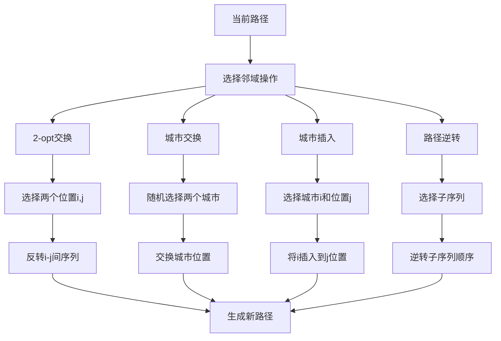
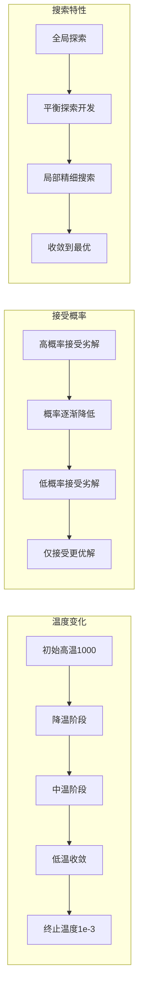
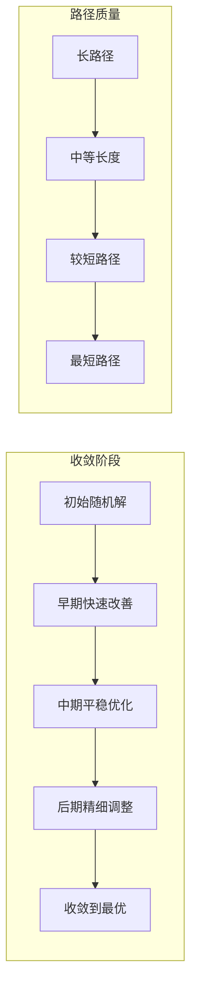

# SA_TSP - 模拟退火算法求解旅行商问题

## 问题描述

**旅行商问题 (Traveling Salesman Problem, TSP)**

TSP是经典的组合优化问题，目标是找到一条经过所有给定城市且每个城市只经过一次的最短路径，最后回到起始城市。

### 数学模型

目标函数：
$min \sum_{i=1}^{n} \sum_{j=1}^{n} d_{ij} x_{ij}$

约束条件：
$\sum_{j=1}^{n} x_{ij} = 1, \quad \forall i = 1,2,...,n$

$\sum_{i=1}^{n} x_{ij} = 1, \quad \forall j = 1,2,...,n$

$\sum_{i \in S} \sum_{j \in S} x_{ij} \leq |S| - 1, \quad \forall S \subset V, 2 \leq |S| \leq n-1$

## 算法原理

### 模拟退火算法 (Simulated Annealing, SA)

模拟退火算法模拟固体退火过程，通过控制温度参数来接受劣解，从而跳出局部最优，最终收敛到全局最优。

**算法核心**：
- 在高温时接受劣解的概率较高，有利于全局搜索
- 随着温度降低，接受劣解的概率减小，逐渐收敛
- 使用Metropolis准则判断是否接受新解

### Metropolis准则

接受新解的概率：
$P = \begin{cases}
1, & \text{if } \Delta f \leq 0 \\
e^{-\Delta f / T}, & \text{if } \Delta f > 0
\end{cases}$

其中：
- $\Delta f = f_{new} - f_{old}$：目标函数值的变化
- $T$：当前温度

## 算法流程

### 基于模拟退火的TSP求解

1. **初始化**
   - 生成初始解（随机排列城市顺序）
   - 设置初始温度$T_0$、终止温度$T_{end}$、降温速率$q$
   - 计算每个温度下的迭代次数$L$

2. **邻域搜索**
   - 使用2-opt交换产生新解
   - 随机选择两个城市位置，反转中间的城市序列

3. **接受准则**
   - 如果新解更优，直接接受
   - 如果新解更差，按Metropolis概率接受

4. **降温过程**
   - 温度按几何降温：$T_{k+1} = q \cdot T_k$
   - 降温速率$q$通常取0.8-0.99

## 算法逻辑框架

### SA-TSP完整退火流程图
```mermaid
graph TD
    A[开始] --> B[初始化参数]
    B --> C[设置退火参数]
    C --> D[加载城市数据]
    D --> E[生成初始解]
    E --> F[计算初始路径长度]
    F --> G[设置初始温度T0]
    G --> H{温度 > Tmin?}
    H -->|是| I[内层循环]
    I --> J[产生邻域解]
    J --> K[计算新路径长度]
    K --> L[计算长度差Δf]
    L --> M{Δf < 0?}
    M -->|是| N[接受新解]
    M -->|否| O[计算接受概率]
    O --> P{exp(-Δf/T) > rand?}
    P -->|是| N
    P -->|否| Q[拒绝新解]
    N --> R[更新当前解]
    Q --> R
    R --> S[更新最优解]
    S --> T{内循环完成?}
    T -->|否| I
    T -->|是| U[降低温度]
    U --> V[T = q × T]
    V --> H
    H -->|否| W[输出最优TSP路径]
    W --> X[可视化结果]
    X --> Y[结束]
```

### 邻域搜索机制详解


### 温度调度与接受概率


### Metropolis接受准则
```mermaid
graph TD
    A[新解评估] --> B[计算目标函数差]
    B --> C[Δf = f_new - f_old]
    C --> D{Δf < 0?}
    D -->|是| E[100%接受]
    D -->|否| F[计算概率]
    F --> G[P = exp(-Δf/T)]
    G --> H{随机数 < P?}
    H -->|是| I[接受劣解]
    H -->|否| J[保持原解]
    E --> K[更新当前解]
    I --> K
    J --> L[保持当前解]
```

### 算法收敛过程


### 伪代码框架
```
初始化参数:
    初始温度 T0 = 1000
    终止温度 Tend = 1e-3
    降温速率 q = 0.9
    链长 L = 200
    城市数量 N

加载数据:
    城市坐标 City.mat
    距离矩阵 Distance.mat

主过程:
% 初始化
当前解 = 随机生成TSP路径
当前长度 = 计算路径长度(当前解)
最优解 = 当前解
最优长度 = 当前长度
温度 = T0

while 温度 > Tend:
    for iter = 1 to L:
        % 产生邻域解
        新解 = 2opt邻域操作(当前解)
        新长度 = 计算路径长度(新解)
        
        % 计算差异
        Δf = 新长度 - 当前长度
        
        % Metropolis准则
        if Δf < 0:
            接受新解
            当前解 = 新解
            当前长度 = 新长度
            
            if 新长度 < 最优长度:
                最优解 = 新解
                最优长度 = 新长度
        else:
            接受概率 = exp(-Δf/温度)
            if rand() < 接受概率:
                接受新解
                当前解 = 新解
                当前长度 = 新长度
    
    % 降温
    温度 = q × 温度

输出最优TSP路径
输出最短路径长度
```

## 关键实现特点

### 1. 初始解生成
```matlab
% 生成初始TSP路径
TSProute = [0, randperm(CityNum)] + 1;
S1 = ones(1, CityNum + 2);  % 包含起点和终点
S1(2:end-1) = TSProute(2:end);
```

### 2. 邻域结构
**2-opt交换**：
1. 随机选择两个位置i和j（1 < i < j < n）
2. 反转i和j之间的城市序列
3. 生成新的路径

示例：
原路径：[1,2,3,4,5,6,1]
选择位置2和5：
新路径：[1,5,4,3,2,6,1]

### 3. 目标函数计算
```matlab
% 计算TSP路径长度
function distance = calculateTSPDistance(route, Distance)
    totalDist = 0;
    for i = 2:length(route)
        totalDist = totalDist + Distance(route(i-1), route(i));
    end
    distance = totalDist;
end
```

### 4. 温度调度
**几何降温**：
$T_{k+1} = q \cdot T_k$

**参数设置**：
- 初始温度$T_0 = 1000$：足够高以接受劣解
- 终止温度$T_{end} = 10^{-3}$：足够低以确保收敛
- 降温速率$q = 0.9$：平衡搜索精度和计算时间
- 链长$L = 200$：每个温度下的迭代次数

## 文件结构

- `Main.m`：SA_TSP主程序
- `Evaluation.m`：解的评估函数
- `NewSolution.m`：新解生成函数
- `Metropolis.m`：Metropolis接受准则
- `DrawPath.m`：路径可视化
- `TextOutput.m`：结果输出
- `dsxy2figxy.m`：坐标转换工具

## 参数配置

- 初始温度(T0)：1000
- 终止温度(Tend)：1e-3
- 降温速率(q)：0.9
- 链长(L)：200
- 迭代次数：$\lceil \log(T_{end}/T_0) / \log(q) \rceil$

## 算法性能分析

### 收敛特性
1. **高温阶段**：接受劣解概率高，全局搜索能力强
2. **中温阶段**：平衡探索与开发
3. **低温阶段**：主要接受优解，局部精细搜索

### 参数影响
- **初始温度**：影响初始搜索范围
- **降温速率**：影响收敛速度和质量
- **链长**：影响每个温度的搜索深度
- **终止温度**：影响最终解的精度

### 优缺点
**优点**：
- 理论保证收敛到全局最优
- 实现简单，参数较少
- 适合离散优化问题
- 鲁棒性强

**缺点**：
- 收敛速度较慢
- 参数调优需要经验
- 计算时间较长
- 可能陷入局部最优

## 改进策略

### 1. 自适应温度调度
- 根据解的改进情况调整降温速率
- 在搜索停滞时减缓降温

### 2. 混合邻域结构
- 结合2-opt、3-opt、交换等多种邻域操作
- 提高搜索效率

### 3. 并行化
- 多个初始解并行搜索
- 提高计算效率

## 使用示例

1. 准备数据文件：
   - `City.mat`：城市坐标数据
   - `Distance.mat`：城市间距离矩阵

2. 运行`Main.m`执行求解

3. 输出结果：
   - 最优路径
   - 最短距离
   - 收敛过程图
   - 温度变化曲线

## 实际应用

SA算法适用于：
- **TSP问题**：城市路径规划
- **调度问题**：作业车间调度
- **网络设计**：通信网络优化
- **资源分配**：任务分配优化
- **组合优化**：各类NP-hard问题

## 与其他算法比较

| 特征 | SA | GA | ACO |
|------|----|----|-----|
| 搜索策略 | 单点搜索 | 群体搜索 | 群体搜索 |
| 接受劣解 | 概率接受 | 通过选择 | 信息素引导 |
| 参数数量 | 较少 | 较多 | 较多 |
| 收敛理论 | 有 | 无 | 无 |
| 实现复杂度 | 简单 | 中等 | 中等 |