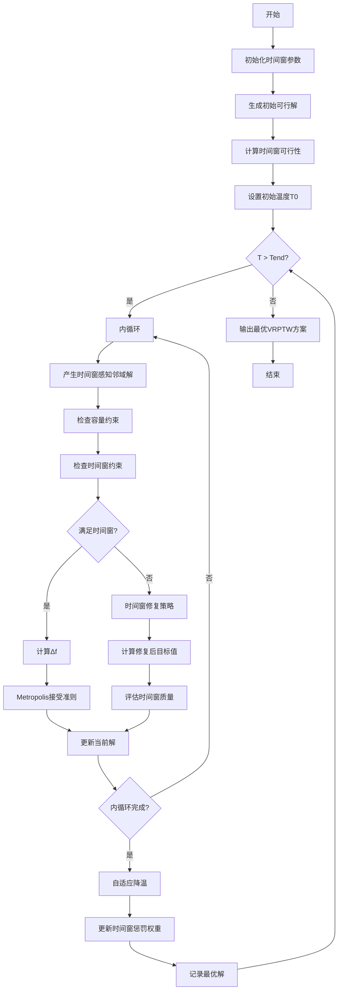
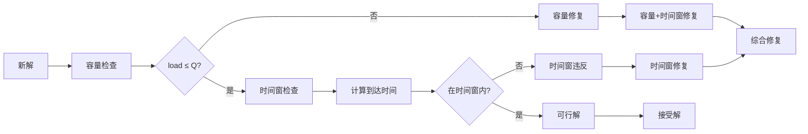
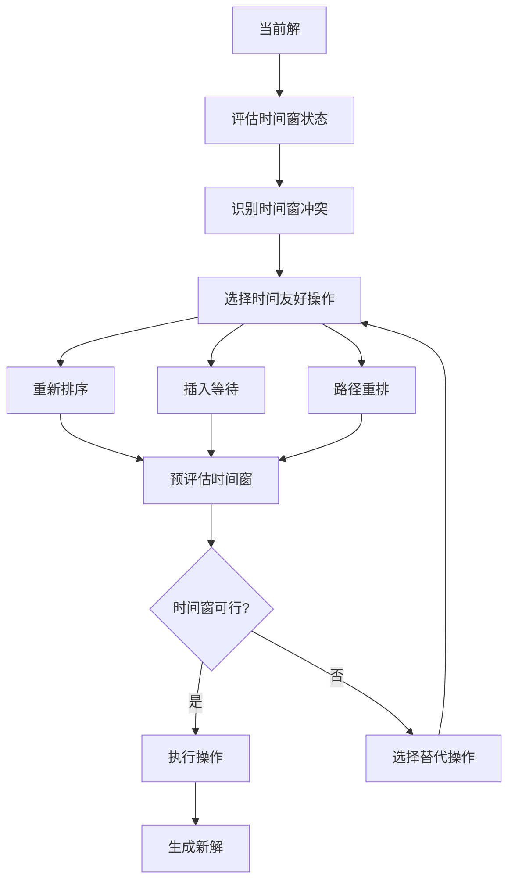

# SA_VRPTW - 模拟退火算法求解带时间窗车辆路径问题

## 问题描述

**带时间窗车辆路径问题 (Vehicle Routing Problem with Time Windows, VRPTW)**

VRPTW是VRP的重要扩展，每个客户除了有货物需求外，还要求服务必须在特定的时间窗内完成。问题包含两个主要约束：
1. **容量约束**：车辆载重不超过最大容量
2. **时间窗约束**：服务必须在规定时间窗内完成

### 数学模型

目标函数：
$min \sum_{k=1}^{m} \sum_{i=0}^{n} \sum_{j=0}^{n} c_{ij} x_{ijk}$

约束条件：
1. **容量约束**：
$\sum_{i=1}^{n} q_i y_{ik} \leq Q_k, \quad \forall k$

2. **时间窗约束**：
$e_i \leq s_i \leq l_i, \quad \forall i$

3. **服务时间约束**：
$s_j \geq s_i + s_{service} + t_{ij}, \quad \forall (i,j) \in A$

4. **客户分配**：
$\sum_{k=1}^{m} y_{ik} = 1, \quad \forall i = 1,2,...,n$

5. **流量守恒**：
$\sum_{j=0}^{n} x_{ijk} - \sum_{j=0}^{n} x_{jik} = 0, \quad \forall i,k$

## 算法挑战

### 时间窗约束的复杂性

VRPTW相比CVRP面临额外挑战：
1. **时间可行性**：路径必须满足所有时间窗约束
2. **等待时间**：提前到达需要等待，增加总时间
3. **时间窗冲突**：某些客户组合可能不可行
4. **服务顺序**：时间窗严格限制客户服务顺序

### 约束处理策略

**时间窗冲突处理**：
1. **软时间窗**：允许违反但施加惩罚
2. **硬时间窗**：严格禁止违反
3. **混合策略**：关键客户硬约束，其他软约束

**时间窗修复**：
1. **重新排序**：调整客户服务顺序
2. **插入等待**：在适当位置插入等待时间
3. **路径重排**：重新规划路径结构

## 算法流程

### 基于模拟退火的VRPTW求解

1. **初始化阶段**
   - 生成满足容量和时间窗的初始解
   - 设置SA参数，考虑时间窗约束
   - 建立时间窗检查机制

2. **时间窗检查**
   - 计算路径到达时间
   - 检查时间窗可行性
   - 计算等待时间和服务时间

3. **时间窗感知邻域操作**
   - 设计考虑时间窗的操作
   - 预评估时间窗可行性
   - 优先选择时间友好的操作

4. **时间窗修复策略**
   - 时间窗冲突修复
   - 等待时间优化
   - 服务顺序调整

## 算法逻辑框架

### SA-VRPTW时间窗流程图


### 时间窗约束检查机制


### 时间窗感知邻域操作


### 温度调度与时间窗适应


### 伪代码框架
```
初始化时间窗参数
生成初始可行解（满足容量+时间窗）
计算初始目标值和时间窗违反
设置初始温度T0（考虑时间窗复杂性）

while T > Tend:
    for i = 1 to L:
        产生时间窗感知的邻域新解
        检查容量约束：load ≤ Q
        检查时间窗约束：e_i ≤ arrival ≤ l_i
        
        if 满足时间窗约束:
            计算目标值变化Δf
            按Metropolis准则接受
        else:
            使用时间窗修复策略
            计算修复后的目标值
            评估修复质量
    
    自适应降温：T = q * T
    更新时间窗惩罚权重
    记录最优可行解

输出最优VRPTW方案
```

## 关键实现特点

### 1. 时间窗检查机制
```matlab
% 同时检查容量和时间窗约束
function [feasible, violations] = checkTimeWindowConstraints(route, ...)
    % 容量检查
    totalLoad = sum(demands(route(route ~= 0)));
    capacityViolation = max(0, totalLoad - vehicleCapacity);
    
    % 时间窗检查
    arrivalTimes = calculateArrivalTimes(route, timeMatrix, serviceTime);
    timeWindowViolation = sum(max(0, arrivalTimes - latestTime) + ...
                           max(0, earliestTime - arrivalTimes));
    
    % 综合评估
    feasible = (capacityViolation == 0) && (timeWindowViolation == 0);
    violations = [capacityViolation, timeWindowViolation];
end
```

### 2. 时间窗感知邻域操作

**时间友好交换**：
```matlab
% 考虑时间窗的客户交换
function newSolution = timeWindowAwareSwap(current, i, j)
    % 评估交换对时间窗的影响
    timeImpact = evaluateTimeWindowChange(current, i, j);
    capacityImpact = evaluateCapacityChange(current, i, j);
    
    % 仅当交换不会导致严重时间窗违反时才执行
    if timeImpact + capacityImpact < threshold:
        newSolution = performSwap(current, i, j);
    else:
        newSolution = findTimeWindowFriendlyMove(current, i, j);
    end
end
```

### 3. 时间窗修复策略

**分层修复算法**：
1. **时间窗冲突修复**：
   - 识别时间窗冲突客户
   - 调整服务顺序
   - 插入必要的等待时间

2. **服务时间优化**：
   - 最小化总等待时间
   - 优化服务顺序
   - 平衡等待与服务效率

3. **综合修复**：
   - 同时考虑容量和时间窗
   - 寻找最优修复方案
   - 最小化对解质量的影响

### 4. 自适应时间窗惩罚

**动态惩罚权重**：
$F = D + \alpha \cdot C_{violation} + eta \cdot T_{violation}$

其中：
- $\alpha$：容量约束惩罚权重
- $eta$：时间窗约束惩罚权重
- 权重随搜索阶段动态调整

## 文件结构

- `Main.m`：SA_VRPTW主程序
- `Evaluation.m`：容量+时间窗评估
- `NewSolution.m`：时间窗感知邻域操作
- `TimeWindowCheck.m`：时间窗约束检查
- `TimeWindowRepair.m`：时间窗修复策略
- `AdaptivePenalty.m`：自适应惩罚权重
- `DrawPath.m`：带时间窗路径可视化
- `TextOutput.m`：详细结果输出

## 参数配置

### SA参数（针对时间窗优化）
- 初始温度(T0)：1000（考虑时间窗复杂性）
- 终止温度(Tend)：1e-4
- 降温速率(q)：0.92（较慢降温）
- 链长(L)：500（更长搜索）
- 最大迭代次数：3000

### VRPTW参数
- 车辆容量(Q)：根据车辆类型设定
- 时间窗宽度：客户特定
- 服务时间：客户特定
- 客户数量：n
- 车辆数量：m（动态计算）

### 时间窗参数
- 最早到达时间：e_i
- 最晚到达时间：l_i
- 服务时间：s_i
- 等待时间成本：按时间计算

## 使用示例

```matlab
% 运行SA_VRPTW算法
[bestSolution, bestCost] = SA_VRPTW(customers, vehicles, distances, ...
                                   demands, timeWindows, serviceTimes);

% 结果可视化
DrawPath(bestSolution, customerCoordinates);
TextOutput(bestSolution, bestCost);
```

## 算法复杂度分析

- **时间复杂度**：O(I × L × n²)，其中I为迭代次数，L为链长，n为客户数
- **空间复杂度**：O(n²)，用于存储距离矩阵和时间窗信息
- **收敛性**：通过温度调度保证收敛到近似最优解

## 实际应用

SA_VRPTW适用于：
- **物流配送**：考虑客户时间偏好的配送路线优化
- **快递服务**：快递员配送路线的时间窗约束优化
- **医疗配送**：医院药品配送的时间敏感路径优化
- **城市配送**：考虑交通拥堵时间窗的城市配送优化